[← Regresar](../../README.md)

# Casos de Uso

## Core
Quetxal TV es una plataforma de streaming de video bajo demanda diseñada para usuarios que buscan entretenimiento digital personalizado y para los equipos de QUETZALtv que necesitan gestionar ese contenido de forma eficiente. Resuelve la fragmentación del contenido familiar al permitir múltiples perfiles independientes dentro de una sola cuenta, con historial y preferencias propias para cada uno, mientras que para el equipo de la platraforma ayuda a centralizar la publicación, edición y control del catálogo con trazabilidad automática de cada cambio. Su valor está en conectar ambos mundos de forma transparente: el usuario disfruta contenido de forma continua, retomando exactamente donde lo dejó y viendo precios en su moneda local, mientras el administrador mantiene control total sobre qué se publica, cuándo y con qué historial de modificaciones.

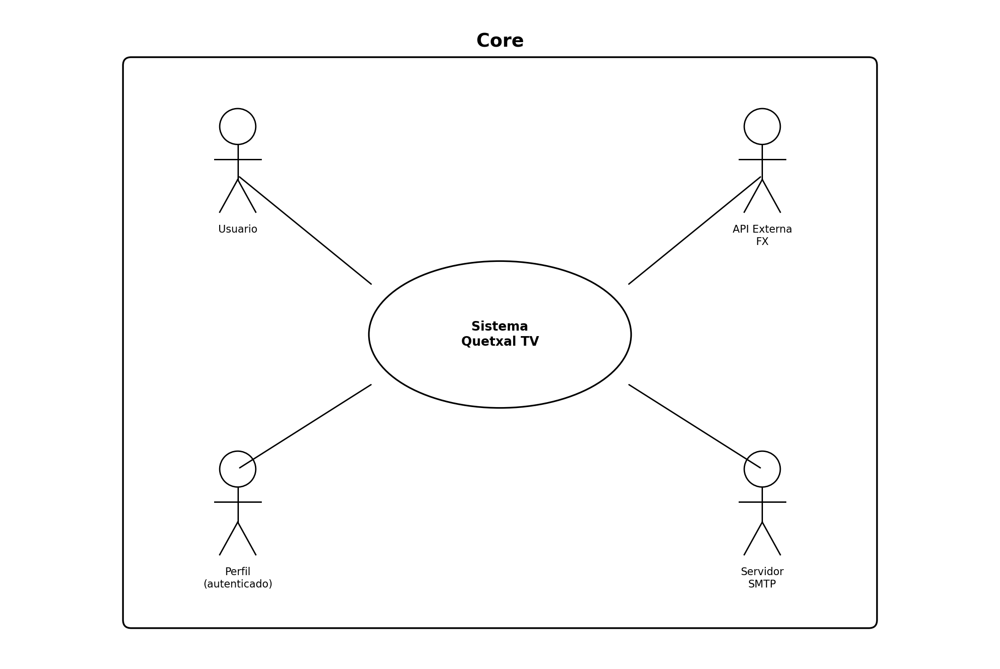

### Primera Descomposición

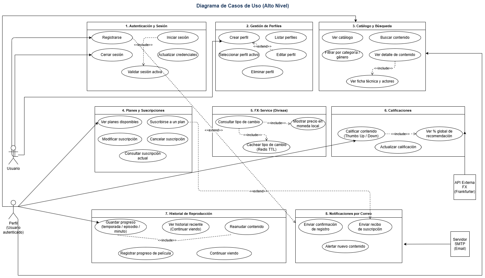

## Stakeholders

| # | Stakeholder | Tipo | Rol en el sistema |
|---|-------------|------|-------------------|
| 1 | **Usuario** | Actor primario | Consume el servicio: gestiona su cuenta, perfiles, suscripción, explora contenido y consulta precios en su moneda local |
| 2 | **Administrador** | Actor primario | Opera la plataforma: gestiona el catálogo de contenido y administra la auditoría y reportes del sistema |
| 3 | **Frankfurter API** | Actor externo | Proveedor externo de tasas de cambio en tiempo real consumido por el FX-Service |
| 4 | **Google Cloud Storage** | Actor externo | Almacena y sirve los archivos multimedia (videos y portadas) del catálogo de contenido |
| 5 | **Servicio SMTP** | Actor externo | Infraestructura de correo electrónico que ejecuta el envío físico de las notificaciones generadas por la plataforma |
| 6 | **Kubernetes** | Actor de infraestructura | Orquesta y monitorea el ciclo de vida de los contenedores en el entorno de producción (rama `release`) |
| 7 | **GitHub Actions** | Actor de infraestructura | Automatiza el pipeline de CI/CD: ejecuta pruebas, construye imágenes y gestiona el despliegue continuo en GCP |

--------

## Diagramas por Módulo

### Módulo 1 — Autenticación y Sesión

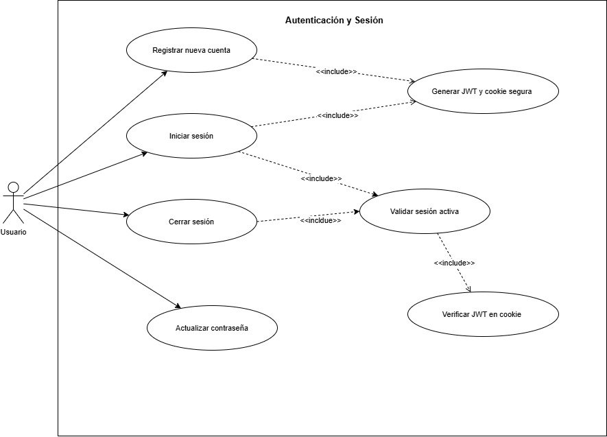

| Nombre        | Autenticación y Sesión |
| :------------ | :------------------------------------------------------------------------------------- |
| **Actores**   | Usuario |
| **Propósito** | Permitir al usuario registrarse, iniciar sesión, mantener su sesión activa mediante cookies seguras y JWT, cerrar sesión y actualizar sus credenciales de acceso. |
| **Resumen**   | El caso de uso inicia cuando el usuario accede a la plataforma Quetxal TV. El sistema permite registrar una nueva cuenta, iniciar sesión con credenciales existentes y mantener la sesión mediante una cookie segura que contiene un JWT. El API Gateway valida la cookie en cada ruta protegida mediante una llamada gRPC al Identity Service. El usuario puede cerrar sesión en cualquier momento o actualizar su contraseña. Finaliza cuando el usuario tiene una sesión activa con perfil seleccionado o cierra sesión voluntariamente. |

**Curso Normal de Eventos**

| \#  | Acción del Actor | Respuesta del Sistema |
| :-- | :--------------- | :-------------------- |
| 1   | El usuario ingresa email, contraseña y nombre completo para registrarse. | El sistema valida el formato del email y que la contraseña tenga mínimo 8 caracteres. |
| 2   |  | El sistema verifica que el email no esté registrado previamente (`sp_find_user_by_email`). |
| 3   |  | El sistema hashea la contraseña con bcrypt y crea la cuenta (`sp_register_user`). |
| 4   |  | El sistema genera un JWT con `user_id` y `email`, establece la cookie segura (`httpOnly`, `sameSite`) y publica un evento de notificación en Redis. |
| 5   | El usuario ingresa email y contraseña para iniciar sesión. | El sistema busca al usuario por email (`sp_find_user_by_email`) y compara la contraseña con bcrypt. |
| 6   |  | El sistema genera un JWT, establece la cookie segura y retorna `user_id`. |
| 7   | El usuario accede a una ruta protegida. | El API Gateway lee la cookie, llama a `ValidateToken` vía gRPC al Identity Service y adjunta `user_id`, `email` y `profile_id` a la solicitud. |
| 8   | El usuario cierra sesión. | El sistema limpia la cookie del cliente. |
| 9   | El usuario ingresa su contraseña actual y la nueva contraseña. | El sistema verifica la contraseña actual, hashea la nueva con bcrypt y ejecuta `sp_update_user_password`. El trigger `trg_audit_credential_update` registra el cambio automáticamente. |

**Flujos Alternativos y de Excepción**

| Tipo | Descripción |
| :--- | :---------- |
| **Flujo Alternativo** | Si el email ya está registrado durante el registro, el sistema retorna 400: "Email already registered" y no crea la cuenta. |
| **Flujo Alternativo** | Si las credenciales son incorrectas durante el login, el sistema retorna 401: "Invalid credentials" sin revelar cuál campo es incorrecto. |
| **Flujo Alternativo** | Si la contraseña actual es incorrecta al actualizar credenciales, el sistema retorna 401: "Current password is incorrect" y no modifica el hash. |
| **Flujo de Excepción** | Si el token en la cookie es inválido o expirado, el API Gateway retorna 401: "Invalid or expired token" y bloquea el acceso a la ruta protegida. |
| **Flujo de Excepción** | Si el Identity Service no está disponible, el API Gateway retorna 503: "Identity Service unavailable". Aplica a todos los flujos del módulo. |

### Módulo 2 - Gestión Cuentas y Perfiles

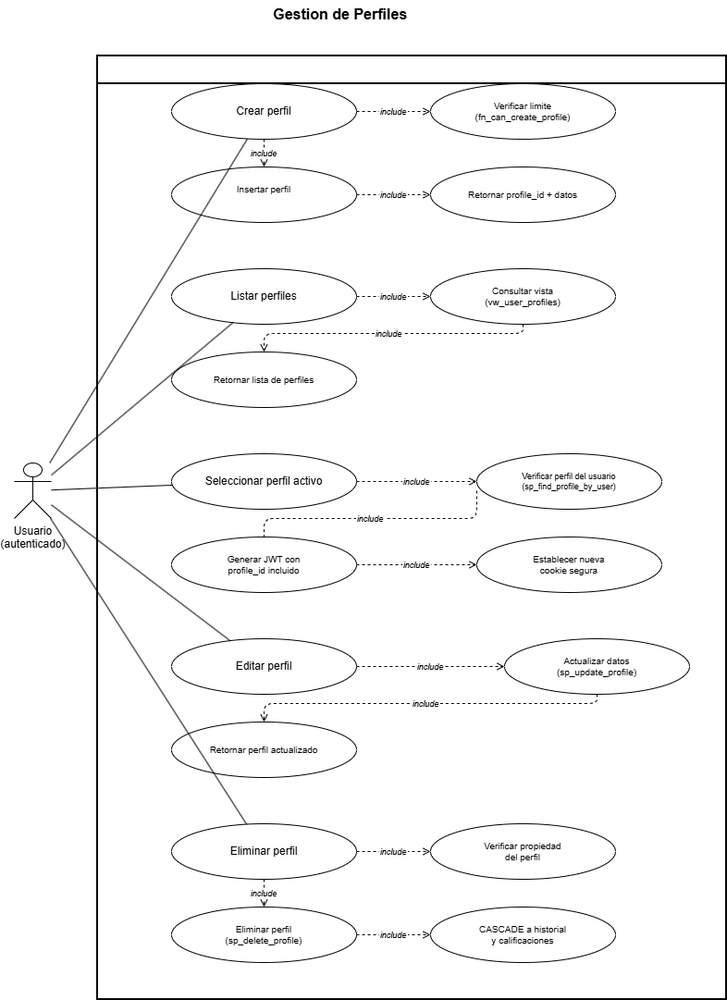

| Nombre        | Gestión de Perfiles |
| :------------ | :------------------ |
| **Actores**   | Usuario (autenticado) |
| **Propósito** | Permitir al usuario crear, listar, seleccionar, editar y eliminar perfiles dentro de su cuenta, con un máximo de cinco perfiles por cuenta. |
| **Resumen**   | El caso de uso inicia cuando el usuario autenticado accede a la gestión de perfiles. El sistema permite crear nuevos perfiles validando el límite de cinco mediante la función `fn_can_create_profile`, listarlos a través de la vista `vw_user_profiles`, seleccionar un perfil activo generando un nuevo JWT que incluye el `profile_id`, editar el nombre y avatar de un perfil existente, y eliminar un perfil verificando que pertenezca al usuario. Finaliza cuando el usuario tiene un perfil activo seleccionado con su JWT actualizado. |

**Curso Normal de Eventos**

| \#  | Acción del Actor | Respuesta del Sistema |
| :-- | :--------------- | :-------------------- |
| 1   | El usuario solicita crear un nuevo perfil con nombre y avatar. | El sistema verifica que el usuario no tenga ya 5 perfiles (`fn_can_create_profile`). |
| 2   |  | El sistema inserta el perfil en la base de datos (`sp_create_profile`) y retorna el `profile_id` y los datos del perfil creado. |
| 3   | El usuario solicita listar sus perfiles. | El sistema consulta la vista `vw_user_profiles` y retorna la lista de perfiles asociados a la cuenta. |
| 4   | El usuario selecciona un perfil activo. | El sistema verifica que el perfil pertenezca al usuario (`sp_find_profile_by_user_and_profile`). |
| 5   |  | El sistema genera un nuevo JWT que incluye `user_id`, `email` y `profile_id`, establece una nueva cookie segura y retorna los datos del perfil. |
| 6   | El usuario edita el nombre o avatar de un perfil. | El sistema actualiza los datos en la base de datos (`sp_update_profile`) y retorna el perfil actualizado. |
| 7   | El usuario elimina un perfil. | El sistema verifica que el perfil pertenezca al usuario, lo elimina (`sp_delete_profile`) y aplica CASCADE sobre historial y calificaciones asociadas. |

**Flujos Alternativos y de Excepción**

| Tipo | Descripción |
| :--- | :---------- |
| **Flujo Alternativo** | Si el usuario ya tiene 5 perfiles, `fn_can_create_profile` retorna FALSE y el sistema responde con el error "User cannot have more than 5 profiles". |
| **Flujo Alternativo** | Si el perfil no pertenece al usuario al intentar seleccionarlo o editarlo, el sistema retorna "Profile not found for this user" y no genera nuevo JWT. |
| **Flujo Alternativo** | Si el perfil no existe al intentar eliminarlo, el sistema retorna "Profile not found for this user" sin realizar cambios. |
| **Flujo de Excepción** | Si el Identity Service no está disponible, el API Gateway retorna 503: "Identity Service unavailable". Aplica a todos los flujos del módulo. | 

### Módulo 3 — Explorar y Consumir Contenido

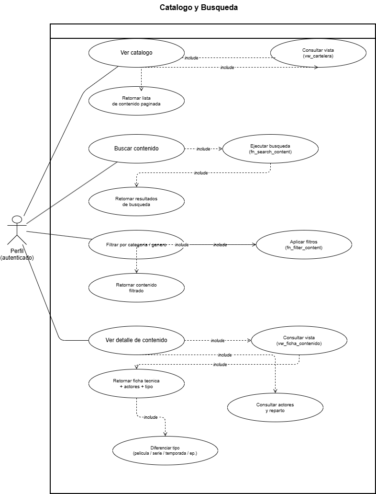

| Nombre        | Catalogo y Busqueda |
| :------------ | :------------------ |
| **Actores**   | Perfil (autenticado) |
| **Propósito** | Permitir al perfil autenticado explorar el catálogo de contenido multimedia, buscar por título, filtrar por categoría o género, y consultar el detalle completo de una película o serie incluyendo su ficha técnica y actores. |
| **Resumen**   | El caso de uso inicia cuando el perfil autenticado accede al catálogo. El sistema consulta la vista `vw_cartelera` para listar el contenido disponible. El perfil puede buscar por título mediante la función `fn_search_content`, filtrar por categoría o género mediante `fn_filter_content`, y seleccionar un contenido para ver su detalle completo consultando la vista `vw_ficha_contenido` junto con los actores y reparto asociados. El sistema diferencia entre películas, series, temporadas y episodios para presentar la información correcta. Finaliza cuando el perfil obtiene el detalle del contenido deseado. |

**Curso Normal de Eventos**

| \#  | Acción del Actor | Respuesta del Sistema |
| :-- | :--------------- | :-------------------- |
| 1   | El perfil accede al catálogo. | El sistema consulta la vista `vw_cartelera` y retorna la lista de contenido disponible de forma paginada. |
| 2   | El perfil ingresa un término de búsqueda por título. | El sistema ejecuta `fn_search_content` y retorna los resultados que coinciden con el término ingresado. |
| 3   | El perfil selecciona un filtro de categoría o género. | El sistema ejecuta `fn_filter_content` con los parámetros seleccionados y retorna el contenido filtrado. |
| 4   | El perfil selecciona un contenido para ver su detalle. | El sistema consulta la vista `vw_ficha_contenido` y obtiene los datos técnicos del contenido. |
| 5   |  | El sistema consulta los actores y reparto asociados al contenido. |
| 6   |  | El sistema diferencia el tipo de contenido (película, serie, temporada o episodio) y retorna la ficha técnica completa con actores. |

**Flujos Alternativos y de Excepción**

| Tipo | Descripción |
| :--- | :---------- |
| **Flujo Alternativo** | Si la búsqueda no retorna resultados, `fn_search_content` devuelve lista vacía y el sistema muestra un mensaje informativo al perfil. |
| **Flujo Alternativo** | Si no existe contenido que coincida con los filtros aplicados, `fn_filter_content` devuelve lista vacía y el sistema lo indica. |
| **Flujo Alternativo** | Si el contenido solicitado en el detalle no existe, `vw_ficha_contenido` retorna vacío y el sistema responde con 404: Content not found. |
| **Flujo de Excepción** | Si el Catalog Service no está disponible, el API Gateway retorna 503: Catalog Service unavailable. Aplica a todos los flujos del módulo. |

### Modulo 4 Suscribirse y Gestionar Planes

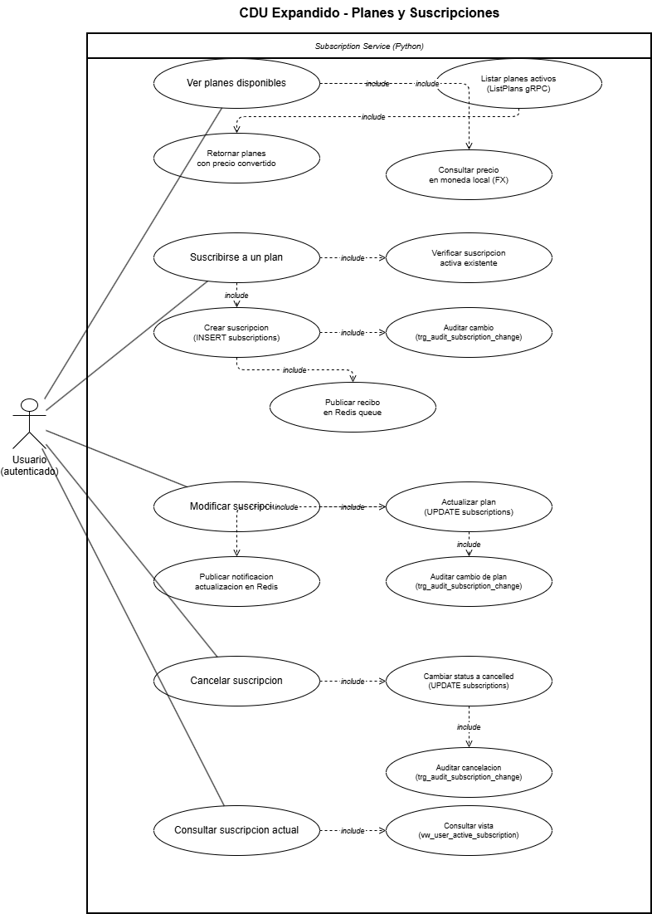

| Nombre        | Planes y Suscripciones |
| :------------ | :--------------------- |
| **Actores**   | Usuario (autenticado) |
| **Propósito** | Permitir al usuario ver los planes disponibles con su precio en moneda local, suscribirse a un plan, modificar o cancelar su suscripción activa y consultar el estado de su suscripción actual. |
| **Resumen**   | El caso de uso inicia cuando el usuario autenticado accede a la sección de planes. El sistema lista los planes activos vía `ListPlans` gRPC y consulta el FX-Service para mostrar el precio convertido a moneda local. Al suscribirse, el sistema verifica que no exista ya una suscripción activa mediante el índice único `ux_subscriptions_one_active_per_user`, inserta el registro y el trigger `trg_audit_subscription_change` registra el evento automáticamente. Al modificar o cancelar, el mismo trigger audita el cambio. En todos los casos de creación y modificación se publica un evento en la cola Redis para que el Notification Service envíe el recibo al usuario. |

**Curso Normal de Eventos**

| \#  | Acción del Actor | Respuesta del Sistema |
| :-- | :--------------- | :-------------------- |
| 1   | El usuario solicita ver los planes disponibles. | El sistema llama a `ListPlans` gRPC, obtiene los planes activos (Básico $5, Estándar $8, Premium $12) y consulta el FX-Service para convertir los precios a la moneda local del usuario. |
| 2   | El usuario selecciona un plan y confirma la suscripción. | El sistema verifica que el usuario no tenga ya una suscripción activa. |
| 3   |  | El sistema inserta la suscripción con status `active` y el trigger `trg_audit_subscription_change` registra el evento en `subscription_audit`. |
| 4   |  | El sistema publica un evento `purchase_receipt` en la cola Redis para envío de recibo por correo. |
| 5   | El usuario solicita modificar su plan actual. | El sistema actualiza el `plan_id` de la suscripción activa, el trigger audita el cambio de plan y se publica un evento `subscription_update` en Redis. |
| 6   | El usuario solicita cancelar su suscripción. | El sistema actualiza el status a `cancelled`, el trigger registra el cambio y retorna confirmación. |
| 7   | El usuario consulta su suscripción actual. | El sistema consulta la vista `vw_user_active_subscription` y retorna los datos del plan activo con precio y fechas. |

**Flujos Alternativos y de Excepción**

| Tipo | Descripción |
| :--- | :---------- |
| **Flujo Alternativo** | Si el usuario ya tiene una suscripción activa al intentar crear una nueva, el índice único lanza error y el sistema retorna: "user already has an active subscription". |
| **Flujo Alternativo** | Si el plan seleccionado no existe o está inactivo, el sistema retorna: "plan not found" y no crea ni modifica la suscripción. |
| **Flujo Alternativo** | Si la suscripción a cancelar no existe o ya está cancelada, el sistema retorna `success=False` con el mensaje "subscription not found". |
| **Flujo Alternativo** | Si el Notification Service falla al publicar el evento en Redis, el sistema registra el warning en logs pero no interrumpe el flujo principal. |
| **Flujo de Excepción** | Si el Subscription Service no está disponible, el API Gateway retorna 503: Service unavailable. Aplica a todos los flujos del módulo. |

### Modulo 5 Consultar Tipo de Cambio

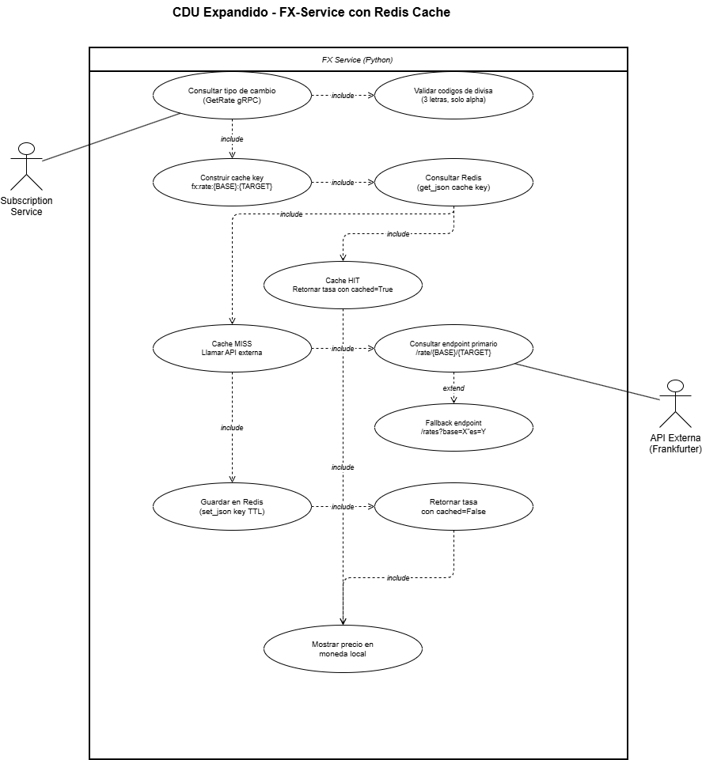

| Nombre        | FX-Service con Redis Cache |
| :------------ | :------------------------- |
| **Actores**   | Subscription Service, API Externa Frankfurter |
| **Propósito** | Consultar el tipo de cambio entre dos divisas utilizando Redis como capa de caché con TTL para evitar llamadas repetitivas a la API externa, y retornar la tasa para mostrar precios en moneda local. |
| **Resumen**   | El caso de uso inicia cuando el Subscription Service llama a `GetRate` vía gRPC. El sistema valida los códigos de divisa, construye la cache key `fx:rate:{BASE}:{TARGET}` y consulta Redis. Si hay cache HIT retorna la tasa con `cached=True`. Si hay cache MISS llama al endpoint primario de Frankfurter `/rate/{BASE}/{TARGET}` y si falla hace fallback a `/rates?base=X&quotes=Y`. Una vez obtenida la tasa la guarda en Redis con TTL y la retorna con `cached=False`. En ambos casos el Subscription Service usa la tasa para convertir y mostrar el precio del plan en la moneda local del usuario. |

**Curso Normal de Eventos**

| \#  | Acción del Actor | Respuesta del Sistema |
| :-- | :--------------- | :-------------------- |
| 1   | El Subscription Service llama a `GetRate(base, target)` vía gRPC. | El sistema valida que ambos códigos sean de 3 letras alfabéticas. |
| 2   |  | El sistema construye la cache key `fx:rate:{BASE}:{TARGET}` y consulta Redis con `get_json`. |
| 3a  | Cache HIT. | El sistema retorna la tasa almacenada con `cached=True` sin llamar a la API externa. |
| 3b  | Cache MISS. | El sistema llama al endpoint primario de Frankfurter `/rate/{BASE}/{TARGET}`. |
| 4   |  | Si el endpoint primario falla, el sistema hace fallback al endpoint `/rates` con parámetros `base` y `quotes`. |
| 5   |  | El sistema guarda la tasa obtenida en Redis con `set_json` y el TTL configurado (`FX_CACHE_TTL`). |
| 6   |  | El sistema retorna la tasa con `cached=False`, `base`, `target`, `rate` y `timestamp`. |
| 7   |  | El Subscription Service usa la tasa para calcular y mostrar el precio del plan en moneda local. |

**Flujos Alternativos y de Excepción**

| Tipo | Descripción |
| :--- | :---------- |
| **Flujo Alternativo** | Si `base` es igual a `target`, el sistema retorna `rate=1.0` directamente sin consultar Redis ni la API externa. |
| **Flujo Alternativo** | Si el código de divisa tiene menos de 3 letras o contiene caracteres no alfabéticos, el sistema retorna `success=False`: "currency codes must be 3 letters". |
| **Flujo de Excepción** | Si la API externa Frankfurter no está disponible o retorna error HTTP, el sistema lanza `FxProviderError` y retorna `success=False`: "could not fetch fx rate". |
| **Flujo de Excepción** | Si Redis no está disponible al intentar guardar la tasa, el sistema registra un warning en logs pero no interrumpe el flujo y retorna la tasa igualmente. |

### Modulo 6 Calificar Contenido

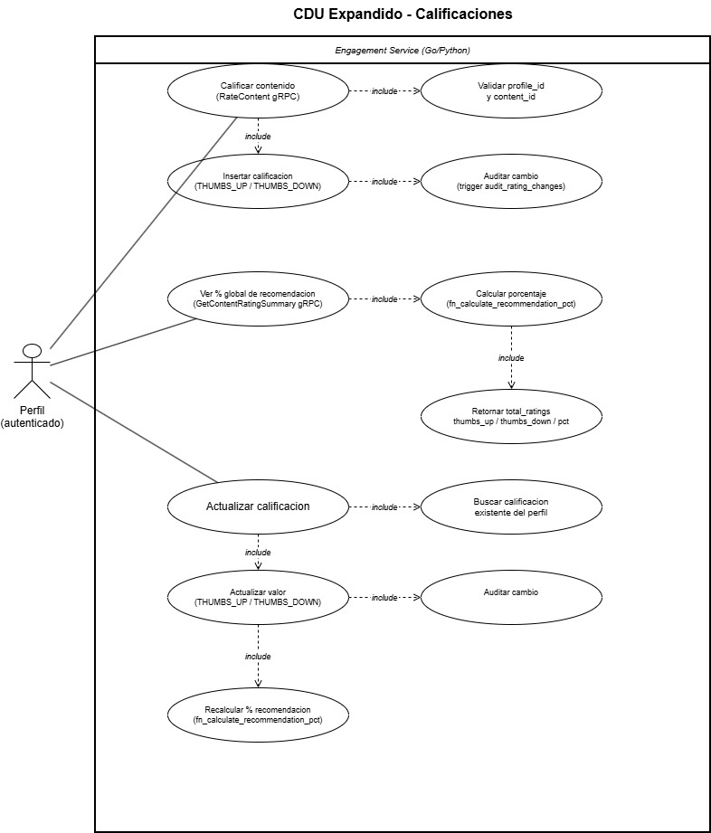

| Nombre        | Calificaciones |
| :------------ | :------------- |
| **Actores**   | Perfil (autenticado) |
| **Propósito** | Permitir al perfil autenticado calificar contenido con pulgar arriba o abajo, consultar el porcentaje global de recomendación calculado dinámicamente y actualizar una calificación previamente registrada. |
| **Resumen**   | El caso de uso inicia cuando el perfil selecciona un contenido y decide calificarlo. El sistema recibe la llamada `RateContent` vía gRPC con el `profile_id`, `content_id` y el valor `THUMBS_UP` o `THUMBS_DOWN`, valida los campos, inserta la calificación y el trigger `audit_rating_changes` registra el evento. El porcentaje global se calcula dinámicamente con `fn_calculate_recommendation_pct` usando la fórmula `thumbs_up_count / total_ratings * 100` y se muestra en el catálogo y detalle del contenido. Si el perfil ya calificó el contenido puede actualizar su valor, lo que recalcula el porcentaje automáticamente. |

**Curso Normal de Eventos**

| \#  | Acción del Actor | Respuesta del Sistema |
| :-- | :--------------- | :-------------------- |
| 1   | El perfil selecciona THUMBS_UP o THUMBS_DOWN para un contenido. | El sistema recibe `RateContent(profile_id, content_id, rating)` vía gRPC y valida que `profile_id` y `content_id` no estén vacíos. |
| 2   |  | El sistema inserta la calificación en la tabla `ratings` y el trigger `audit_rating_changes` registra el evento automáticamente. |
| 3   | El perfil o el catálogo solicita el resumen de calificaciones. | El sistema llama a `GetContentRatingSummary(content_id)` y ejecuta `fn_calculate_recommendation_pct` para calcular el porcentaje. |
| 4   |  | El sistema retorna `total_ratings`, `thumbs_up_count`, `thumbs_down_count` y `recommendation_percentage` (fórmula: thumbs_up / total * 100). |
| 5   | El perfil cambia su calificación previa a un nuevo valor. | El sistema busca la calificación existente del perfil para ese contenido y actualiza el valor. |
| 6   |  | El trigger `audit_rating_changes` registra el cambio y el sistema recalcula el porcentaje global con `fn_calculate_recommendation_pct`. |

**Flujos Alternativos y de Excepción**

| Tipo | Descripción |
| :--- | :---------- |
| **Flujo Alternativo** | Si el contenido no tiene calificaciones, `total_ratings = 0` y `recommendation_percentage = 0.0` sin error. |
| **Flujo Alternativo** | Si no existe calificación previa al actualizar, el sistema trata la operación como un nuevo insert usando `RateContent` con el valor indicado. |
| **Flujo de Excepción** | Si el Engagement Service no está disponible, el API Gateway retorna 503: Service unavailable. Aplica a todos los flujos del módulo. |

### Modulo 7 Consultar Historial de Reproduccion

| Nombre        | Historial de Reproduccion |
| :------------ | :------------------------ |
| **Actores**   | Perfil (autenticado) |
| **Propósito** | Permitir al perfil registrar su progreso de visualización por contenido, consultar su historial reciente y reanudar la reproducción desde el último punto guardado, almacenando temporada, episodio y minuto exacto para series. |
| **Resumen**   | El caso de uso inicia cuando el perfil reproduce contenido. El sistema llama a `SaveProgress` vía gRPC con `profile_id`, `content_id`, `season_number`, `episode_number` y `minute`. Para películas `season_number` y `episode_number` se envían en 0. El procedimiento `save_watch_progress` inserta o actualiza el registro. El perfil puede consultar su historial reciente mediante `GetRecentHistory`, que consulta la vista `vw_recent_profile_history` con un límite configurable. Al seleccionar un contenido para reanudar, `ResumeContent` busca el último progreso y retorna el punto exacto para iniciar la reproducción desde donde se dejó. |

**Curso Normal de Eventos**

| \#  | Acción del Actor | Respuesta del Sistema |
| :-- | :--------------- | :-------------------- |
| 1   | El perfil reproduce contenido y el sistema registra el progreso. | El sistema recibe `SaveProgress(profile_id, content_id, season, episode, minute)` vía gRPC y valida que `profile_id` y `content_id` no estén vacíos. |
| 2   |  | El sistema detecta el tipo de contenido: si `season=0` y `episode=0` es película, si tienen valores reales es serie. Ejecuta `save_watch_progress` para insertar o actualizar el registro. |
| 3   |  | El sistema retorna `success=True` con mensaje de confirmación. |
| 4   | El perfil accede a la sección continuar viendo. | El sistema llama a `GetRecentHistory(profile_id, limit)`, consulta `vw_recent_profile_history` y aplica el límite configurado. |
| 5   |  | El sistema retorna la lista de `HistoryItem` con `content_id`, `season_number`, `episode_number`, `minute` y `updated_at` ordenados por más reciente. |
| 6   | El perfil selecciona un contenido para reanudar. | El sistema llama a `ResumeContent(profile_id, content_id)` y busca el último progreso registrado. |
| 7   |  | El sistema retorna `found=True` con `season`, `episode` y `minute` exactos, y el frontend inicia la reproducción desde ese punto. |

**Flujos Alternativos y de Excepción**

| Tipo | Descripción |
| :--- | :---------- |
| **Flujo Alternativo** | Si es la primera vez que el perfil ve el contenido, no existe registro previo y el sistema inserta uno nuevo en lugar de actualizar. |
| **Flujo Alternativo** | Si el perfil no tiene historial, `GetRecentHistory` retorna lista vacía y el frontend muestra la sección "Continuar viendo" vacía. |
| **Flujo Alternativo** | Si no existe progreso guardado para el contenido al reanudar, `ResumeContent` retorna `found=False` y el frontend inicia la reproducción desde el principio. |
| **Flujo de Excepción** | Si el Engagement Service no está disponible, el API Gateway retorna 503: Service unavailable. Aplica a todos los flujos del módulo. |

###  Notificaciones por Correo

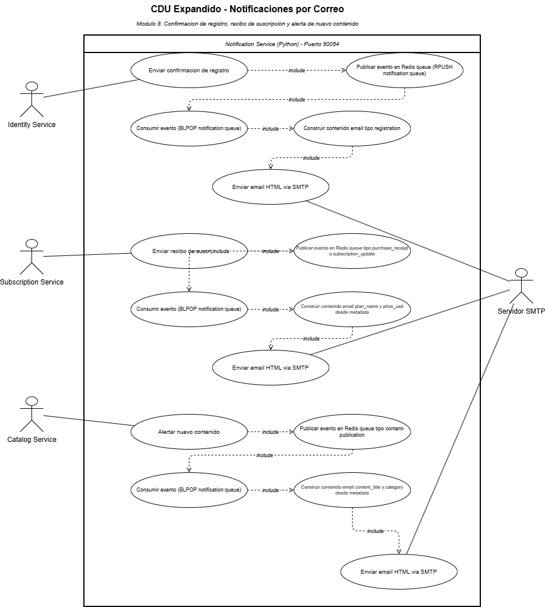

| Nombre        | Notificaciones por Correo |
| :------------ | :------------------------ |
| **Actores**   | Identity Service, Subscription Service, Catalog Service, Servidor SMTP |
| **Propósito** | Enviar notificaciones automáticas por correo electrónico para confirmación de registro, recibos de suscripción y alertas de nuevo contenido, utilizando Redis como cola de mensajes desacoplada entre los servicios productores y el Notification Service. |
| **Resumen**   | El caso de uso no es iniciado directamente por el usuario sino por otros servicios del sistema. El Identity Service publica un evento tipo `registration` en la cola Redis al registrar un usuario. El Subscription Service publica eventos tipo `purchase_receipt` o `subscription_update` al crear o modificar una suscripción. El Catalog Service publica eventos tipo `content-publication` al agregar nuevo contenido. El Notification Service consume los eventos de la cola mediante `BLPOP`, construye el contenido del email según el tipo de notificación y lo envía vía SMTP con formato HTML. Si SMTP no está configurado, usa un fallback de consola registrando el evento en logs. |

**Curso Normal de Eventos**

| \#  | Acción del Actor | Respuesta del Sistema |
| :-- | :--------------- | :-------------------- |
| 1   | Identity Service registra un usuario exitosamente. | Identity Service publica un evento `registration` en Redis con `RPUSH notification:queue`, incluyendo `email`, `user_id`, `full_name` y `subject`. |
| 2   | Subscription Service crea o modifica una suscripción. | Subscription Service publica un evento `purchase_receipt` o `subscription_update` en Redis con `plan_name`, `price_usd` y datos de la suscripción en `metadata`. |
| 3   | Catalog Service publica nuevo contenido. | Catalog Service publica un evento `content-publication` en Redis con `content_title` y `category` en `metadata`. |
| 4   |  | El worker del Notification Service consume el evento con `BLPOP notification:queue` y deserializa el payload JSON. |
| 5   |  | El sistema identifica el tipo de notificación y construye el subject y body del email con `_build_notification_content`. |
| 6   |  | El sistema arma el email HTML con el template de Quetxal TV y lo envía al destinatario vía SMTP usando `aiosmtplib`. |
| 7   |  | El servidor SMTP entrega el correo al usuario y el sistema registra el envío exitoso en logs. |

**Flujos Alternativos y de Excepción**

| Tipo | Descripción |
| :--- | :---------- |
| **Flujo Alternativo** | Si SMTP no está configurado o `aiosmtplib` no está instalado, el sistema usa console fallback: registra el payload completo en logs sin enviar email. |
| **Flujo Alternativo** | Si el envío SMTP falla, el sistema registra la excepción en logs y continúa procesando el siguiente evento de la cola sin reintentar. |
| **Flujo Alternativo** | Si el worker encuentra un error al procesar un evento, registra la excepción y espera 2 segundos antes de continuar con el siguiente. |
| **Flujo de Excepción** | Si Redis no está disponible al publicar el evento, el servicio productor (Identity o Subscription) registra un warning en logs pero no interrumpe el flujo principal de su operación. |

### Acceder al Panel de Administración

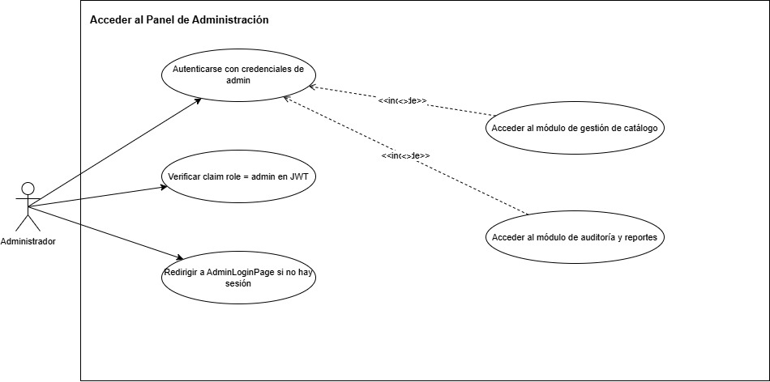

| Campo | Detalle |
| :------------ | :------------------------------------------------------------------------------------- |
| **Nombre** | Acceder al Panel de Administración |
| **Actores** | Administrador |
| **Propósito** | Garantizar que únicamente usuarios con rol `admin` puedan acceder al panel de administración de Quetxal TV, validando credenciales y el claim de rol en el JWT antes de exponer cualquier módulo administrativo. |
| **Resumen** | El caso de uso inicia cuando un usuario intenta acceder a la ruta `/admin`. El sistema verifica si existe una sesión activa con claim `role = admin` en el JWT. Si no existe, redirige a `AdminLoginPage` donde el administrador ingresa sus credenciales. El API Gateway valida el token y el claim de rol mediante el middleware `admin.middleware.ts`. Si la validación es exitosa, el administrador accede al panel y puede navegar hacia el módulo de gestión de catálogo o el módulo de auditoría y reportes. Finaliza cuando el administrador tiene acceso activo al panel o cuando la sesión es rechazada. |

#### Curso Normal de Eventos

| \# | Acción del Actor | Respuesta del Sistema |
| :-- | :--------------- | :-------------------- |
| 1 | El administrador intenta acceder a la ruta `/admin`. | El sistema verifica si existe una cookie con JWT válido en la solicitud. |
| 2 | | Si no existe sesión activa, el sistema redirige al administrador a `AdminLoginPage`. |
| 3 | El administrador ingresa su correo y contraseña en `AdminLoginPage`. | El sistema valida las credenciales contra el `identity-service` vía gRPC. |
| 4 | | El sistema verifica que el JWT generado contenga el claim `role = admin`. |
| 5 | | El `admin.middleware.ts` en el API Gateway intercepta la solicitud y valida el claim `role`. |
| 6 | | El sistema concede acceso al panel y renderiza la interfaz de administración. |
| 7 | El administrador selecciona el módulo de gestión de catálogo. | El sistema navega al módulo de gestión de catálogo de contenido. |
| 8 | El administrador selecciona el módulo de auditoría y reportes. | El sistema navega al módulo de visualización del log transaccional. |

#### Flujos Alternativos y de Excepción

| Tipo | Descripción |
| :--- | :---------- |
| **Flujo Alternativo** | Si el administrador ya tiene una sesión activa con `role = admin`, el sistema omite la pantalla de login y concede acceso directamente al panel. |
| **Flujo Alternativo** | Si las credenciales son incorrectas, el sistema retorna 401 y muestra mensaje de error sin revelar cuál campo es incorrecto. |
| **Flujo de Excepción** | Si el JWT existe pero el claim `role` no es `admin`, el `admin.middleware.ts` retorna 403: "Forbidden" y bloquea el acceso al panel. |
| **Flujo de Excepción** | Si el token en la cookie es inválido o expirado, el API Gateway retorna 401: "Invalid or expired token". |
| **Flujo de Excepción** | Si el `identity-service` no está disponible, el API Gateway retorna 503: "Identity Service unavailable". |

### Gestionar Catálogo de Contenido

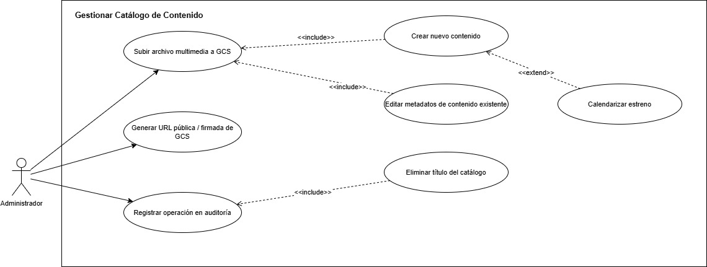

| Campo | Detalle |
| :------------ | :------------------------------------------------------------------------------------- |
| **Nombre** | Gestionar Catálogo de Contenido |
| **Actores** | Administrador |
| **Propósito** | Permitir al administrador crear, editar y eliminar contenido multimedia del catálogo de Quetxal TV, incluyendo la carga de archivos a Google Cloud Storage, la generación de URLs de acceso y el registro automático de cada operación en la tabla de auditoría. |
| **Resumen** | El caso de uso inicia cuando el administrador accede al módulo de gestión de catálogo dentro del panel de administración. El administrador puede crear nuevo contenido cargando metadatos y archivos multimedia, los cuales se almacenan en GCS y retornan URLs firmadas para consumo del frontend. Puede también editar metadatos existentes o eliminar títulos del catálogo. Cada operación de escritura dispara automáticamente el trigger de auditoría. Opcionalmente, al crear o editar contenido, el administrador puede calendarizar la fecha exacta de estreno. Finaliza cuando la operación sobre el catálogo se completa y los cambios quedan persistidos y auditados. |

#### Curso Normal de Eventos

| \# | Acción del Actor | Respuesta del Sistema |
| :-- | :--------------- | :-------------------- |
| 1 | El administrador accede al módulo de gestión de catálogo. | El sistema renderiza el listado actual de contenidos del catálogo. |
| 2 | El administrador selecciona crear nuevo contenido e ingresa título, categoría, descripción y archivos (video y portada). | El sistema valida los campos obligatorios y el formato de los archivos. |
| 3 | | El sistema carga los archivos al bucket de Google Cloud Storage (`media_store.go`). |
| 4 | | El sistema genera URLs públicas o firmadas de GCS para los archivos cargados. |
| 5 | | El sistema persiste el registro del contenido en la base de datos del `catalog-service` incluyendo las URLs de GCS. |
| 6 | | El trigger de auditoría registra automáticamente el INSERT con usuario responsable, timestamp y estado nuevo. |
| 7 | El administrador selecciona un contenido existente y modifica sus metadatos. | El sistema actualiza el registro en base de datos. El trigger registra el UPDATE con estado anterior y nuevo. |
| 8 | El administrador define una fecha de estreno para el contenido. | El sistema almacena el campo `release_date`. El contenido solo será visible en el catálogo del usuario cuando `release_date <= NOW()`. |
| 9 | El administrador elimina un título del catálogo. | El sistema elimina el registro de base de datos y los archivos asociados en GCS. El trigger registra la operación en auditoría. |

#### Flujos Alternativos y de Excepción

| Tipo | Descripción |
| :--- | :---------- |
| **Flujo Alternativo** | Si el administrador no adjunta archivo de video o portada al crear contenido, el sistema acepta el registro solo con la URL de GCS que ya exista, o lo rechaza si el campo es obligatorio. |
| **Flujo Alternativo** | Si el administrador define una `release_date` futura, el contenido se crea pero no aparece en el catálogo del usuario hasta que se alcance esa fecha. |
| **Flujo de Excepción** | Si la carga del archivo a GCS falla, el sistema retorna error, no persiste el registro en base de datos y no dispara el trigger de auditoría. |
| **Flujo de Excepción** | Si el `catalog-service` no está disponible, el API Gateway retorna 503: "Catalog Service unavailable". |
| **Flujo de Excepción** | Si el administrador intenta eliminar un contenido que no existe, el sistema retorna 404: "Content not found". |

### Administrar Reportes de Auditoría

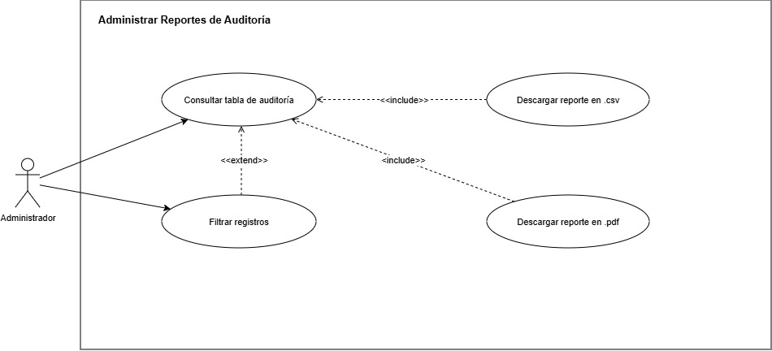
| Campo | Detalle |
| :------------ | :------------------------------------------------------------------------------------- |
| **Nombre** | Administrar Reportes de Auditoría |
| **Actores** | Administrador |
| **Propósito** | Permitir al administrador visualizar el log transaccional completo de la tabla de auditoría, aplicar filtros sobre los registros y descargar reportes formateados en `.csv` o `.pdf` para trazabilidad y control del sistema. |
| **Resumen** | El caso de uso inicia cuando el administrador accede al módulo de auditoría dentro del panel de administración. El sistema consulta la tabla de auditoría y presenta el log transaccional con información de usuario responsable, timestamp, tabla afectada, estado anterior y nuevo. El administrador puede filtrar los registros por rango de fecha, tabla o usuario. Opcionalmente, puede descargar el reporte completo o filtrado en formato `.csv` o `.pdf`. Finaliza cuando el administrador ha consultado o descargado la información requerida. |

#### Curso Normal de Eventos

| \# | Acción del Actor | Respuesta del Sistema |
| :-- | :--------------- | :-------------------- |
| 1 | El administrador accede al módulo de auditoría y reportes. | El sistema consulta la tabla de auditoría y renderiza el log transaccional ordenado por timestamp descendente. |
| 2 | | El sistema muestra para cada registro: usuario responsable, timestamp exacto, tabla afectada, estado anterior (`OLD`) y estado nuevo (`NEW`). |
| 3 | El administrador aplica filtros por rango de fecha, tabla afectada o usuario responsable. | El sistema filtra los registros según los criterios seleccionados y actualiza la vista del log. |
| 4 | El administrador selecciona descargar el reporte en `.csv`. | El sistema genera un archivo `.csv` bien ordenado con los registros visibles y lo descarga en el navegador. |
| 5 | El administrador selecciona descargar el reporte en `.pdf`. | El sistema genera un archivo `.pdf` formateado con los registros visibles y lo descarga en el navegador. |

#### Flujos Alternativos y de Excepción

| Tipo | Descripción |
| :--- | :---------- |
| **Flujo Alternativo** | Si no existen registros en la tabla de auditoría, el sistema muestra el log vacío con mensaje informativo y deshabilita los botones de descarga. |
| **Flujo Alternativo** | Si los filtros aplicados no retornan resultados, el sistema muestra tabla vacía con mensaje "No se encontraron registros con los filtros seleccionados". |
| **Flujo de Excepción** | Si la generación del archivo `.csv` o `.pdf` falla en el servidor, el sistema retorna 500 y muestra mensaje de error al administrador sin interrumpir la vista del log. |
| **Flujo de Excepción** | Si la base de datos de auditoría no está disponible, el sistema retorna 503 y muestra mensaje: "No es posible consultar el log de auditoría en este momento". |

### Despliegue y Gestión de Contenedores

| Campo | Detalle |
| :------------ | :------------------------------------------------------------------------------------- |
| **Nombre** | Despliegue y Gestión de Contenedores |
| **Actores** | GitHub Actions, Kubernetes |
| **Propósito** | Automatizar el ciclo completo de integración, empaquetado y despliegue de los microservicios de Quetxal TV mediante un pipeline CI/CD con cortocircuito crítico, garantizando disponibilidad continua en producción mediante estrategias de RollingUpdate, Rollback automático y monitoreo de salud con Readiness y Liveness Probes. |
| **Resumen** | El caso de uso inicia cuando se realiza un push o merge a las ramas `develop` o `release`. GitHub Actions ejecuta el pipeline validando pruebas unitarias con cobertura mínima del 75% antes de permitir cualquier empaquetado. Si las pruebas pasan, construye y publica las imágenes Docker en el registro privado. Según la rama impactada, despliega en Google Compute Engine (`develop`) o en Google Kubernetes Engine (`release`). En el despliegue a GKE aplica obligatoriamente la estrategia RollingUpdate y genera el tag semántico de versión. Kubernetes monitorea continuamente la salud de cada contenedor mediante Readiness y Liveness Probes. Si los pods fallan en su inicialización, el pipeline ejecuta Rollback automático. Finaliza cuando todos los pods están en estado `Running` y el tráfico fluye correctamente a través del Ingress. |

#### Curso Normal de Eventos

| \# | Acción del Actor | Respuesta del Sistema |
| :-- | :--------------- | :-------------------- |
| 1 | Se realiza push o merge a rama `develop` o `release`. | GitHub Actions detecta el evento y dispara el pipeline `deploy-develop.yml`. |
| 2 | | El pipeline ejecuta las pruebas unitarias del backend políglota (Go, TypeScript, Python). |
| 3 | | El pipeline valida que la cobertura de código sea igual o mayor al 75% sobre el total de endpoints. |
| 4 | | El pipeline ejecuta el backup programado de todas las bases de datos operacionales (excluye Redis). |
| 5 | | El pipeline construye las imágenes Docker de frontend y backend y las publica en el registro privado de imágenes. |
| 6 | Si la rama impactada es `develop`. | El pipeline despliega automáticamente la arquitectura en las VMs de Google Compute Engine. |
| 7 | Si la rama impactada es `release`. | El pipeline genera el tag semántico (`v2.x.0`) y despliega los pods en el clúster de GKE aplicando estrategia RollingUpdate. |
| 8 | | Kubernetes aplica RollingUpdate sustituyendo gradualmente los pods de la versión anterior por los nuevos sin interrumpir el servicio. |
| 9 | | Kubernetes evalúa el Readiness Probe de cada pod para determinar cuándo está listo para recibir tráfico del API Gateway. |
| 10 | | Kubernetes evalúa el Liveness Probe de cada pod de forma continua para detectar procesos congelados o muertos. |

#### Flujos Alternativos y de Excepción

| Tipo | Descripción |
| :--- | :---------- |
| **Flujo Alternativo** | Si la cobertura cae por debajo del 75%, el pipeline aplica cortocircuito crítico, detiene la ejecución de inmediato y no progresa a las etapas de empaquetado ni despliegue. |
| **Flujo Alternativo** | Si el backup de bases de datos falla, el pipeline detiene su ejecución antes del empaquetado para proteger la integridad de los datos. |
| **Flujo de Excepción** | Si los nuevos pods entran en `CrashLoopBackOff` tras el despliegue en GKE, el pipeline ejecuta automáticamente `kubectl rollout undo` restaurando la última versión estable del release. |
| **Flujo de Excepción** | Si el Liveness Probe de un pod retorna error de forma persistente, Kubernetes destruye el pod y aprovisiona una nueva instancia automáticamente. |
| **Flujo de Excepción** | Si el Readiness Probe falla, Kubernetes no enruta tráfico hacia ese pod hasta que el probe retorne éxito, evitando que el API Gateway reciba errores. |
| **Flujo de Excepción** | Queda estrictamente prohibido cualquier despliegue manual mediante CLI. Todo cambio estructural en el clúster debe realizarse exclusivamente a través del pipeline de CD. |

### Recomendacion de contenido

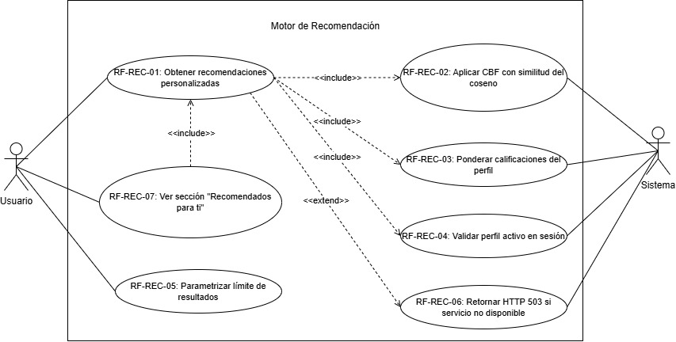

| Campo | Detalle |
| :------------ | :------------------------------------------------------------------------------------- |
| **Nombre** | Motor de Recomendación |
| **Actores** | Usuario, Sistema |
| **Propósito** | Generar y presentar recomendaciones personalizadas de contenido al perfil activo, analizando su historial de visualización y calificaciones mediante Content-Based Filtering con similitud del coseno sobre vectores binarios de géneros. |
| **Resumen** | El caso de uso inicia cuando el frontend solicita recomendaciones para el perfil activo. El API Gateway valida que exista un profile_id en el JWT de sesión y delega la solicitud al recommendation-service vía gRPC. El servicio consulta el catálogo completo desde catalog_db y el historial de visualización con calificaciones desde engagement_db. Construye el perfil de preferencias del usuario ponderando positivamente los contenidos vistos y calificados con THUMBS_UP, y negativamente los calificados con THUMBS_DOWN. Aplica similitud del coseno sobre vectores binarios de géneros para calcular la afinidad entre el perfil y cada contenido no visto. Retorna los K contenidos con mayor puntuación. El frontend renderiza la sección "Recomendados para ti" en el catálogo. Finaliza cuando el usuario visualiza las recomendaciones personalizadas. |

#### Curso Normal de Eventos

| # | Acción del Actor | Respuesta del Sistema |
| :-- | :--------------- | :-------------------- |
| 1 | El usuario accede al catálogo con un perfil activo en sesión. | El frontend ejecuta `GET /api/recommendations?limit=10` adjuntando la cookie de sesión. |
| 2 | | El API Gateway valida el JWT y extrae el `profile_id` del perfil activo. |
| 3 | | El API Gateway invoca `GetRecommendations(profile_id, limit)` en el `recommendation-service` vía gRPC. |
| 4 | | El `recommendation-service` consulta `catalog_db` obteniendo todos los contenidos disponibles con sus géneros mediante `ARRAY_AGG`. |
| 5 | | El `recommendation-service` consulta `engagement_db` obteniendo el historial de visualización del perfil con `LEFT JOIN` sobre la tabla de calificaciones. |
| 6 | | El servicio enriquece cada registro del historial con los géneros obtenidos del catálogo (join en memoria por `content_id`). |
| 7 | | El servicio construye el vocabulario de géneros, genera vectores binarios para cada contenido y calcula el perfil de preferencias del usuario ponderando THUMBS_UP como +1, THUMBS_DOWN como -1 y visto sin calificación como +1. |
| 8 | | El servicio calcula la similitud del coseno entre el vector de perfil del usuario y cada contenido no visto del catálogo usando NumPy. |
| 9 | | El servicio filtra los contenidos con puntuación mayor a cero, ordena por similitud descendente y retorna los K más relevantes. |
| 10 | | El API Gateway serializa la respuesta y retorna HTTP 200 con la lista de `RecommendedContent[]`. |
| 11 | | El frontend renderiza el componente `RecommendedRow` con la sección "Recomendados para ti" entre el hero y los filtros del catálogo. |

#### Flujos Alternativos y de Excepción

| Tipo | Descripción |
| :--- | :---------- |
| **Flujo Alternativo** | Si el perfil no tiene historial de visualización, el vector de perfil es cero y no se generan recomendaciones. El componente `RecommendedRow` retorna `null` sin mostrar sección vacía ni mensaje de error. |
| **Flujo Alternativo** | Si el parámetro `limit` es omitido, el sistema aplica el valor por defecto de 10 recomendaciones. |
| **Flujo Alternativo** | Si todos los contenidos del catálogo ya fueron vistos por el perfil, el servicio retorna lista vacía con `success=true`. |
| **Flujo de Excepción** | Si el JWT no contiene `profile_id`, el API Gateway retorna HTTP 400 sin invocar el `recommendation-service`. |
| **Flujo de Excepción** | Si la consulta a `catalog_db` falla, el servicio retorna `success=false` con mensaje "could not fetch catalog" sin consultar `engagement_db`. |
| **Flujo de Excepción** | Si la consulta a `engagement_db` falla, el servicio retorna `success=false` con mensaje "could not fetch watch history". |
| **Flujo de Excepción** | Si el `recommendation-service` no está disponible, el API Gateway absorbe el fallo retornando HTTP 503 únicamente en `GET /api/recommendations` sin afectar ninguna otra ruta del sistema. |