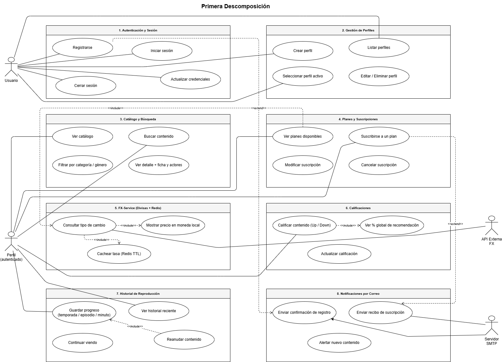
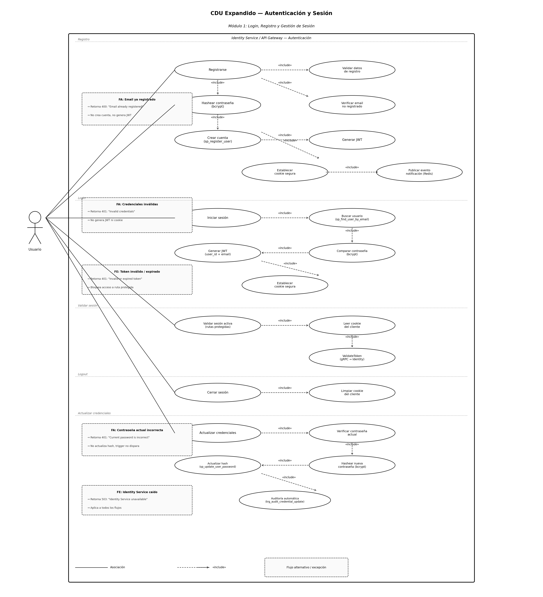
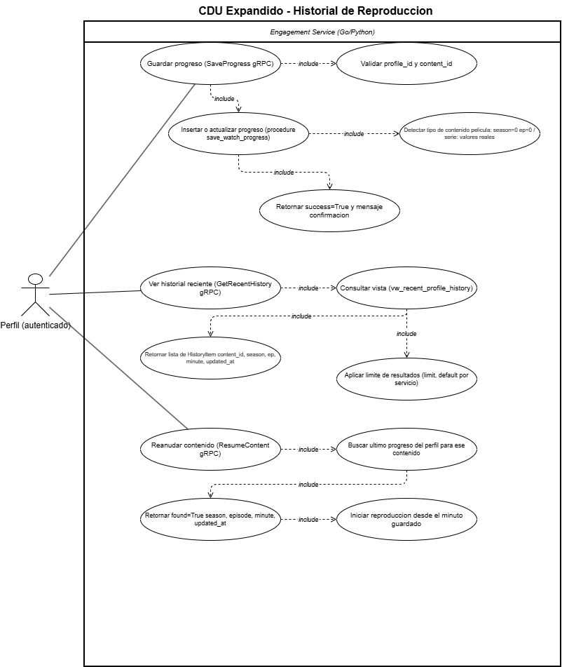

# Casos de Uso

## Core

### Primera Descomposición

## Stakeholders

| Stakeholder | Descripción | Responsabilidades |
| :--- | :--- | :--- |
| Usuario | Usuario final que consume contenido multimedia en la plataforma. | Proveer y validar requerimientos de interacción con el sistema. Validar flujos de registro, login, selección de perfil, búsqueda de contenido y reproducción. |
| Perfil (Usuario autenticado) | Representación de un usuario dentro de una cuenta con historial y preferencias propias. | Validar que el historial, progreso de reproducción y calificaciones se mantengan aislados por perfil. Confirmar flujos de reanudación de contenido. |
| Administrador de la Plataforma | Responsable de la gestión operativa del catálogo y los planes de suscripción. | Proporcionar y validar requerimientos relacionados con la administración del catálogo, carga de contenido, gestión de planes y precios base. |
| Proveedor FX Externo | Servicio externo que provee los tipos de cambio de divisas (Frankfurter API). | Proveer la interfaz de consulta de tasas de cambio. Definir los límites de uso y disponibilidad del servicio para dimensionar la política de caché con Redis. |
| Servidor SMTP | Servicio externo de correo electrónico utilizado para el envío de notificaciones. | Proveer entorno de pruebas (Mailhog en local). Definir credenciales y configuración SMTP para el entorno de producción en GCP. |
| Administrador de Base de Datos | Responsable del diseño, acceso y objetos programables de cada base de datos por microservicio. | Diseñar y validar esquemas, procedimientos almacenados, vistas, funciones y triggers de cada servicio con persistencia. |
| Administrador de Infraestructura | Responsable del entorno de contenedores y despliegue en la nube. | Apoyo en la configuración de Docker, Docker Compose local y cloud, despliegue en Google Cloud Platform y gestión de variables de entorno. |
| Equipo de Desarrollo | Integrantes del proyecto responsables de implementar los microservicios. | Implementar los servicios en TypeScript, Go y Python respetando los contratos gRPC, las políticas de Git y los estándares de documentación. |

##  Diagrama de alto nivel
Este diagrama presenta una vista general del sistema Quetxal TV, mostrando los ocho módulos funcionales que lo componen y los cuatro actores que interactúan con él: el Usuario, el Perfil autenticado, la API Externa FX y el Servidor SMTP. Las relaciones «include» señalan dependencias obligatorias entre casos de uso, mientras que las «extend» representan comportamientos opcionales que se activan bajo ciertas condiciones, como el envío de notificaciones por correo al registrarse o suscribirse a un plan.

--------

## Diagramas por Módulo

### Módulo 1 — Autenticación y Sesión

| Nombre        | Autenticación y Sesión |
| :------------ | :------------------------------------------------------------------------------------- |
| **Actores**   | Usuario |
| **Propósito** | Permitir al usuario registrarse, iniciar sesión, mantener su sesión activa mediante cookies seguras y JWT, cerrar sesión y actualizar sus credenciales de acceso. |
| **Resumen**   | El caso de uso inicia cuando el usuario accede a la plataforma Quetxal TV. El sistema permite registrar una nueva cuenta, iniciar sesión con credenciales existentes y mantener la sesión mediante una cookie segura que contiene un JWT. El API Gateway valida la cookie en cada ruta protegida mediante una llamada gRPC al Identity Service. El usuario puede cerrar sesión en cualquier momento o actualizar su contraseña. Finaliza cuando el usuario tiene una sesión activa con perfil seleccionado o cierra sesión voluntariamente. |

**Curso Normal de Eventos**

| \#  | Acción del Actor | Respuesta del Sistema |
| :-- | :--------------- | :-------------------- |
| 1   | El usuario ingresa email, contraseña y nombre completo para registrarse. | El sistema valida el formato del email y que la contraseña tenga mínimo 8 caracteres. |
| 2   |  | El sistema verifica que el email no esté registrado previamente (`sp_find_user_by_email`). |
| 3   |  | El sistema hashea la contraseña con bcrypt y crea la cuenta (`sp_register_user`). |
| 4   |  | El sistema genera un JWT con `user_id` y `email`, establece la cookie segura (`httpOnly`, `sameSite`) y publica un evento de notificación en Redis. |
| 5   | El usuario ingresa email y contraseña para iniciar sesión. | El sistema busca al usuario por email (`sp_find_user_by_email`) y compara la contraseña con bcrypt. |
| 6   |  | El sistema genera un JWT, establece la cookie segura y retorna `user_id`. |
| 7   | El usuario accede a una ruta protegida. | El API Gateway lee la cookie, llama a `ValidateToken` vía gRPC al Identity Service y adjunta `user_id`, `email` y `profile_id` a la solicitud. |
| 8   | El usuario cierra sesión. | El sistema limpia la cookie del cliente. |
| 9   | El usuario ingresa su contraseña actual y la nueva contraseña. | El sistema verifica la contraseña actual, hashea la nueva con bcrypt y ejecuta `sp_update_user_password`. El trigger `trg_audit_credential_update` registra el cambio automáticamente. |

**Flujos Alternativos y de Excepción**

| Tipo | Descripción |
| :--- | :---------- |
| **Flujo Alternativo** | Si el email ya está registrado durante el registro, el sistema retorna 400: "Email already registered" y no crea la cuenta. |
| **Flujo Alternativo** | Si las credenciales son incorrectas durante el login, el sistema retorna 401: "Invalid credentials" sin revelar cuál campo es incorrecto. |
| **Flujo Alternativo** | Si la contraseña actual es incorrecta al actualizar credenciales, el sistema retorna 401: "Current password is incorrect" y no modifica el hash. |
| **Flujo de Excepción** | Si el token en la cookie es inválido o expirado, el API Gateway retorna 401: "Invalid or expired token" y bloquea el acceso a la ruta protegida. |
| **Flujo de Excepción** | Si el Identity Service no está disponible, el API Gateway retorna 503: "Identity Service unavailable". Aplica a todos los flujos del módulo. |

### Módulo 2 - Gestión de Perfiles

| Nombre        | Gestión de Perfiles |
| :------------ | :------------------ |
| **Actores**   | Usuario (autenticado) |
| **Propósito** | Permitir al usuario crear, listar, seleccionar, editar y eliminar perfiles dentro de su cuenta, con un máximo de cinco perfiles por cuenta. |
| **Resumen**   | El caso de uso inicia cuando el usuario autenticado accede a la gestión de perfiles. El sistema permite crear nuevos perfiles validando el límite de cinco mediante la función `fn_can_create_profile`, listarlos a través de la vista `vw_user_profiles`, seleccionar un perfil activo generando un nuevo JWT que incluye el `profile_id`, editar el nombre y avatar de un perfil existente, y eliminar un perfil verificando que pertenezca al usuario. Finaliza cuando el usuario tiene un perfil activo seleccionado con su JWT actualizado. |

**Curso Normal de Eventos**

| \#  | Acción del Actor | Respuesta del Sistema |
| :-- | :--------------- | :-------------------- |
| 1   | El usuario solicita crear un nuevo perfil con nombre y avatar. | El sistema verifica que el usuario no tenga ya 5 perfiles (`fn_can_create_profile`). |
| 2   |  | El sistema inserta el perfil en la base de datos (`sp_create_profile`) y retorna el `profile_id` y los datos del perfil creado. |
| 3   | El usuario solicita listar sus perfiles. | El sistema consulta la vista `vw_user_profiles` y retorna la lista de perfiles asociados a la cuenta. |
| 4   | El usuario selecciona un perfil activo. | El sistema verifica que el perfil pertenezca al usuario (`sp_find_profile_by_user_and_profile`). |
| 5   |  | El sistema genera un nuevo JWT que incluye `user_id`, `email` y `profile_id`, establece una nueva cookie segura y retorna los datos del perfil. |
| 6   | El usuario edita el nombre o avatar de un perfil. | El sistema actualiza los datos en la base de datos (`sp_update_profile`) y retorna el perfil actualizado. |
| 7   | El usuario elimina un perfil. | El sistema verifica que el perfil pertenezca al usuario, lo elimina (`sp_delete_profile`) y aplica CASCADE sobre historial y calificaciones asociadas. |

**Flujos Alternativos y de Excepción**

| Tipo | Descripción |
| :--- | :---------- |
| **Flujo Alternativo** | Si el usuario ya tiene 5 perfiles, `fn_can_create_profile` retorna FALSE y el sistema responde con el error "User cannot have more than 5 profiles". |
| **Flujo Alternativo** | Si el perfil no pertenece al usuario al intentar seleccionarlo o editarlo, el sistema retorna "Profile not found for this user" y no genera nuevo JWT. |
| **Flujo Alternativo** | Si el perfil no existe al intentar eliminarlo, el sistema retorna "Profile not found for this user" sin realizar cambios. |
| **Flujo de Excepción** | Si el Identity Service no está disponible, el API Gateway retorna 503: "Identity Service unavailable". Aplica a todos los flujos del módulo. | 

### Módulo 3 — Catálogo y Búsqueda

| Nombre        | Catalogo y Busqueda |
| :------------ | :------------------ |
| **Actores**   | Perfil (autenticado) |
| **Propósito** | Permitir al perfil autenticado explorar el catálogo de contenido multimedia, buscar por título, filtrar por categoría o género, y consultar el detalle completo de una película o serie incluyendo su ficha técnica y actores. |
| **Resumen**   | El caso de uso inicia cuando el perfil autenticado accede al catálogo. El sistema consulta la vista `vw_cartelera` para listar el contenido disponible. El perfil puede buscar por título mediante la función `fn_search_content`, filtrar por categoría o género mediante `fn_filter_content`, y seleccionar un contenido para ver su detalle completo consultando la vista `vw_ficha_contenido` junto con los actores y reparto asociados. El sistema diferencia entre películas, series, temporadas y episodios para presentar la información correcta. Finaliza cuando el perfil obtiene el detalle del contenido deseado. |

**Curso Normal de Eventos**

| \#  | Acción del Actor | Respuesta del Sistema |
| :-- | :--------------- | :-------------------- |
| 1   | El perfil accede al catálogo. | El sistema consulta la vista `vw_cartelera` y retorna la lista de contenido disponible de forma paginada. |
| 2   | El perfil ingresa un término de búsqueda por título. | El sistema ejecuta `fn_search_content` y retorna los resultados que coinciden con el término ingresado. |
| 3   | El perfil selecciona un filtro de categoría o género. | El sistema ejecuta `fn_filter_content` con los parámetros seleccionados y retorna el contenido filtrado. |
| 4   | El perfil selecciona un contenido para ver su detalle. | El sistema consulta la vista `vw_ficha_contenido` y obtiene los datos técnicos del contenido. |
| 5   |  | El sistema consulta los actores y reparto asociados al contenido. |
| 6   |  | El sistema diferencia el tipo de contenido (película, serie, temporada o episodio) y retorna la ficha técnica completa con actores. |

**Flujos Alternativos y de Excepción**

| Tipo | Descripción |
| :--- | :---------- |
| **Flujo Alternativo** | Si la búsqueda no retorna resultados, `fn_search_content` devuelve lista vacía y el sistema muestra un mensaje informativo al perfil. |
| **Flujo Alternativo** | Si no existe contenido que coincida con los filtros aplicados, `fn_filter_content` devuelve lista vacía y el sistema lo indica. |
| **Flujo Alternativo** | Si el contenido solicitado en el detalle no existe, `vw_ficha_contenido` retorna vacío y el sistema responde con 404: Content not found. |
| **Flujo de Excepción** | Si el Catalog Service no está disponible, el API Gateway retorna 503: Catalog Service unavailable. Aplica a todos los flujos del módulo. |

### Modulo 4 Planes y Suscripciones

| Nombre        | Planes y Suscripciones |
| :------------ | :--------------------- |
| **Actores**   | Usuario (autenticado) |
| **Propósito** | Permitir al usuario ver los planes disponibles con su precio en moneda local, suscribirse a un plan, modificar o cancelar su suscripción activa y consultar el estado de su suscripción actual. |
| **Resumen**   | El caso de uso inicia cuando el usuario autenticado accede a la sección de planes. El sistema lista los planes activos vía `ListPlans` gRPC y consulta el FX-Service para mostrar el precio convertido a moneda local. Al suscribirse, el sistema verifica que no exista ya una suscripción activa mediante el índice único `ux_subscriptions_one_active_per_user`, inserta el registro y el trigger `trg_audit_subscription_change` registra el evento automáticamente. Al modificar o cancelar, el mismo trigger audita el cambio. En todos los casos de creación y modificación se publica un evento en la cola Redis para que el Notification Service envíe el recibo al usuario. |

**Curso Normal de Eventos**

| \#  | Acción del Actor | Respuesta del Sistema |
| :-- | :--------------- | :-------------------- |
| 1   | El usuario solicita ver los planes disponibles. | El sistema llama a `ListPlans` gRPC, obtiene los planes activos (Básico $5, Estándar $8, Premium $12) y consulta el FX-Service para convertir los precios a la moneda local del usuario. |
| 2   | El usuario selecciona un plan y confirma la suscripción. | El sistema verifica que el usuario no tenga ya una suscripción activa. |
| 3   |  | El sistema inserta la suscripción con status `active` y el trigger `trg_audit_subscription_change` registra el evento en `subscription_audit`. |
| 4   |  | El sistema publica un evento `purchase_receipt` en la cola Redis para envío de recibo por correo. |
| 5   | El usuario solicita modificar su plan actual. | El sistema actualiza el `plan_id` de la suscripción activa, el trigger audita el cambio de plan y se publica un evento `subscription_update` en Redis. |
| 6   | El usuario solicita cancelar su suscripción. | El sistema actualiza el status a `cancelled`, el trigger registra el cambio y retorna confirmación. |
| 7   | El usuario consulta su suscripción actual. | El sistema consulta la vista `vw_user_active_subscription` y retorna los datos del plan activo con precio y fechas. |

**Flujos Alternativos y de Excepción**

| Tipo | Descripción |
| :--- | :---------- |
| **Flujo Alternativo** | Si el usuario ya tiene una suscripción activa al intentar crear una nueva, el índice único lanza error y el sistema retorna: "user already has an active subscription". |
| **Flujo Alternativo** | Si el plan seleccionado no existe o está inactivo, el sistema retorna: "plan not found" y no crea ni modifica la suscripción. |
| **Flujo Alternativo** | Si la suscripción a cancelar no existe o ya está cancelada, el sistema retorna `success=False` con el mensaje "subscription not found". |
| **Flujo Alternativo** | Si el Notification Service falla al publicar el evento en Redis, el sistema registra el warning en logs pero no interrumpe el flujo principal. |
| **Flujo de Excepción** | Si el Subscription Service no está disponible, el API Gateway retorna 503: Service unavailable. Aplica a todos los flujos del módulo. |

### Modulo 5 FX-Service con Redis Cache

| Nombre        | FX-Service con Redis Cache |
| :------------ | :------------------------- |
| **Actores**   | Subscription Service, API Externa Frankfurter |
| **Propósito** | Consultar el tipo de cambio entre dos divisas utilizando Redis como capa de caché con TTL para evitar llamadas repetitivas a la API externa, y retornar la tasa para mostrar precios en moneda local. |
| **Resumen**   | El caso de uso inicia cuando el Subscription Service llama a `GetRate` vía gRPC. El sistema valida los códigos de divisa, construye la cache key `fx:rate:{BASE}:{TARGET}` y consulta Redis. Si hay cache HIT retorna la tasa con `cached=True`. Si hay cache MISS llama al endpoint primario de Frankfurter `/rate/{BASE}/{TARGET}` y si falla hace fallback a `/rates?base=X&quotes=Y`. Una vez obtenida la tasa la guarda en Redis con TTL y la retorna con `cached=False`. En ambos casos el Subscription Service usa la tasa para convertir y mostrar el precio del plan en la moneda local del usuario. |

**Curso Normal de Eventos**

| \#  | Acción del Actor | Respuesta del Sistema |
| :-- | :--------------- | :-------------------- |
| 1   | El Subscription Service llama a `GetRate(base, target)` vía gRPC. | El sistema valida que ambos códigos sean de 3 letras alfabéticas. |
| 2   |  | El sistema construye la cache key `fx:rate:{BASE}:{TARGET}` y consulta Redis con `get_json`. |
| 3a  | Cache HIT. | El sistema retorna la tasa almacenada con `cached=True` sin llamar a la API externa. |
| 3b  | Cache MISS. | El sistema llama al endpoint primario de Frankfurter `/rate/{BASE}/{TARGET}`. |
| 4   |  | Si el endpoint primario falla, el sistema hace fallback al endpoint `/rates` con parámetros `base` y `quotes`. |
| 5   |  | El sistema guarda la tasa obtenida en Redis con `set_json` y el TTL configurado (`FX_CACHE_TTL`). |
| 6   |  | El sistema retorna la tasa con `cached=False`, `base`, `target`, `rate` y `timestamp`. |
| 7   |  | El Subscription Service usa la tasa para calcular y mostrar el precio del plan en moneda local. |

**Flujos Alternativos y de Excepción**

| Tipo | Descripción |
| :--- | :---------- |
| **Flujo Alternativo** | Si `base` es igual a `target`, el sistema retorna `rate=1.0` directamente sin consultar Redis ni la API externa. |
| **Flujo Alternativo** | Si el código de divisa tiene menos de 3 letras o contiene caracteres no alfabéticos, el sistema retorna `success=False`: "currency codes must be 3 letters". |
| **Flujo de Excepción** | Si la API externa Frankfurter no está disponible o retorna error HTTP, el sistema lanza `FxProviderError` y retorna `success=False`: "could not fetch fx rate". |
| **Flujo de Excepción** | Si Redis no está disponible al intentar guardar la tasa, el sistema registra un warning en logs pero no interrumpe el flujo y retorna la tasa igualmente. |

### Modulo 6 Calificaciones

| Nombre        | Calificaciones |
| :------------ | :------------- |
| **Actores**   | Perfil (autenticado) |
| **Propósito** | Permitir al perfil autenticado calificar contenido con pulgar arriba o abajo, consultar el porcentaje global de recomendación calculado dinámicamente y actualizar una calificación previamente registrada. |
| **Resumen**   | El caso de uso inicia cuando el perfil selecciona un contenido y decide calificarlo. El sistema recibe la llamada `RateContent` vía gRPC con el `profile_id`, `content_id` y el valor `THUMBS_UP` o `THUMBS_DOWN`, valida los campos, inserta la calificación y el trigger `audit_rating_changes` registra el evento. El porcentaje global se calcula dinámicamente con `fn_calculate_recommendation_pct` usando la fórmula `thumbs_up_count / total_ratings * 100` y se muestra en el catálogo y detalle del contenido. Si el perfil ya calificó el contenido puede actualizar su valor, lo que recalcula el porcentaje automáticamente. |

**Curso Normal de Eventos**

| \#  | Acción del Actor | Respuesta del Sistema |
| :-- | :--------------- | :-------------------- |
| 1   | El perfil selecciona THUMBS_UP o THUMBS_DOWN para un contenido. | El sistema recibe `RateContent(profile_id, content_id, rating)` vía gRPC y valida que `profile_id` y `content_id` no estén vacíos. |
| 2   |  | El sistema inserta la calificación en la tabla `ratings` y el trigger `audit_rating_changes` registra el evento automáticamente. |
| 3   | El perfil o el catálogo solicita el resumen de calificaciones. | El sistema llama a `GetContentRatingSummary(content_id)` y ejecuta `fn_calculate_recommendation_pct` para calcular el porcentaje. |
| 4   |  | El sistema retorna `total_ratings`, `thumbs_up_count`, `thumbs_down_count` y `recommendation_percentage` (fórmula: thumbs_up / total * 100). |
| 5   | El perfil cambia su calificación previa a un nuevo valor. | El sistema busca la calificación existente del perfil para ese contenido y actualiza el valor. |
| 6   |  | El trigger `audit_rating_changes` registra el cambio y el sistema recalcula el porcentaje global con `fn_calculate_recommendation_pct`. |

**Flujos Alternativos y de Excepción**

| Tipo | Descripción |
| :--- | :---------- |
| **Flujo Alternativo** | Si el contenido no tiene calificaciones, `total_ratings = 0` y `recommendation_percentage = 0.0` sin error. |
| **Flujo Alternativo** | Si no existe calificación previa al actualizar, el sistema trata la operación como un nuevo insert usando `RateContent` con el valor indicado. |
| **Flujo de Excepción** | Si el Engagement Service no está disponible, el API Gateway retorna 503: Service unavailable. Aplica a todos los flujos del módulo. |

### Modulo 7 Historial de Reproduccion

| Nombre        | Historial de Reproduccion |
| :------------ | :------------------------ |
| **Actores**   | Perfil (autenticado) |
| **Propósito** | Permitir al perfil registrar su progreso de visualización por contenido, consultar su historial reciente y reanudar la reproducción desde el último punto guardado, almacenando temporada, episodio y minuto exacto para series. |
| **Resumen**   | El caso de uso inicia cuando el perfil reproduce contenido. El sistema llama a `SaveProgress` vía gRPC con `profile_id`, `content_id`, `season_number`, `episode_number` y `minute`. Para películas `season_number` y `episode_number` se envían en 0. El procedimiento `save_watch_progress` inserta o actualiza el registro. El perfil puede consultar su historial reciente mediante `GetRecentHistory`, que consulta la vista `vw_recent_profile_history` con un límite configurable. Al seleccionar un contenido para reanudar, `ResumeContent` busca el último progreso y retorna el punto exacto para iniciar la reproducción desde donde se dejó. |

**Curso Normal de Eventos**

| \#  | Acción del Actor | Respuesta del Sistema |
| :-- | :--------------- | :-------------------- |
| 1   | El perfil reproduce contenido y el sistema registra el progreso. | El sistema recibe `SaveProgress(profile_id, content_id, season, episode, minute)` vía gRPC y valida que `profile_id` y `content_id` no estén vacíos. |
| 2   |  | El sistema detecta el tipo de contenido: si `season=0` y `episode=0` es película, si tienen valores reales es serie. Ejecuta `save_watch_progress` para insertar o actualizar el registro. |
| 3   |  | El sistema retorna `success=True` con mensaje de confirmación. |
| 4   | El perfil accede a la sección continuar viendo. | El sistema llama a `GetRecentHistory(profile_id, limit)`, consulta `vw_recent_profile_history` y aplica el límite configurado. |
| 5   |  | El sistema retorna la lista de `HistoryItem` con `content_id`, `season_number`, `episode_number`, `minute` y `updated_at` ordenados por más reciente. |
| 6   | El perfil selecciona un contenido para reanudar. | El sistema llama a `ResumeContent(profile_id, content_id)` y busca el último progreso registrado. |
| 7   |  | El s

### Modulo 8 Historial de Reproduccion

| Nombre        | Historial de Reproduccion |
| :------------ | :------------------------ |
| **Actores**   | Perfil (autenticado) |
| **Propósito** | Permitir al perfil registrar su progreso de visualización por contenido, consultar su historial reciente y reanudar la reproducción desde el último punto guardado, almacenando temporada, episodio y minuto exacto para series. |
| **Resumen**   | El caso de uso inicia cuando el perfil reproduce contenido. El sistema llama a `SaveProgress` vía gRPC con `profile_id`, `content_id`, `season_number`, `episode_number` y `minute`. Para películas `season_number` y `episode_number` se envían en 0. El procedimiento `save_watch_progress` inserta o actualiza el registro. El perfil puede consultar su historial reciente mediante `GetRecentHistory`, que consulta la vista `vw_recent_profile_history` con un límite configurable. Al seleccionar un contenido para reanudar, `ResumeContent` busca el último progreso y retorna el punto exacto para iniciar la reproducción desde donde se dejó. |

**Curso Normal de Eventos**

| \#  | Acción del Actor | Respuesta del Sistema |
| :-- | :--------------- | :-------------------- |
| 1   | El perfil reproduce contenido y el sistema registra el progreso. | El sistema recibe `SaveProgress(profile_id, content_id, season, episode, minute)` vía gRPC y valida que `profile_id` y `content_id` no estén vacíos. |
| 2   |  | El sistema detecta el tipo de contenido: si `season=0` y `episode=0` es película, si tienen valores reales es serie. Ejecuta `save_watch_progress` para insertar o actualizar el registro. |
| 3   |  | El sistema retorna `success=True` con mensaje de confirmación. |
| 4   | El perfil accede a la sección continuar viendo. | El sistema llama a `GetRecentHistory(profile_id, limit)`, consulta `vw_recent_profile_history` y aplica el límite configurado. |
| 5   |  | El sistema retorna la lista de `HistoryItem` con `content_id`, `season_number`, `episode_number`, `minute` y `updated_at` ordenados por más reciente. |
| 6   | El perfil selecciona un contenido para reanudar. | El sistema llama a `ResumeContent(profile_id, content_id)` y busca el último progreso registrado. |
| 7   |  | El sistema retorna `found=True` con `season`, `episode` y `minute` exactos, y el frontend inicia la reproducción desde ese punto. |

**Flujos Alternativos y de Excepción**

| Tipo | Descripción |
| :--- | :---------- |
| **Flujo Alternativo** | Si es la primera vez que el perfil ve el contenido, no existe registro previo y el sistema inserta uno nuevo en lugar de actualizar. |
| **Flujo Alternativo** | Si el perfil no tiene historial, `GetRecentHistory` retorna lista vacía y el frontend muestra la sección "Continuar viendo" vacía. |
| **Flujo Alternativo** | Si no existe progreso guardado para el contenido al reanudar, `ResumeContent` retorna `found=False` y el frontend inicia la reproducción desde el principio. |
| **Flujo de Excepción** | Si el Engagement Service no está disponible, el API Gateway retorna 503: Service unavailable. Aplica a todos los flujos del módulo. |

### Modulo 8 Notificaciones por Correo

| Nombre        | Notificaciones por Correo |
| :------------ | :------------------------ |
| **Actores**   | Identity Service, Subscription Service, Catalog Service, Servidor SMTP |
| **Propósito** | Enviar notificaciones automáticas por correo electrónico para confirmación de registro, recibos de suscripción y alertas de nuevo contenido, utilizando Redis como cola de mensajes desacoplada entre los servicios productores y el Notification Service. |
| **Resumen**   | El caso de uso no es iniciado directamente por el usuario sino por otros servicios del sistema. El Identity Service publica un evento tipo `registration` en la cola Redis al registrar un usuario. El Subscription Service publica eventos tipo `purchase_receipt` o `subscription_update` al crear o modificar una suscripción. El Catalog Service publica eventos tipo `content-publication` al agregar nuevo contenido. El Notification Service consume los eventos de la cola mediante `BLPOP`, construye el contenido del email según el tipo de notificación y lo envía vía SMTP con formato HTML. Si SMTP no está configurado, usa un fallback de consola registrando el evento en logs. |

**Curso Normal de Eventos**

| \#  | Acción del Actor | Respuesta del Sistema |
| :-- | :--------------- | :-------------------- |
| 1   | Identity Service registra un usuario exitosamente. | Identity Service publica un evento `registration` en Redis con `RPUSH notification:queue`, incluyendo `email`, `user_id`, `full_name` y `subject`. |
| 2   | Subscription Service crea o modifica una suscripción. | Subscription Service publica un evento `purchase_receipt` o `subscription_update` en Redis con `plan_name`, `price_usd` y datos de la suscripción en `metadata`. |
| 3   | Catalog Service publica nuevo contenido. | Catalog Service publica un evento `content-publication` en Redis con `content_title` y `category` en `metadata`. |
| 4   |  | El worker del Notification Service consume el evento con `BLPOP notification:queue` y deserializa el payload JSON. |
| 5   |  | El sistema identifica el tipo de notificación y construye el subject y body del email con `_build_notification_content`. |
| 6   |  | El sistema arma el email HTML con el template de Quetxal TV y lo envía al destinatario vía SMTP usando `aiosmtplib`. |
| 7   |  | El servidor SMTP entrega el correo al usuario y el sistema registra el envío exitoso en logs. |

**Flujos Alternativos y de Excepción**

| Tipo | Descripción |
| :--- | :---------- |
| **Flujo Alternativo** | Si SMTP no está configurado o `aiosmtplib` no está instalado, el sistema usa console fallback: registra el payload completo en logs sin enviar email. |
| **Flujo Alternativo** | Si el envío SMTP falla, el sistema registra la excepción en logs y continúa procesando el siguiente evento de la cola sin reintentar. |
| **Flujo Alternativo** | Si el worker encuentra un error al procesar un evento, registra la excepción y espera 2 segundos antes de continuar con el siguiente. |
| **Flujo de Excepción** | Si Redis no está disponible al publicar el evento, el servicio productor (Identity o Subscription) registra un warning en logs pero no interrumpe el flujo principal de su operación. |