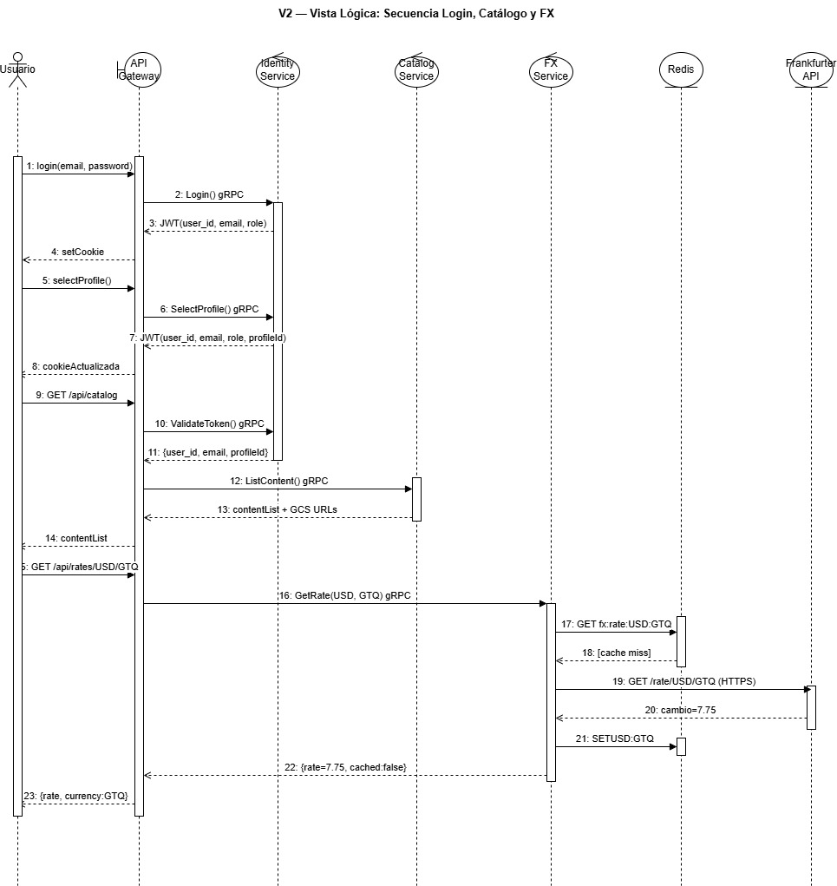
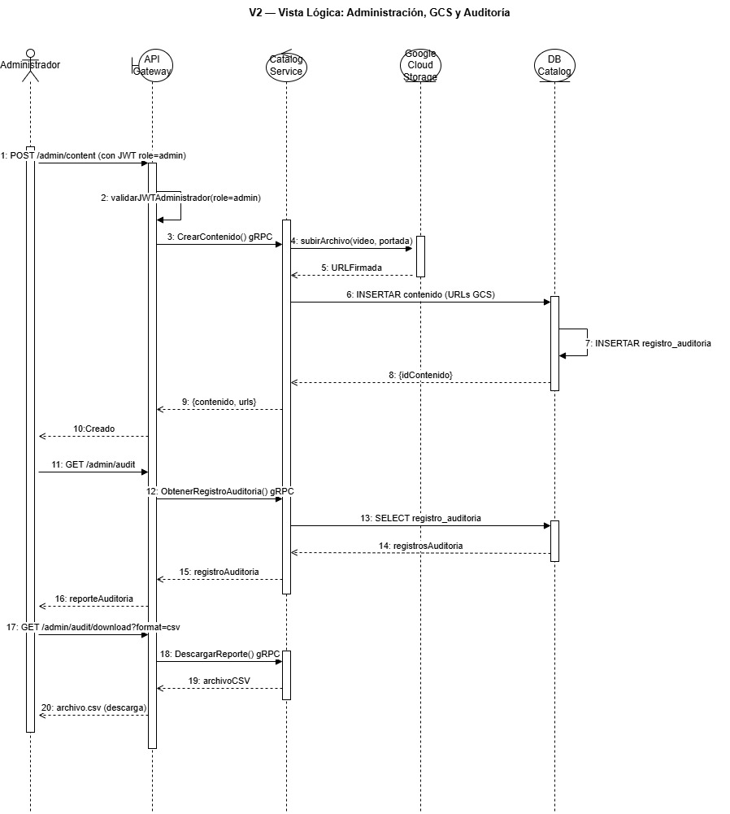
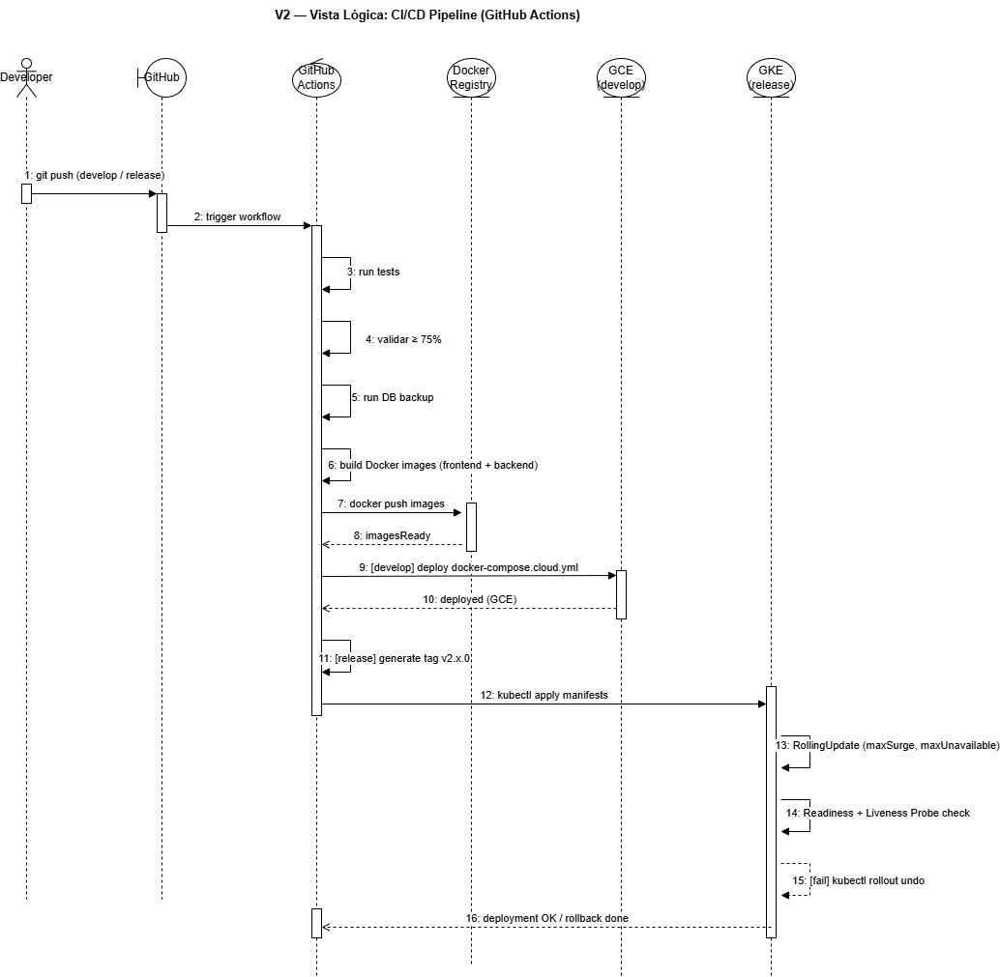

[← Regresar](../../README.md)

## V2 — Vista Lógica

La vista lógica describe la organización interna de cada microservicio en términos
de paquetes, módulos y responsabilidades. Muestra cómo se distribuye la lógica de
negocio, la comunicación gRPC, el acceso a datos y los utilitarios dentro de cada
servicio, y cómo todos comparten los contratos definidos en la carpeta `/proto`.

Se representa mediante **tres diagramas de secuencia** que modelan los flujos
internos más críticos de la plataforma.

### Secuencia Login, Catálogo y FX (Usuario)

### Secuencia Administración, GCS y Auditoría

### Secuencia  Pipeline CI/CD 

---

### Carpeta /proto (compartida)

Es el único punto de contrato entre todos los servicios. Contiene los archivos
Protocol Buffers que definen los mensajes y métodos gRPC de cada dominio:
`identity.proto`, `catalog.proto`, `subscription.proto`, `fx.proto`,
`engagement.proto` y `notification.proto`. Ningún servicio puede cambiar su
interfaz sin actualizar primero su `.proto` correspondiente.

---

### Distribución por servicio

| Servicio | Lenguaje | Módulos principales |
| :------- | :------- | :------------------ |
| `api-gateway` | TypeScript | `routes/` (auth, profiles, subscriptions, fx, catalog, admin, health), `middleware/auth.middleware.ts`, `middleware/admin.middleware.ts`, `grpc/` (identity.client, catalog.client, subscription.client, fx.client), `config/env.ts` |
| `identity-service` | TypeScript | `grpc/identity.server.ts`, `services/identity.service.ts`, `repositories/` (user, profile), `utils/` (password bcrypt, token JWT con claim `role`), `events/notification.publisher.ts`, `db/pool.ts`, `migrations/` |
| `catalog-service` | Go | `grpc/catalog.server.go`, `internal/service/catalog_service.go`, `internal/service/media_store.go` (Google Cloud Storage SDK: upload, signedURL), `internal/repository/content_repository.go`, `migrations/` (triggers de auditoría, vistas) |
| `subscription-service` | Python | `grpc_server.py`, `repository.py` (list_plans, create/update/cancel_subscription), `notification_publisher.py` (RPUSH Redis), `schemas.py`, `db.py` |
| `fx-service` | Python | `grpc_server.py` (GetRate), `cache.py` (RedisCache: get_json, set_json con TTL), `provider.py` (fetch_rate Frankfurter con primary + fallback), `config.py` |
| `engagement-service` | Go/Python | `grpc_server` (RateContent, GetRatingSummary, SaveProgress, GetRecentHistory, ResumeContent), `repository` (ratings, watch_history, progress), `db/migrations` (fn_calculate_recommendation_pct, vw_recent_profile_history, trigger audit_rating_changes) |
| `notification-service` | Python | `grpc_server.py` (Health, Send), `notification_worker` (BLPOP Redis queue), `build_notification_content` (por tipo: registration, purchase_receipt, subscription_update, content-publication), `send_email` (aiosmtplib SMTP + console fallback) |

---

### Principios de organización

Cada servicio aplica separación de responsabilidades en capas: la capa gRPC
recibe y despacha las llamadas, la capa de servicio o lógica de negocio orquesta
las operaciones, la capa de repositorio accede a la base de datos mediante objetos
programables (stored procedures, vistas y funciones), y la capa de utilitarios
agrupa funciones reutilizables como hashing, generación de JWT y publicación de
eventos. Esta estructura garantiza que cada capa pueda modificarse o probarse de
forma independiente.

En Fase 2, el `catalog-service` incorpora adicionalmente el módulo
`media_store.go` responsable de toda la interacción con Google Cloud Storage, y el
`api-gateway` incorpora el `admin.middleware.ts` que valida el claim `role = admin`
antes de exponer cualquier ruta del panel de administración.