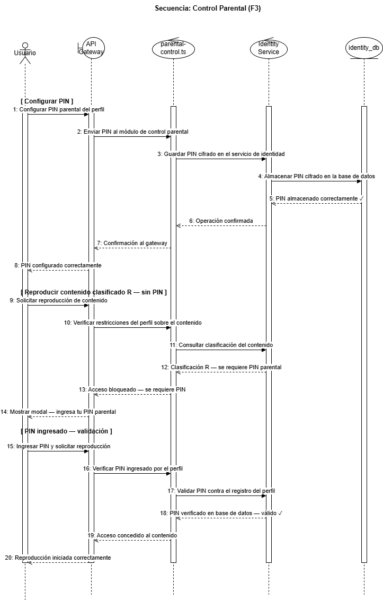
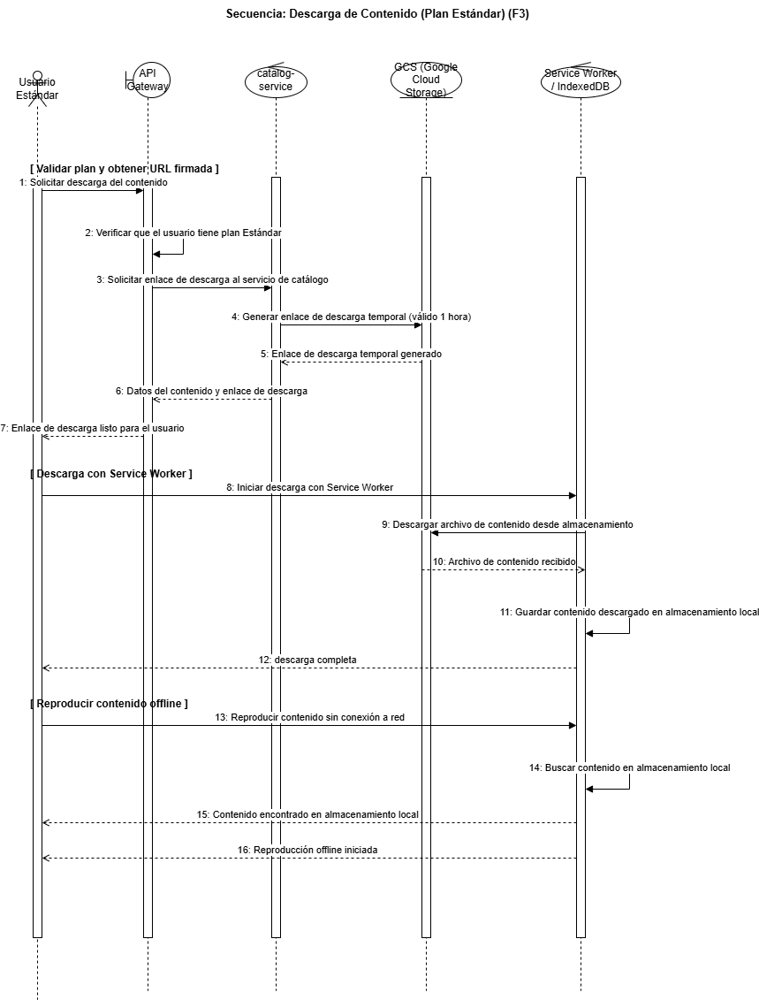
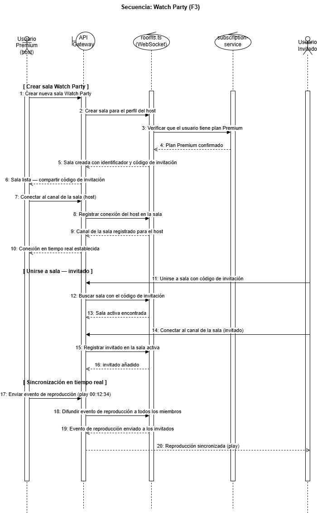
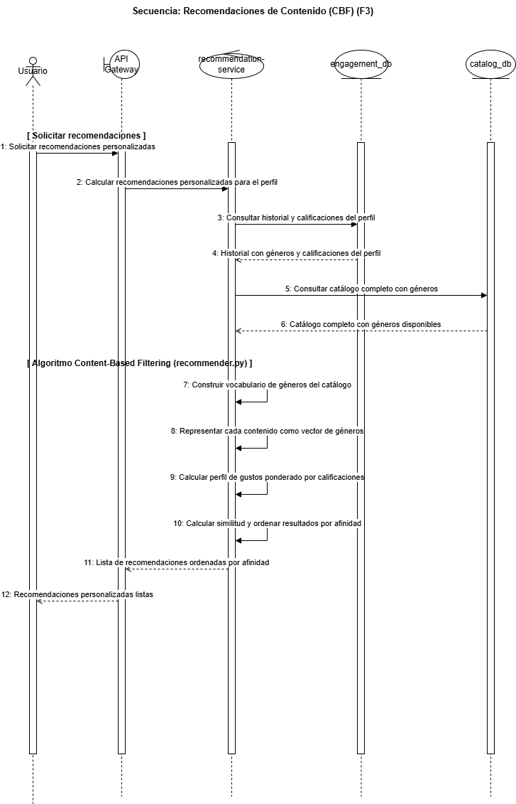

[← Regresar](../../README.md)

## V2 — Vista Lógica

La vista lógica describe la organización interna de cada microservicio en términos
de paquetes, módulos y responsabilidades. Muestra cómo se distribuye la lógica de
negocio, la comunicación gRPC, el acceso a datos y los utilitarios dentro de cada
servicio, y cómo todos comparten los contratos definidos en la carpeta `/proto`.

Se representa mediante **diagramas de secuencia** que modelan los flujos internos
más críticos de la plataforma. Las tres primeras secuencias cubren los flujos de
Fase 1 y Fase 2; las tres siguientes incorporan los flujos nuevos de Fase 3.

---

### Secuencia Login, Catálogo y FX (Usuario)

### Secuencia Administración, GCS y Auditoría

### Secuencia Pipeline CI/CD

---

### Secuencia Control Parental — Fase 3

### Secuencia Descarga de Contenido — Fase 3

### Secuencia Watch Party — Fase 3

### Secuencia Recomendaciones de Contenido — Fase 3

---

### Carpeta /proto (compartida)

Es el único punto de contrato entre todos los servicios. Contiene los archivos
Protocol Buffers que definen los mensajes y métodos gRPC de cada dominio:
`identity.proto`, `catalog.proto`, `subscription.proto`, `fx.proto`,
`engagement.proto`, `notification.proto` y `recommendation.proto` (agregado en
Fase 3). Ningún servicio puede cambiar su interfaz sin actualizar primero su
`.proto` correspondiente.

---

### Distribución por servicio

| Servicio | Lenguaje | Módulos principales |
| :------- | :------- | :------------------ |
| `api-gateway` | TypeScript | `routes/` (auth, profiles, subscriptions, fx, catalog, admin, health, recommendations), `middleware/auth.middleware.ts`, `middleware/admin.middleware.ts`, `policies/parental-control.ts` (valida PIN via gRPC + clasificación de contenido G/PG-13/R), `watch-party/rooms.ts` (WebSocket rooms, acceso exclusivo plan Premium), `grpc/` (identity.client, catalog.client, subscription.client, fx.client, recommendation.client), `config/env.ts` |
| `identity-service` | TypeScript | `grpc/identity.server.ts`, `services/identity.service.ts`, `repositories/` (user, profile), `utils/` (password bcrypt, token JWT con claim `role`), `events/notification.publisher.ts`, `db/pool.ts`, `migrations/` (stored procedures: `sp_set_parental_pin`, `sp_verify_parental_pin`, `sp_purge_inactive_users`; trigger: `trg_audit_account_purge`) |
| `catalog-service` | Go | `grpc/catalog.server.go`, `internal/service/catalog_service.go`, `internal/service/media_store.go` (Google Cloud Storage SDK: upload, signedURL — las Signed URLs también son consumidas por el Service Worker del cliente para descarga offline), `internal/repository/content_repository.go`, `migrations/` (triggers de auditoría, vistas) |
| `subscription-service` | Python | `grpc_server.py`, `repository.py` (list_plans, create/update/cancel_subscription), `notification_publisher.py` (RPUSH Redis), `schemas.py`, `db.py` |
| `fx-service` | Python | `grpc_server.py` (GetRate), `cache.py` (RedisCache: get_json, set_json con TTL), `provider.py` (fetch_rate Frankfurter con primary + fallback), `config.py` |
| `engagement-service` | Go/Python | `grpc_server` (RateContent, GetRatingSummary, SaveProgress, GetRecentHistory, ResumeContent), `repository` (ratings, watch_history, progress), `db/migrations` (fn_calculate_recommendation_pct, vw_recent_profile_history, trigger audit_rating_changes) |
| `notification-service` | Python | `grpc_server.py` (Health, Send), `notification_worker` (BLPOP Redis queue), `build_notification_content` (por tipo: registration, purchase_receipt, subscription_update, content-publication), `send_email` (aiosmtplib SMTP + console fallback) |
| `recommendation-service` | Python | `grpc_server.py` (GetRecommendations), `recommender.py` (Content-Based Filtering: vocabulario de géneros, vectores binarios, perfil ponderado por rating, similitud del coseno via NumPy), sin base de datos propia — lee de `engagement_db` (historial + ratings) y `catalog_db` (géneros del contenido) |

---

### Procesos autónomos — Fase 3

#### CronJob: Purga de Cuentas Inactivas

El proceso de depuración de cuentas se ejecuta como un **Kubernetes CronJob** (`k8s/cronjobs/purge-inactive-users.yml`) dentro del namespace `quetxal-tv-prod`. No forma parte de ningún microservicio existente: corre como un Pod efímero que se destruye al terminar.

| Elemento | Detalle |
| :------- | :------ |
| Scheduler | Kubernetes CronJob — ejecución periódica configurable |
| Umbral de inactividad | 90 días sin actividad (`last_activity_at`) |
| Operación | Llama a `sp_purge_inactive_users` en `identity_db` |
| Tipo de borrado | Soft delete: `deleted_at = NOW()`, `status = 'purged'` |
| Auditoría | Trigger `trg_audit_account_purge` registra cada cuenta purgada automáticamente |
| Reintentos | `backoffLimit: 3` — si falla tres veces genera alerta en ELK / Prometheus |
| Exclusión | Cuentas con suscripción activa quedan fuera del umbral de purga |

---

### Capa de Observabilidad — Fase 3

La plataforma incorpora en Fase 3 una capa transversal de observabilidad desplegada en el namespace `observability` de GKE. No pertenece a ningún microservicio de negocio; actúa como infraestructura de soporte que recolecta, procesa y visualiza tanto logs como métricas de todos los componentes.

#### Stack ELK — Logs

| Componente | Rol | Módulo clave |
| :--------- | :-- | :----------- |
| **Filebeat** | Agente recolector (DaemonSet en cada nodo GKE) | Lee `/var/log/containers/*.log` (stdout/stderr de todos los Pods) y los envía al puerto 5044 de Logstash |
| **Logstash** | Pipeline de procesamiento | Filtra, transforma y enruta logs; consume eventos de Cloud Pub/Sub para logs de servicios administrados (Cloud SQL, Memorystore) via plugin `logstash-input-google_pubsub` |
| **Elasticsearch** | Motor de almacenamiento e indexación | Almacena todos los logs indexados para búsqueda y análisis |
| **Kibana** | Interfaz de visualización | Dashboards para explorar logs transaccionales y de auditoría del sistema |

#### Stack Prometheus + Grafana — Métricas

| Componente | Rol | Detalle |
| :--------- | :-- | :------ |
| **Prometheus** | Motor de scraping y almacenamiento de métricas | Modelo Pull — consulta el endpoint `/metrics` de cada exporter periódicamente |
| **Node Exporter** | Métricas de nodos GKE | CPU, RAM, disco y red de las máquinas del clúster |
| **Kube-State-Metrics** | Métricas de Kubernetes | Estado de Pods, Deployments, ReplicaSets, CronJobs |
| **Stackdriver Exporter** | Métricas de servicios administrados GCP | Traduce métricas de Cloud SQL y Memorystore (Redis) al formato Prometheus; requiere permiso IAM `roles/monitoring.viewer` en el nodo |
| **Grafana** | Dashboards interactivos | Lee series temporales de Prometheus y visualiza telemetría en tiempo real de toda la plataforma |

---

### Principios de organización

Cada servicio aplica separación de responsabilidades en capas: la capa gRPC
recibe y despacha las llamadas, la capa de servicio o lógica de negocio orquesta
las operaciones, la capa de repositorio accede a la base de datos mediante objetos
programables (stored procedures, vistas y funciones), y la capa de utilitarios
agrupa funciones reutilizables como hashing, generación de JWT y publicación de
eventos. Esta estructura garantiza que cada capa pueda modificarse o probarse de
forma independiente.

En Fase 2, el `catalog-service` incorpora el módulo `media_store.go` responsable
de toda la interacción con Google Cloud Storage, y el `api-gateway` incorpora el
`admin.middleware.ts` que valida el claim `role = admin` antes de exponer cualquier
ruta del panel de administración.

En Fase 3, el `api-gateway` incorpora dos módulos transversales adicionales:
`policies/parental-control.ts`, que intercepta las peticiones de reproducción y
verifica la clasificación del contenido contra el PIN configurado por el perfil, y
`watch-party/rooms.ts`, que gestiona las salas WebSocket de visualización
sincronizada restringidas al plan Premium. Se incorpora además
`recommendation-service` como servicio independiente que aplica Content-Based
Filtering sin base de datos propia, y el CronJob de depuración como proceso
autónomo de infraestructura desacoplado de los microservicios de negocio.