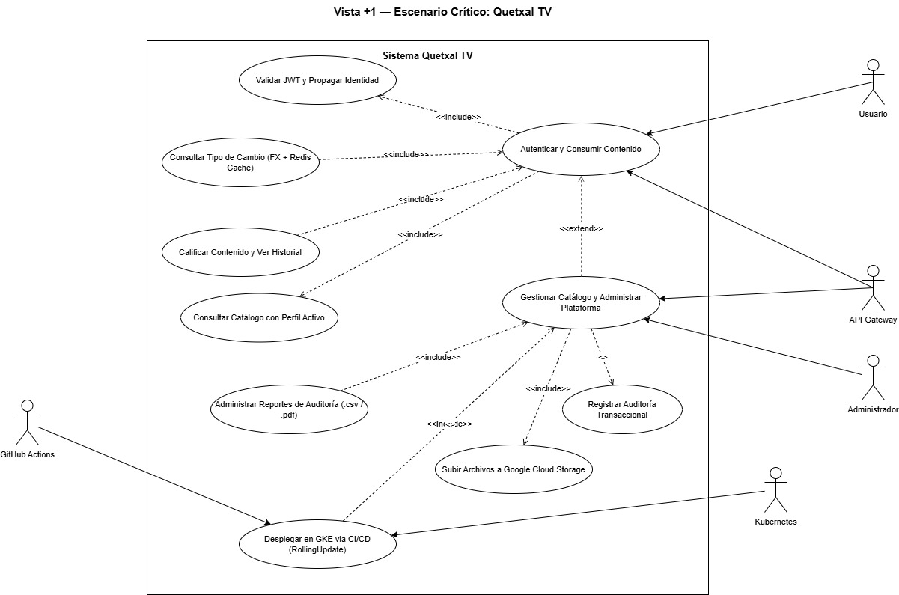
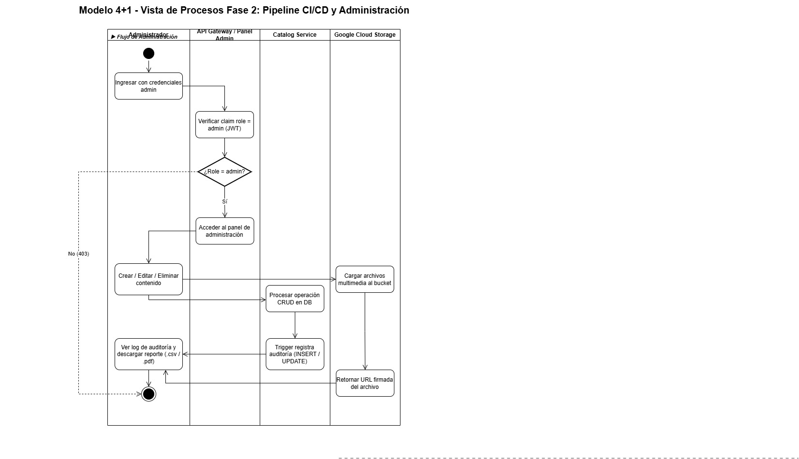
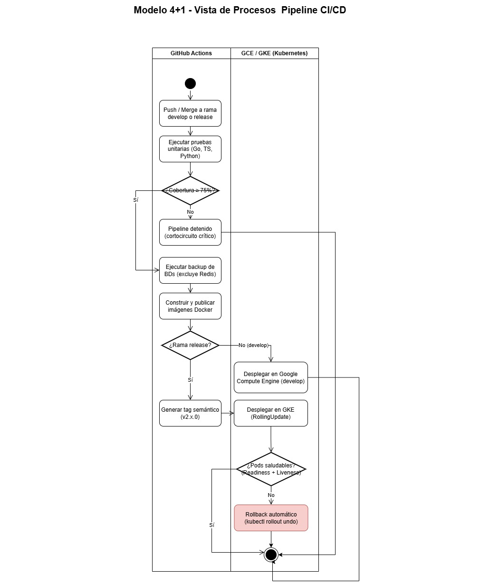

## V3 — Vista de Procesos

La vista de procesos modela los flujos de comunicación y coordinación entre los
componentes del sistema en tiempo de ejecución. Muestra cómo los procesos
interactúan, qué protocolos usan y cómo fluye la información a través de los
microservicios de Quetxal TV.

Se representa como **diagramas de actividades con swimlanes**, donde cada carril
corresponde a un proceso o servicio del sistema. Existen dos diagramas
diferenciados: uno para el flujo crítico de usuario (Fase 1) y uno para el
pipeline de CI/CD y gestión administrativa (Fase 2).

###  Autenticación, Catálogo, Pipeline CI/CD y Administración

---

### Procesos modelados

| Proceso | Fase | Descripción |
| :------ | :--- | :---------- |
| **Autenticación y sesión** | 1 | El usuario ingresa credenciales → API Gateway reenvía vía gRPC → Identity Service valida con bcrypt → genera JWT (`user_id`, `email`, `role`) → API Gateway establece cookie HttpOnly. |
| **Selección de perfil** | 1 | El usuario selecciona perfil → Identity Service emite nuevo JWT con `profile_id` → API Gateway actualiza cookie. |
| **Consumo de catálogo** | 1 | El usuario accede al catálogo → API Gateway valida JWT (`ValidateToken` gRPC) → Catalog Service consulta DB y URLs de GCS → retorna listado de contenidos. |
| **Suscripción con pago** | 1 | Lista planes → convierte precio via FX → autoriza pago en Payment Gateway → crea suscripción solo si el pago es aprobado. |
| **Consulta FX con cache** | 1 | El usuario solicita precio local → FX Service consulta Redis cache (TTL). Si hay cache hit retorna tasa cacheada. Si hay cache miss llama API Frankfurter y guarda en Redis con TTL. |
| **Notificaciones asíncronas** | 1 | Identity/Subscription publican eventos en `notification:queue` via `RPUSH`. El Notification Worker consume con `BLPOP` y envía el correo o usa fallback a consola. |
| **Gestión de catálogo (Admin)** | 2 | Administrador accede al panel → Catalog Service crea/edita/elimina contenido → archivos se cargan a GCS → trigger registra auditoría automáticamente. |
| **Pipeline CI/CD** | 2 | Push a `develop` → pruebas (≥75% cobertura) → build imágenes → deploy en GCE. Push a `release` → tag semántico → deploy en GKE con RollingUpdate y Rollback automático. |

---

### Canales de comunicación

| Canal | Tipo | Entre |
| :---- | :--- | :---- |
| HTTP REST + Cookie | Síncrono | Cliente Web → API Gateway |
| gRPC (HTTP/2) | Síncrono | API Gateway → Identity / Catalog / Subscription / FX / Payment / Engagement Service |
| Redis Queue (RPUSH/BLPOP) | Asíncrono | Identity / Subscription / Catalog → Notification Service |
| Redis Cache (GET/SET TTL) | Síncrono | FX Service ↔ Redis |
| HTTPS | Síncrono | FX Service → Frankfurter API externa |
| GCS SDK | Síncrono | Catalog Service → Google Cloud Storage |
| GitHub Actions → GCP | Asíncrono | Pipeline CI/CD → Compute Engine / GKE |

---

### Decisiones de proceso

| Decisión | Condición Sí | Condición No |
| :-------- | :----------- | :----------- |
| ¿Credenciales válidas? | Generar JWT y establecer cookie | Retornar HTTP 401 al cliente |
| ¿Pago autorizado? | Crear suscripción activa | Retornar HTTP 400/402 sin crear suscripción |
| ¿Cache hit en Redis (FX)? | Retornar tasa cacheada con `cached: true` | Llamar API Frankfurter y guardar en Redis con TTL |
| ¿Pruebas CI pasan (≥75%)? | Continuar a empaquetado y despliegue | Cortocircuito: detener pipeline inmediatamente |
| ¿Pods GKE saludables? | Completar RollingUpdate | Ejecutar `kubectl rollout undo` automáticamente |

---

### Canal 1 — gRPC Síncrono (HTTP/2)

Es el canal principal del sistema. El cliente web se comunica con el API Gateway
mediante HTTP con cookies seguras. El Gateway transforma cada solicitud HTTP en
una llamada gRPC al microservicio correspondiente usando los clientes generados
desde los archivos `.proto`. Ningún cliente externo puede llamar directamente a
los microservicios — el Gateway es el único punto de entrada.

| Llamada | Métodos gRPC |
| :------ | :----------- |
| Gateway → Identity Service | `RegisterUser`, `Login`, `ValidateToken`, `CreateProfile`, `ListProfiles`, `SelectProfile`, `UpdateProfile`, `DeleteProfile`, `UpdateCredentials` |
| Gateway → Catalog Service | `ListContent`, `SearchContent`, `GetContentDetail`, `CreateContent`, `DeleteContent`, `SyncMinimumCatalog` |
| Gateway → Subscription Service | `ListPlans`, `CreateSubscription`, `UpdateSubscription`, `CancelSubscription`, `ListUserSubscriptions`, `UpdatePlan` |
| Gateway → FX Service | `GetRate` |
| Gateway → Payment Gateway Service | `AuthorizePayment`, `Health` |
| Gateway → Engagement Service | `RateContent`, `GetContentRatingSummary`, `SaveProgress`, `GetRecentHistory`, `ResumeContent` |

Cada servicio procesa la solicitud de forma síncrona, accede a su base de datos
propia y retorna la respuesta directamente al Gateway, que la convierte a HTTP y
la devuelve al cliente.

#### Flujo de Suscripción — 4 llamadas gRPC en secuencia estricta

| Paso | Llamada gRPC | Servicio | Descripción |
| :--- | :----------- | :------- | :---------- |
| 1 | `ListPlans()` | Subscription Service | Obtener los planes disponibles y su precio en USD |
| 2 | `GetRate(base:USD, target:currency)` | FX Service | Convertir el precio a la moneda seleccionada. Si `base == target` retorna `rate=1.0` sin consultar Redis ni la API externa |
| 3 | `AuthorizePayment(card_data, amount, currency)` | Payment Gateway Service | Validar tarjeta (algoritmo de Luhn, vencimiento, CVV) y procesar pago en sandbox QuetxalPay. Retorna `status:approved` con `transaction_id` y `authorization_code`, o `status:rejected` (HTTP 400) / `status:declined` (HTTP 402) |
| 4 | `CreateSubscription(user_id, plan_id, email)` | Subscription Service | Activar la suscripción. **Solo se ejecuta si el paso 3 retorna `status:approved`**. Si el pago falla, el flujo termina en el paso 3 sin crear ninguna suscripción |

---

### Canal 2 — Redis Asíncrono (Queue)

Es el canal de notificaciones. Los servicios productores publican eventos en la
cola Redis con `RPUSH` sin esperar respuesta. El Notification Worker los consume
de forma independiente con `BLPOP` bloqueante con timeout de 5 segundos.

| Paso | Proceso | Operación Redis | Tipo de evento |
| :--- | :------ | :-------------- | :------------- |
| 1 | Identity Service al registrar un usuario | `RPUSH notification:queue` | `registration` |
| 2 | Subscription Service al crear una suscripción | `RPUSH notification:queue` | `purchase_receipt` |
| 3 | Subscription Service al modificar una suscripción | `RPUSH notification:queue` | `subscription_update` |
| 4 | Catalog Service al publicar nuevo contenido | `RPUSH notification:queue` | `content-publication` |
| 5 | Notification Worker consume el evento de la cola | `BLPOP notification:queue (timeout=5s)` | — |
| 6 | Notification Service construye el correo según el tipo | `_build_notification_content` | — |
| 7 | Notification Service envía el correo o usa fallback | `aiosmtplib.send` / `logger.info` | — |

Este canal desacopla completamente el envío de correos del flujo principal. Si el
Notification Service falla o se reinicia, los eventos permanecen en la cola Redis
hasta ser procesados. Los servicios productores nunca esperan confirmación del
envío del correo.

---

### Canal 3 — Redis Cache FX (Cache-Aside)

El FX Service utiliza Redis como caché de tasas de cambio bajo el patrón
Cache-Aside. La clave de caché tiene el formato `fx:rate:{BASE}:{TARGET}` con TTL
configurable mediante la variable de entorno `FX_CACHE_TTL` (valor por defecto:
3600 segundos).

| Paso | Operación | Descripción |
| :--- | :-------- | :---------- |
| 1 | FX Service recibe `GetRate(base, target)` | Si `base == target` retorna `rate=1.0` directamente sin consultar Redis |
| 2 | `get_json(fx:rate:{B}:{T})` | Consulta Redis. Si hay HIT retorna la tasa cacheada con `cached: true` |
| 3 | Cache MISS | Llama al endpoint primario `GET /rate/{BASE}/{TARGET}` de Frankfurter |
| 4 | Fallback | Si el endpoint primario falla, usa `GET /rates?base={B}&quotes={T}` |
| 5 | `set_json(key, payload, TTL)` | Guarda la tasa en Redis con el TTL configurado |
| 6 | Retorna `RateResponse` | Incluye `cached: false` y `provider: frankfurter-v2` |

Si Redis no está disponible al guardar, el FX Service registra un
`logger.warning` pero retorna la tasa igualmente sin interrumpir el flujo
principal.

---

### Redis — Triple responsabilidad

Redis cumple tres roles diferenciados en el sistema:

1. **Caché de tasas de cambio** — clave `fx:rate:{BASE}:{TARGET}` con TTL, evita llamadas repetitivas a la API Frankfurter externa.
2. **Cola de notificaciones** — lista `notification:queue` donde se encolan los eventos JSON que el Notification Worker consume con `BLPOP` de forma bloqueante.
3. **Desacoplador de procesos** — permite que Identity Service y Subscription Service publiquen eventos sin depender de la disponibilidad del Notification Service en el momento exacto.