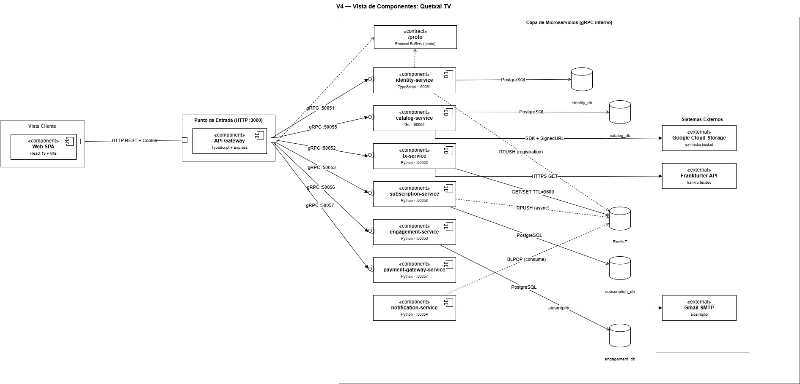

## V4 — Vista de Componentes

La vista de componentes describe la organización física estática del sistema
en unidades autónomas reemplazables. Cada microservicio se modela como un
`<<component>>` con sus interfaces proporcionadas (lollipop) y requeridas
(socket), mostrando cómo se encapsulan los contratos gRPC definidos en `/proto`.

---

### Zonas del diagrama

El diagrama se divide en tres zonas diferenciadas:

**Zona Cliente** — contiene el componente `Web SPA` (React + Vite). Es la única
pieza que se ejecuta en el navegador y se comunica exclusivamente con el
API Gateway via HTTP REST + Cookie HttpOnly. Nunca llama a microservicios directamente.

**Punto de Entrada (HTTP)** — el `API Gateway` (TypeScript, puerto 3000) es
el único componente públicamente accesible. Valida el JWT, aplica el
`admin.middleware.ts` para rutas protegidas y despacha todas las llamadas
internas vía gRPC.

**Capa de Microservicios (gRPC interno)** — siete servicios completamente
desacoplados entre sí, excepto por los contratos definidos en `/proto`:

| Componente | Lenguaje | Puerto | Responsabilidad |
| :--- | :--- | :--- | :--- |
| `identity-service` | TypeScript | 50051 | Autenticación JWT, perfiles, auditoría de credenciales |
| `catalog-service` | Go | 50055 | Catálogo VOD, subida a GCS (Signed URLs), auditoría de cambios |
| `fx-service` | Python | 50052 | Tipos de cambio con caché Redis (Cache-Aside, TTL 3600 s) |
| `subscription-service` | Python | 50053 | Planes y suscripciones; publica eventos a Redis (RPUSH) |
| `engagement-service` | Python | 50056 | Calificaciones, historial de reproducción, progreso |
| `payment-gateway-service` | Python | 50057 | Pasarela sandbox (Luhn + fx-service para conversión) |
| `notification-service` | Python | 50054 | Consume Redis queue (BLPOP) y envía correos via SMTP |

---

### Interfaces y conectores

Cada componente expone una interfaz proporcionada (círculo lleno) que agrupa
los RPCs definidos en su `.proto`. Las interfaces requeridas (socket) modelan
las dependencias hacia infraestructura o hacia otros servicios:

- **gRPC síncrono** (HTTP/2) — todos los servicios hacia el API Gateway.
- **Redis RPUSH / BLPOP** — canal asíncrono de notificaciones entre
  `identity-service` / `subscription-service` (productores) y
  `notification-service` (consumidor).
- **Redis Cache-Aside** — `fx-service` lee y escribe la clave
  `fx:rate:{BASE}:{TARGET}` con TTL de 3600 s antes de consultar
  Frankfurter API.
- **GCS SDK** — `catalog-service` genera Signed URLs para subidas directas
  desde el navegador; también lee y elimina objetos del bucket
  `qx-media-sa-derek-proyecto`.
- **HTTPS externo** — `fx-service` → `frankfurter.dev`;
  `notification-service` → Gmail SMTP.

---

### Contrato compartido `/proto`

La carpeta `/proto` actúa como contrato único entre todos los componentes.
Ningún servicio puede cambiar su interfaz gRPC sin actualizar primero su
archivo `.proto` correspondiente y regenerar los stubs.

Archivos: `identity.proto`, `catalog.proto`, `fx.proto`,
`subscription.proto`, `engagement.proto`, `payment.proto`,
`notification.proto`.

---

### Base de datos por servicio

Cada microservicio con persistencia tiene su propia base de datos PostgreSQL
aislada — ninguno comparte esquema con otro:

| Servicio | Base de datos |
| :--- | :--- |
| `identity-service` | `identity_db` |
| `catalog-service` | `catalog_db` |
| `subscription-service` | `subscription_db` |
| `engagement-service` | `engagement_db` |