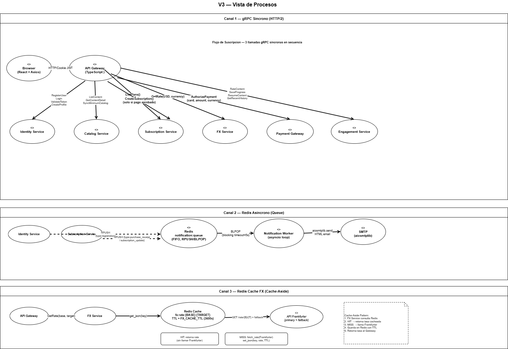

## V5a — Vista de Despliegue Nube

---

### Canal 1 — gRPC Sincrono (HTTP/2)

El cliente web se comunica con el API Gateway mediante HTTP con cookies seguras. El Gateway transforma cada solicitud en llamadas gRPC al microservicio correspondiente. Ningun cliente externo puede llamar directamente a los microservicios.

| Llamada | Metodos gRPC |
| :------ | :----------- |
| Gateway → Identity Service | RegisterUser, Login, ValidateToken, CreateProfile |
| Gateway → Catalog Service | ListContent, GetContentDetail, SyncMinimumCatalog |
| Gateway → Subscription Service | ListPlans, CreateSubscription, UpdateSubscription, CancelSubscription, UpdatePlan |
| Gateway → FX Service | GetRate |
| Gateway → Payment Gateway Service | AuthorizePayment, Health |
| Gateway → Engagement Service | RateContent, GetContentRatingSummary, SaveProgress, ResumeContent, GetRecentHistory |

**Flujo de suscripcion — 4 llamadas gRPC sincronas en secuencia:**

| Paso | Llamada | Servicio | Descripcion |
| :--- | :------ | :------- | :---------- |
| 1 | `ListPlans()` | Subscription Service | Obtener planes y precio en USD |
| 2 | `GetRate(base:USD, target:currency)` | FX Service | Convertir precio a moneda del usuario |
| 3 | `AuthorizePayment(card, amount, currency)` | Payment Gateway :50057 | Validar tarjeta y procesar pago sandbox |
| 4 | `CreateSubscription(user_id, plan_id, email)` | Subscription Service | Activar suscripcion **solo si ③ retorna approved** |

Si el paso ③ retorna `rejected` (400) o `declined` (402), el paso ④ no se ejecuta.

---

### Canal 2 — Redis Asincrono (Queue)

Los servicios productores publican eventos con `RPUSH` sin esperar respuesta. El Notification Worker los consume con `BLPOP` bloqueante con timeout de 5 segundos.

| Paso | Proceso | Operacion | Tipo de evento |
| :--- | :------ | :-------- | :------------- |
| 1 | Identity Service al registrar usuario | RPUSH notification:queue | `registration` |
| 2 | Subscription Service al crear suscripcion | RPUSH notification:queue | `purchase_receipt` |
| 3 | Subscription Service al modificar suscripcion | RPUSH notification:queue | `subscription_update` |
| 4 | Notification Worker consume el evento | BLPOP notification:queue (timeout=5s) | — |
| 5 | Notification Service construye y envia el email | aiosmtplib / console fallback | — |

---

### Canal 3 — Redis Cache FX (Cache-Aside)

El FX Service utiliza Redis como cache de tasas de cambio. La clave tiene el formato `fx:rate:{BASE}:{TARGET}` con TTL configurable via `FX_CACHE_TTL` (default 3600s).

| Paso | Operacion | Resultado |
| :--- | :-------- | :-------- |
| 1 | `get_json(fx:rate:{B}:{T})` | Cache HIT: retorna tasa sin llamar Frankfurter |
| 2 | Cache MISS | Llama `fetch_rate(Frankfurter)` primary + fallback |
| 3 | `set_json(key, rate, TTL)` | Guarda tasa en Redis con TTL |

---

### Redis — Triple responsabilidad

1. **Cache FX** — `fx:rate:{BASE}:{TARGET}` con TTL, evita llamadas a Frankfurter
2. **Cola de notificaciones** — `notification:queue` FIFO con RPUSH/BLPOP
3. **Desacoplador de procesos** — los productores no dependen de la disponibilidad del Notification Service