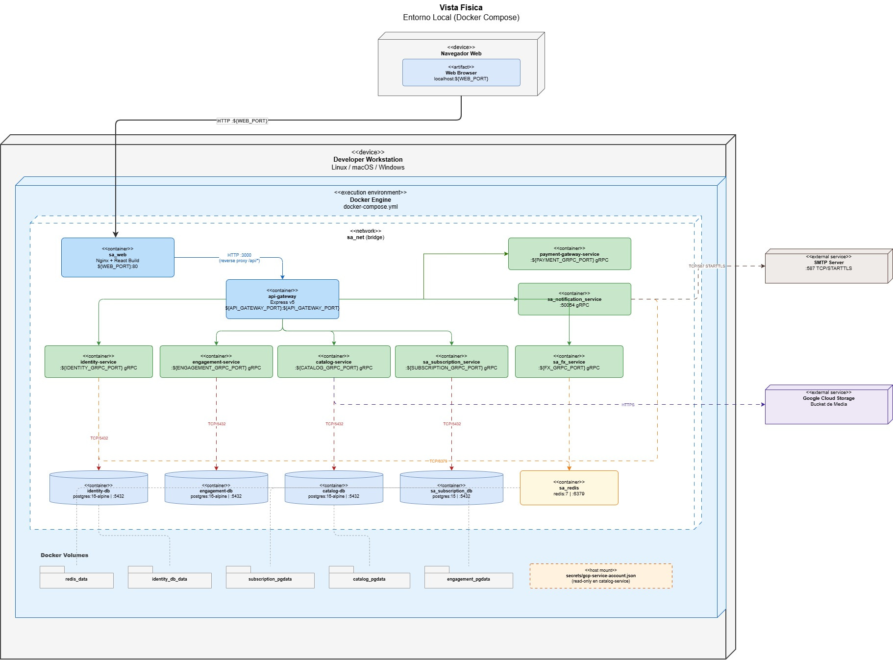
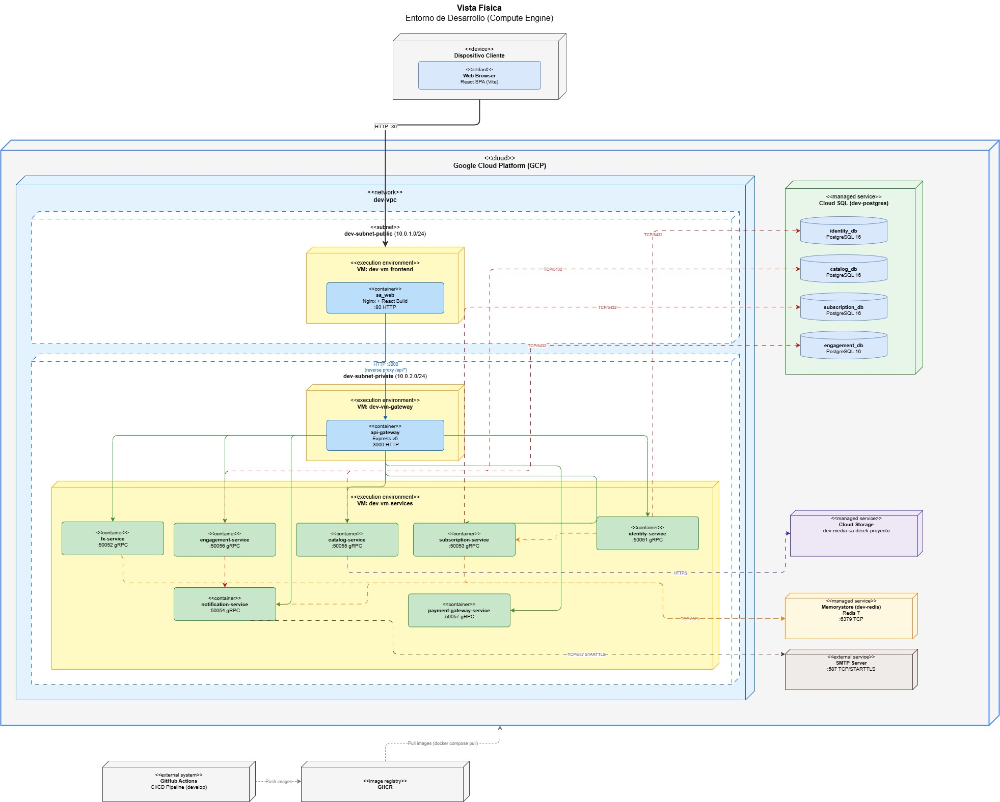
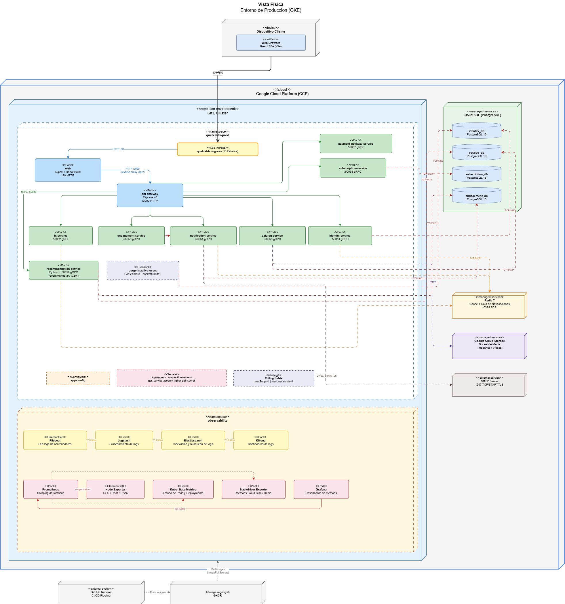

[← Regresar](../../README.md)

# Vista Física

## 1. Entorno Local
* **Imagen:** 
* **Archivo editable:** [VistaFisicaLocal.drawio](../00_assets/raw/Vista4+1/VistaFisicaLocal.drawio)

## 2. Entorno Cloud GCP (Compute Engine)
* **Imagen:** 
* **Archivo editable:** [VistaFisicaGCP.drawio](../00_assets/raw/Vista4+1/VistaFisicaGCP.drawio)

## 3. Entorno Cloud GKE (Kubernetes) ACTUALIZADO
* **Imagen:** 
* **Archivo editable:** [VistaFisicaGKE.drawio](../00_assets/raw/Vista4+1/VistaFisicaGKE.drawio)

El entorno de producción corre sobre **Google Kubernetes Engine (GKE)**. Todos los microservicios se despliegan como Pods dentro del clúster, agrupados en namespaces según su responsabilidad. Los servicios gestionados de GCP (Cloud SQL, Redis, GCS, SMTP) se consumen desde fuera del clúster a través de conexiones TCP cifradas. Las imágenes se publican en GHCR mediante GitHub Actions y se descargan al clúster con `imagePullSecrets`.

### Namespace `quetxal-tv-prod`

Contiene todos los Pods de negocio. El tráfico externo entra por el **Ingress** con IP estática y se distribuye al Pod `web` (Nginx + React) y al `api-gateway` (Express v5). El gateway enruta cada solicitud al microservicio correspondiente mediante gRPC.

| Pod | Puerto | Tecnología | Base de datos propia |
| :-- | :----- | :--------- | :------------------- |
| web | :80 HTTP | Nginx + React Build | — |
| api-gateway | :3000 HTTP | Express v5 / Node.js | — |
| identity-service | :50051 gRPC | Node.js / TypeScript | `identity_db` |
| fx-service | :50052 gRPC | Node.js / TypeScript | — (Redis cache) |
| subscription-service | :50053 gRPC | Node.js / TypeScript | `subscription_db` |
| notification-service | :50054 gRPC | Python | — (Redis queue) |
| catalog-service | :50055 gRPC | Node.js / TypeScript | `catalog_db` |
| engagement-service | :50056 gRPC | Go | `engagement_db` |
| payment-gateway-service | :50057 gRPC | Node.js / TypeScript | — |
| **recommendation-service** *(Fase 3)* | :50058 gRPC | **Python (recommender.py)** | `engagement_db`, `catalog_db` |
| **purge-inactive-users** *(Fase 3)* | — | **CronJob (Pod efímero)** | `identity_db` |

El **`recommendation-service`** implementa el algoritmo de filtrado colaborativo basado en contenido (CBF): consulta el historial y calificaciones de `engagement_db`, vectoriza los géneros del catálogo desde `catalog_db` y devuelve el top-10 ordenado por similitud coseno.

El **CronJob `purge-inactive-users`** se activa periódicamente mediante el Kubernetes Scheduler. Levanta un Pod efímero que identifica cuentas inactivas hace más de 90 días (excluyendo suscriptores activos), ejecuta un soft delete en `identity_db` y destruye el Pod al finalizar. Si falla tres veces consecutivas (`backoffLimit: 3`), genera una alerta en el namespace `observability`.

La estrategia de despliegue es **RollingUpdate** (`maxSurge=1`, `maxUnavailable=0`), con rollback automático ante fallos. Las variables de entorno sensibles se inyectan desde `Secrets` de Kubernetes y las configuraciones no sensibles desde un `ConfigMap`.

---

### Namespace `observability` *(Fase 3)*

Namespace dedicado exclusivamente a la recolección de logs y métricas. Es **no intrusivo**: los Pods de negocio no necesitan modificación alguna para ser monitoreados.

#### Stack ELK — Centralización de Logs

| Componente | Tipo | Rol |
| :--------- | :--- | :-- |
| **Filebeat** | DaemonSet | Corre en cada nodo del clúster. Monta `/var/log/containers/` del nodo y reenvía todos los logs de contenedores a Logstash |
| **Logstash** | Pod | Recibe los logs de Filebeat, aplica filtros de parseo y enriquecimiento, y los entrega a Elasticsearch |
| **Elasticsearch** | Pod | Indexa y almacena los logs. Permite búsqueda full-text sobre toda la actividad del clúster |
| **Kibana** | Pod | Dashboard visual para consultar logs, construir gráficas y configurar alertas sobre el índice de Elasticsearch |

Flujo: `stdout del Pod → Kubernetes escribe en /var/log/containers/ → Filebeat lee del nodo → Logstash procesa → Elasticsearch indexa → Kibana visualiza`

#### Stack Prometheus / Grafana — Métricas en Tiempo Real

| Componente | Tipo | Rol |
| :--------- | :--- | :-- |
| **Node Exporter** | DaemonSet | Expone métricas del sistema operativo de cada nodo: CPU, RAM, disco y red |
| **Kube-State-Metrics** | Pod | Expone el estado de los objetos Kubernetes: Pods activos, Deployments fallidos, réplicas disponibles |
| **Stackdriver Exporter** | Pod | Traduce al formato Prometheus las métricas de los servicios gestionados de GCP (Cloud SQL, Redis) |
| **Prometheus** | Pod | Hace scraping periódico de los tres exporters anteriores y almacena las series de tiempo resultantes |
| **Grafana** | Pod | Consulta Prometheus por TCP/9090 y presenta los dashboards de métricas con histórico y umbrales de alerta |

Flujo: `Exporters exponen /metrics → Prometheus hace scrape → Grafana visualiza → alertas si se superan umbrales`
