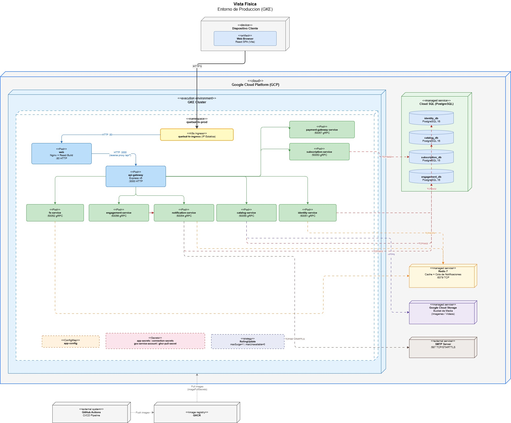

[← Regresar](../../README.md)

# Vista Física

## 1. Entorno Local
* **Imagen:** 
* **Archivo editable:** [VistaFisicaLocal.drawio](../00_assets/raw/Vista4+1/VistaFisicaLocal.drawio)

## 2. Entorno Cloud GCP (Compute Engine)
* **Imagen:** 
* **Archivo editable:** [VistaFisicaGCP.drawio](../00_assets/raw/Vista4+1/VistaFisicaGCP.drawio)

## 3. Entorno Cloud GKE (Kubernetes)
* **Imagen:** 
* **Archivo editable:** [VistaFisicaGKE.drawio](../00_assets/raw/Vista4+1/VistaFisicaGKE.drawio)
