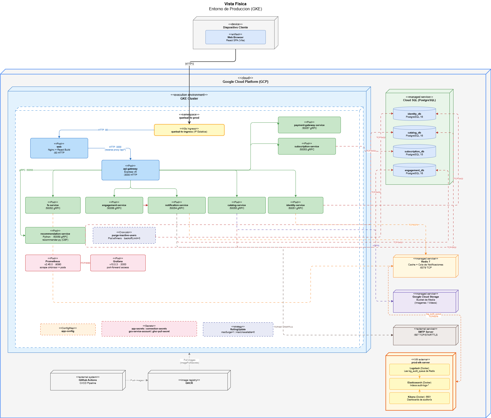

[← Regresar](../../README.md)

# Vista Física

## 1. Entorno Local
* **Imagen:** 
* **Archivo editable:** [VistaFisicaLocal.drawio](../00_assets/raw/Vista4+1/VistaFisicaLocal.drawio)

## 2. Entorno Cloud GCP (Compute Engine)
* **Imagen:** 
* **Archivo editable:** [VistaFisicaGCP.drawio](../00_assets/raw/Vista4+1/VistaFisicaGCP.drawio)

## 3. Entorno Cloud GKE (Kubernetes) ACTUALIZADO
* **Imagen:** 
* **Archivo editable:** [VistaFisicaGKE.drawio](../00_assets/raw/Vista4+1/VistaFisicaGKE.drawio)

El entorno de producción corre sobre **Google Kubernetes Engine (GKE)**. Todos los microservicios se despliegan como Pods dentro del clúster, agrupados en namespaces según su responsabilidad. Los servicios gestionados de GCP (Cloud SQL, Redis, GCS, SMTP) se consumen desde fuera del clúster a través de conexiones TCP cifradas. Las imágenes se publican en GHCR mediante GitHub Actions y se descargan al clúster con `imagePullSecrets`.

### Namespace `quetxal-tv-prod`

Contiene todos los Pods de negocio. El tráfico externo entra por el **Ingress** con IP estática y se distribuye al Pod `web` (Nginx + React) y al `api-gateway` (Express v5). El gateway enruta cada solicitud al microservicio correspondiente mediante gRPC.

| Pod | Puerto | Tecnología | Base de datos propia |
| :-- | :----- | :--------- | :------------------- |
| web | :80 HTTP | Nginx + React Build | — |
| api-gateway | :3000 HTTP | Express v5 / Node.js | — |
| identity-service | :50051 gRPC | Node.js / TypeScript | `identity_db` |
| fx-service | :50052 gRPC | Node.js / TypeScript | — (Redis cache) |
| subscription-service | :50053 gRPC | Node.js / TypeScript | `subscription_db` |
| notification-service | :50054 gRPC | Python | — (Redis queue) |
| catalog-service | :50055 gRPC | Node.js / TypeScript | `catalog_db` |
| engagement-service | :50056 gRPC | Go | `engagement_db` |
| payment-gateway-service | :50057 gRPC | Node.js / TypeScript | — |
| **recommendation-service** *(Fase 3)* | :50058 gRPC | **Python (recommender.py)** | `engagement_db`, `catalog_db` |
| **purge-inactive-users** *(Fase 3)* | — | **CronJob (Pod efímero)** | `identity_db` |
| **Prometheus** *(Fase 3)* | :9090 | `prom/prometheus:v2.45.0` | — (series de tiempo locales) |
| **Grafana** *(Fase 3)* | :3000 | `grafana/grafana:10.0.3` | — (conecta a Prometheus) |

El **`recommendation-service`** implementa el algoritmo de filtrado colaborativo basado en contenido (CBF): consulta el historial y calificaciones de `engagement_db`, vectoriza los géneros del catálogo desde `catalog_db` y devuelve el top-10 ordenado por similitud coseno.

El **CronJob `purge-inactive-users`** se activa periódicamente mediante el Kubernetes Scheduler. Levanta un Pod efímero que identifica cuentas inactivas hace más de 90 días (excluyendo suscriptores activos), ejecuta un soft delete en `identity_db` y destruye el Pod al finalizar. Si falla tres veces consecutivas (`backoffLimit: 3`), el evento de error queda registrado en la cola de auditoría Redis y es procesado por el stack ELK externo.

La estrategia de despliegue es **RollingUpdate** (`maxSurge=1`, `maxUnavailable=0`), con rollback automático ante fallos. Las variables de entorno sensibles se inyectan desde `Secrets` de Kubernetes y las configuraciones no sensibles desde un `ConfigMap`.

---

### Observabilidad *(Fase 3)*

La estrategia de observabilidad combina dos stacks con responsabilidades distintas: **Prometheus + Grafana** dentro del clúster para métricas en tiempo real, y **ELK** en una VM externa para centralización de logs de auditoría.

#### Stack Prometheus / Grafana — Métricas en Tiempo Real (dentro del clúster)

Prometheus y Grafana corren como Pods dentro del namespace `quetxal-tv-prod`. Prometheus recolecta métricas mediante **scraping activo (pull model)** integrándose con **cAdvisor**, que es nativo en GKE y expone métricas de CPU, memoria y red por Pod directamente desde los nodos, sin necesidad de agentes adicionales.

Grafana se conecta a Prometheus en `http://prometheus-service:9090` y presenta dashboards configurados desde `grafana-dashboard-general.json`, con paneles de CPU, memoria y tráfico de red entrante/saliente por Pod. El acceso se realiza mediante port-forwarding:

```bash
kubectl port-forward svc/grafana-service 3000:80 -n quetxal-tv-prod
```

| Tarea de scraping | Fuente | Métricas recolectadas |
| :---------------- | :----- | :-------------------- |
| `kubernetes-cadvisor` | Nodos GKE (cAdvisor nativo) | CPU, RAM, disco y red por Pod |
| `kubernetes-pods` | Auto-descubrimiento de endpoints `/metrics` | Métricas expuestas a nivel aplicativo |

#### Stack ELK — Centralización de Logs de Auditoría (VM externa)

El stack ELK corre en una **VM externa al clúster** (`prod-elk-server`) aprovisionada en GCP mediante **Terraform** (`infra/release/terraform/environments/release/elk.tf`) y desplegada con **Ansible + Docker Compose** (`infra/release/ansible/playbooks/elk_playbook.yml`). No vive dentro de GKE.

Los microservicios generan eventos de auditoría y los publican directamente en la **cola Redis** (`log_audit_queue`), que actúa como message broker desacoplando la generación de logs de su procesamiento.

| Componente | Tipo | Rol |
| :--------- | :--- | :-- |
| **Logstash** | Contenedor Docker | Lee continuamente `log_audit_queue` en Redis, parsea los mensajes JSON y los entrega a Elasticsearch |
| **Elasticsearch** | Contenedor Docker | Indexa y almacena los eventos bajo el patrón `audit-logs-*`; permite búsqueda full-text |
| **Kibana** | Contenedor Docker | Dashboard accesible en `http://35.255.183.222:5601` para consultar y filtrar logs en tiempo real |

Flujo: `Microservicio publica evento de auditoría → Redis (log_audit_queue) → Logstash lee y parsea → Elasticsearch indexa → Kibana visualiza`
