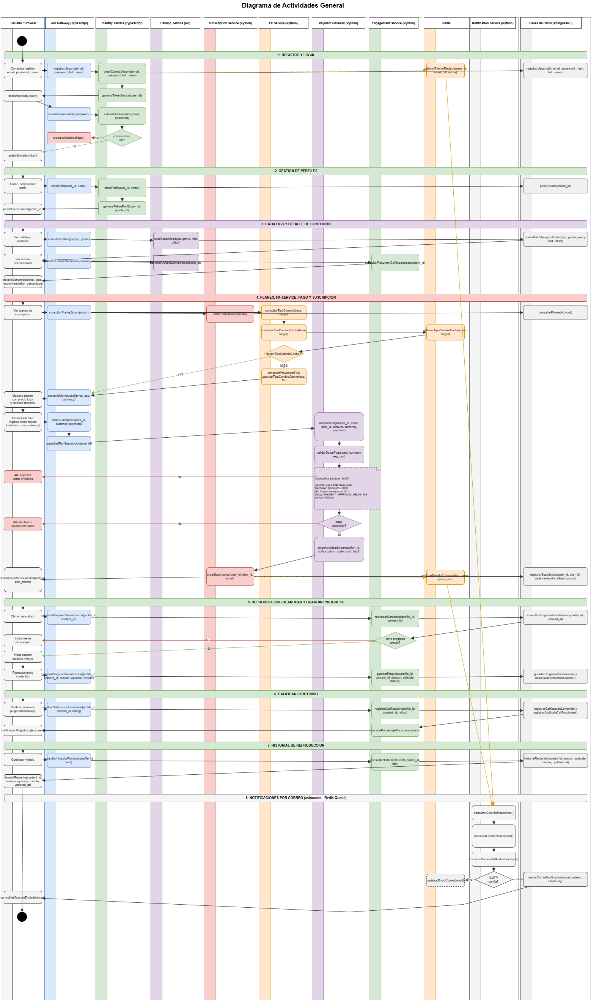
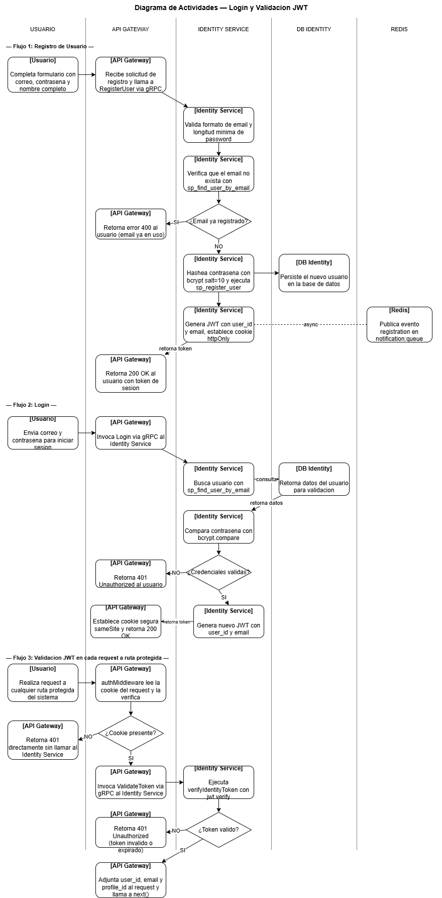
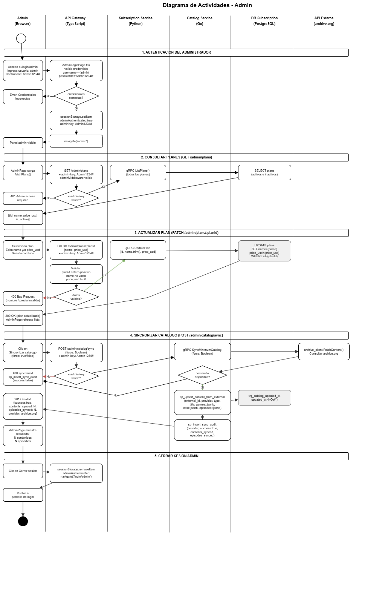
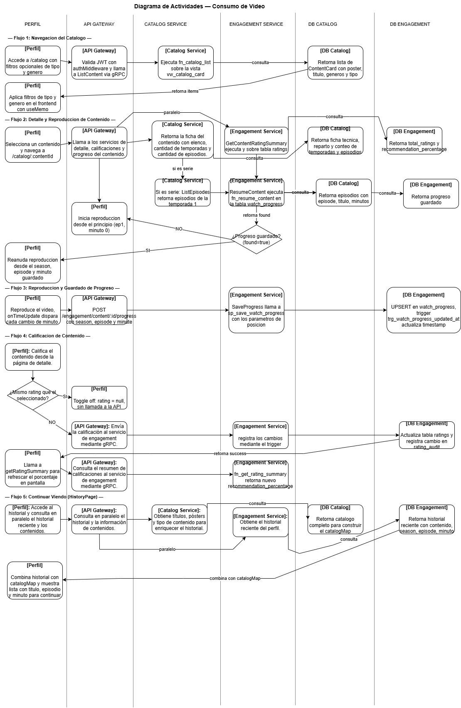
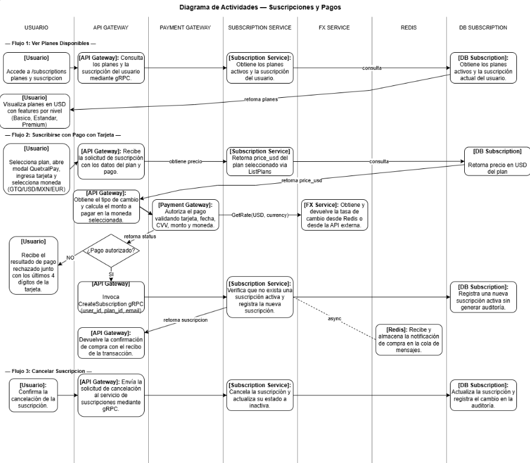
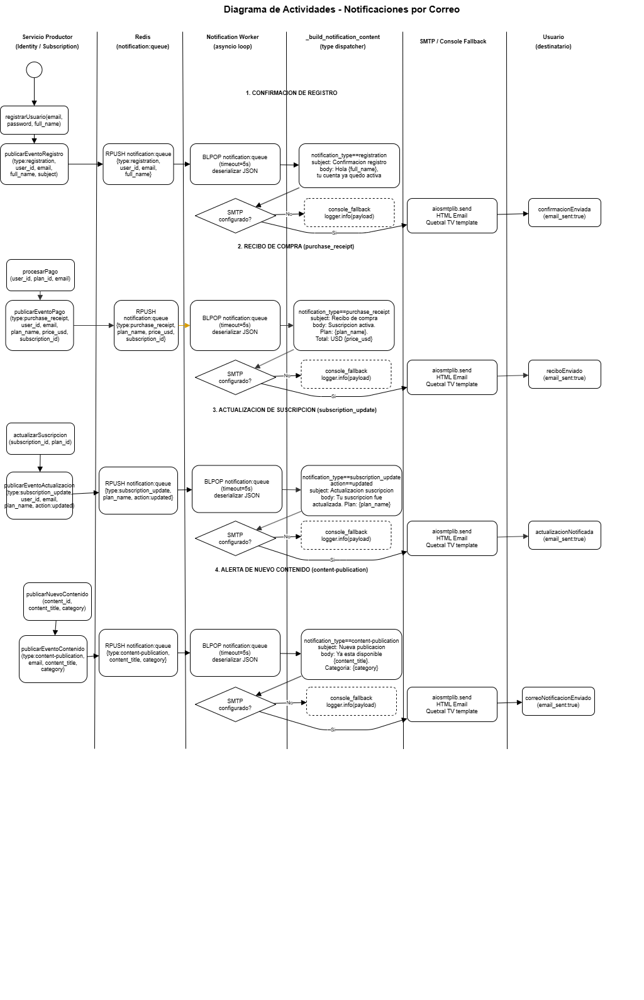
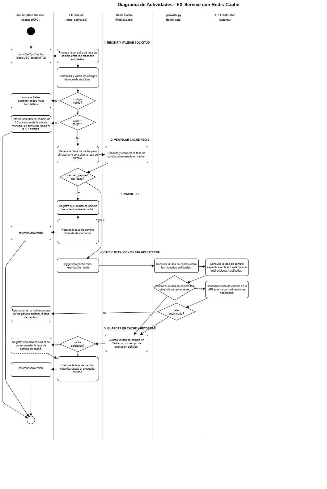
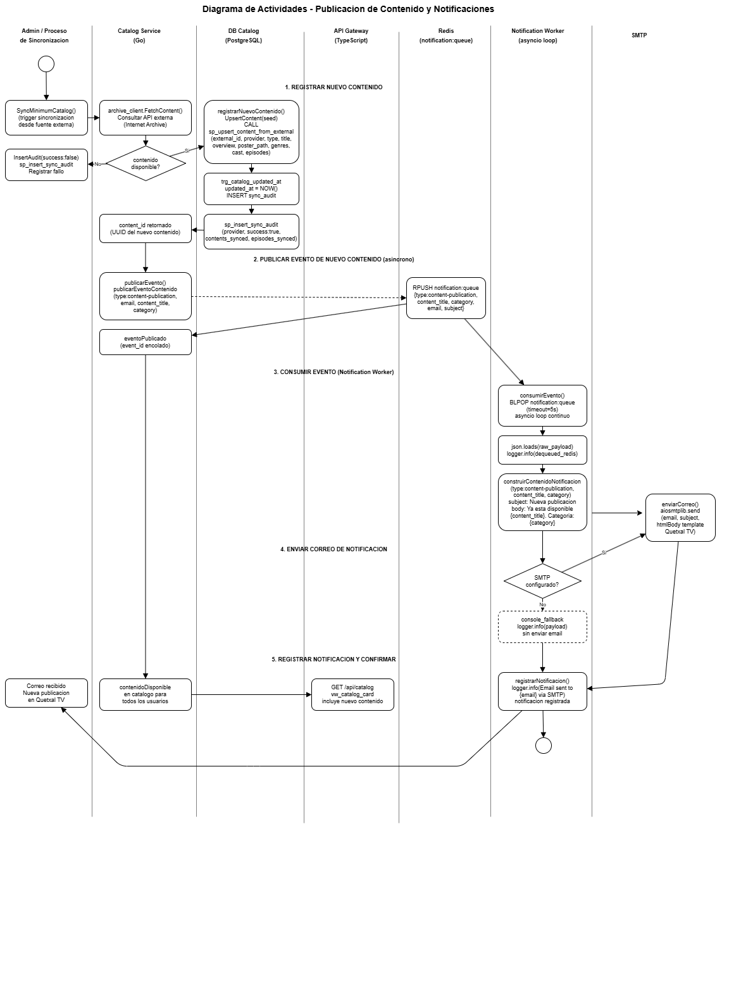
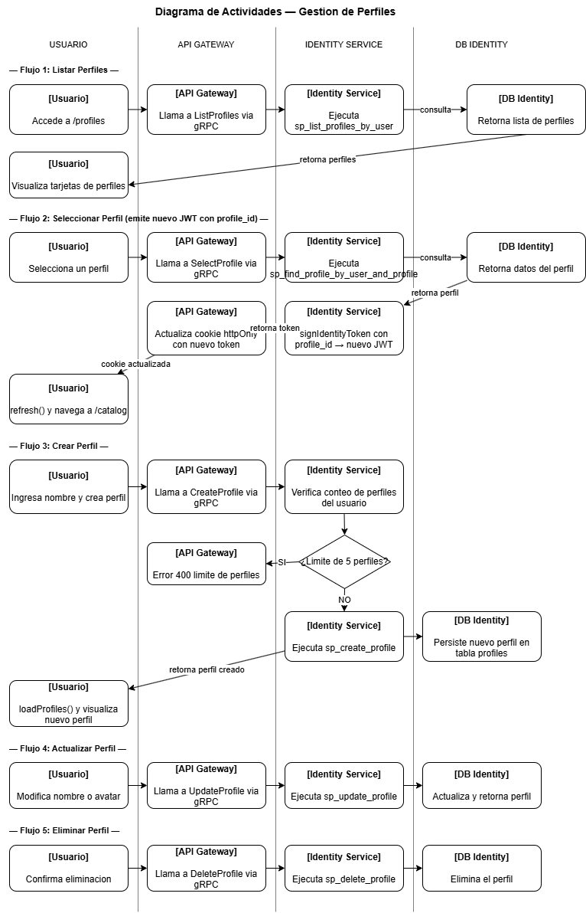

[Regresar](../../README.md)

# Diagrama de Actividades

### Diagrama de Actividades — Login y Validacion JWT

Este diagrama modela los tres flujos de actividad del modulo de autenticacion distribuidos en cinco carriles: Usuario, API Gateway, Identity Service, DB Identity y Redis.

El primer flujo cubre el registro, donde el usuario completa el formulario y el Gateway envia los datos al Identity Service via gRPC. El servicio valida el formato del email y la longitud del password, verifica mediante `sp_find_user_by_email` que el email no este registrado, hashea la contrasena con bcrypt, ejecuta `sp_register_user` para crear la cuenta, genera un JWT con `user_id` y `email`, establece la cookie segura y en paralelo publica un evento de notificacion en Redis.

El segundo flujo cubre el login, donde el Gateway llama a `Login` via gRPC. El Identity Service busca al usuario con `sp_find_user_by_email`, compara la contrasena con `bcrypt.compare`, genera un nuevo JWT y establece la cookie segura en la respuesta.

El tercer flujo cubre la validacion JWT en cada ruta protegida. El `authMiddleware` del Gateway lee la cookie del request, llama a `ValidateToken` via gRPC al Identity Service y si el token es valido adjunta `user_id`, `email` y `profile_id` al request antes de continuar al servicio de destino. Los flujos alternativos de error retornan 400, 401 o 503 segun el tipo de fallo.

----
### Diagrama de Actividades — Admin Panel

Este diagrama modela el flujo completo del panel de administracion de Quetxal TV, distribuido en cinco carriles: Admin Browser, API Gateway, Subscription Service, Catalog Service y DB Subscription.

En la primera seccion el administrador accede a `/login/admin` e ingresa las credenciales `admin / Admin1234#`. El `AdminLoginPage.tsx` valida las credenciales directamente en el frontend sin llamar al backend. Si son correctas guarda `adminAuthenticated:true` y `adminKey:Admin1234#` en `sessionStorage` y redirige a `/admin`. Si son incorrectas muestra el error en pantalla. Cada request posterior al backend incluye el header `x-admin-key: Admin1234#` que el `adminMiddleware` del Gateway valida contra `process.env.ADMIN_KEY`.

En la segunda seccion el `AdminPage.tsx` ejecuta `fetchPlans()` al cargar. El Gateway valida el `x-admin-key`, llama a `gRPC ListPlans()` al Subscription Service y retorna todos los planes con `id`, `name`, `price_usd` e `is_active`.

En la tercera seccion el administrador selecciona un plan, edita el nombre o el precio y guarda. El Gateway valida que `planId` sea entero positivo, `name` no este vacio y `price_usd` sea mayor o igual a cero. Si pasa las validaciones llama a `gRPC UpdatePlan(id, name.trim(), price_usd)` al Subscription Service que ejecuta `UPDATE plans` en la base de datos. Retorna 200 OK con el plan actualizado y el frontend refresca la lista.

En la cuarta seccion el administrador cierra sesion. El frontend ejecuta `sessionStorage.removeItem('adminAuthenticated')` y redirige a `/login/admin`.

---
### Diagrama de Actividades — Consumo de video

Este diagrama modela el flujo completo de un perfil autenticado interactuando con el contenido multimedia, distribuido en seis carriles: Perfil, API Gateway, Catalog Service, Engagement Service, DB Catalog y DB Engagement.

El flujo tiene seis secciones. En la primera el perfil navega el catalogo mediante `GET /api/catalog` o busca por titulo y genero con `GET /api/catalog/search`, el Gateway valida el JWT en cada request y llama a `ListContent` o `SearchContent` via gRPC al Catalog Service, que ejecuta `fn_catalog_list` sobre la vista `vw_catalog_card`.

 En la segunda el perfil selecciona un contenido y el Gateway llama en paralelo a `GetContentDetail` para obtener la ficha tecnica y actores, y a `GetContentRatingSummary` al Engagement Service para mostrar el porcentaje global de recomendacion calculado con `fn_recommendation_percentage`. 
 
 En la tercera el sistema verifica si el perfil tiene progreso previo llamando a `ResumeContent` via gRPC, que consulta `fn_resume_content` en la tabla `watch_progress`; si existe, la reproduccion inicia desde el season, episode y minute exactos guardados, de lo contrario inicia desde el principio.
 
  En la cuarta el perfil reproduce el contenido y el sistema guarda el progreso periodicamente mediante `SaveProgress` via gRPC, que ejecuta `sp_save_watch_progress` con un UPSERT en `watch_progress` y el trigger `trg_watch_progress_updated_at` actualiza automaticamente el timestamp.
  
   En la quinta el perfil puede calificar el contenido con THUMBS_UP o THUMBS_DOWN mediante `RateContent` via gRPC, que ejecuta `sp_rate_content` con un UPSERT en `ratings` y el trigger `trg_audit_rating_changes` registra el cambio en `rating_audit`. 
   
   
   En la sexta el perfil accede a la seccion continuar viendo y el sistema retorna el historial reciente mediante `GetRecentHistory` consultando `fn_get_recent_history` sobre la vista `vw_recent_profile_history`.

-----

### Diagrama de Actividades — Suscripciones y Pagos

Este diagrama modela el flujo completo del ciclo de vida de una suscripcion en Quetxal TV, distribuido en siete carriles: Usuario, API Gateway, Subscription Service, FX Service, Redis, DB Subscription y Notification Service.

El flujo tiene seis secciones, en la primera el usuario solicita ver los planes disponibles. El Gateway llama a `gRPC ListPlans` al Subscription Service, que consulta la tabla `plans` filtrando solo los activos. Con los precios en USD, el Subscription Service llama a `gRPC GetRate` al FX Service para convertir a la moneda local del usuario. El FX Service construye la cache key `fx:rate:USD:LOCAL`, consulta Redis y si hay HIT retorna la tasa directamente. Si hay MISS consulta la API Frankfurter, guarda el resultado en Redis con TTL y retorna la tasa. El Subscription Service aplica `fn_calculate_monthly_price` y retorna los planes con el precio convertido.

En la segunda seccion el usuario selecciona un plan y confirma. El Gateway envía `gRPC CreateSubscription` al Subscription Service, que verifica mediante `vw_user_active_subscription` si el usuario ya tiene una suscripcion activa. Si existe retorna el error `user already has an active subscription`.

En la tercera seccion, si no existe suscripcion previa, el servicio inserta el registro con status `active`. El trigger `trg_audit_subscription_change` registra el evento en `subscription_audit` automaticamente.

En la cuarta seccion el Subscription Service publica un evento `purchase_receipt` en la cola Redis con `RPUSH`. El Notification Service lo consume con `BLPOP` y envia el recibo de compra por correo via SMTP.

En la quinta seccion el usuario puede modificar su plan. El Gateway llama a `gRPC UpdateSubscription`, el servicio actualiza el `plan_id`, el trigger audita el cambio y se publica un evento `subscription_update` en Redis para notificacion.

En la sexta seccion el usuario cancela su suscripcion. El Gateway llama a `gRPC CancelSubscription`, el servicio actualiza el status a `cancelled` y el trigger registra el cambio en auditoria.

----

### Diagrama de Actividades — Notificaciones por correo

Este diagrama modela el flujo de envio de notificaciones automaticas por correo electronico, distribuido en seis carriles: Servicio Productor, Redis Queue, Notification Worker, _build_notification_content, SMTP/Console Fallback y Usuario destinatario.

El diagrama cubre los cuatro tipos de notificacion que el sistema envia.

En el primer flujo de confirmacion de registro, el Identity Service publica un evento `registration` en Redis con `RPUSH notification:queue` incluyendo `user_id`, `email` y `full_name`. El Notification Worker consume el evento con `BLPOP` y lo pasa a `_build_notification_content`, que detecta `notification_type == registration` y construye el subject como "Confirmacion de registro en Quetxal TV" y el body personalizado con el nombre del usuario. Si SMTP esta configurado, envia el email HTML con el template de Quetxal TV via `aiosmtplib.send`. Si no, usa console fallback registrando el payload en logs.

En el segundo flujo de recibo de compra, el Subscription Service publica un evento `purchase_receipt` con `plan_name`, `price_usd` y `subscription_id`. El worker lo procesa, `_build_notification_content` detecta el tipo y construye el subject como "Recibo de compra en Quetxal TV" con el detalle del plan y precio. Se envia via SMTP o console fallback.

En el tercer flujo de actualizacion de suscripcion, el Subscription Service publica un evento `subscription_update` con `action:updated` y `plan_name`. El builder detecta el tipo y el campo `action == updated` para construir el mensaje correcto: "Tu suscripcion fue actualizada. Plan: {plan_name}". Se envia via SMTP o console fallback.

En el cuarto flujo de alerta de nuevo contenido, el Catalog Service publica un evento `content-publication` con `content_title` y `category`. El builder construye el subject como "Nueva publicacion en Quetxal TV" y el body con el titulo y categoria del contenido. Se envia via SMTP o console fallback.

En todos los flujos, si ocurre un error al procesar el evento, el worker registra la excepcion con `logger.exception` y espera 2 segundos antes de continuar con el siguiente evento de la cola, garantizando que un fallo no detenga el procesamiento general.

----

### Diagrama de Actividades — Flujo de FX-Service + Redis Cache

Este diagrama modela el flujo completo del FX-Service distribuido en cinco carriles: Subscription Service (cliente gRPC), FX Service (grpc_server.py), Redis Cache (RedisCache), provider.py (fetch_rate) y API Frankfurter (externa).

El flujo tiene cinco secciones que demuestran la estrategia de cache, optimizacion y tolerancia a fallos del servicio.

En la primera seccion el Subscription Service llama a `GetRate(base, target)` via gRPC. El FX Service ejecuta `_normalize_currency` sobre ambos codigos: aplica `strip().upper()`, verifica que tengan exactamente 3 letras y que sean solo alfabeticos con `isalpha()`. Si alguno es invalido retorna `success:False` con el mensaje `currency codes must be 3 letters`. Si base es igual a target, retorna `rate=1.0` con `provider:self` sin consultar Redis ni la API externa, optimizando el caso trivial.

En la segunda seccion el servicio construye la cache key `fx:rate:{BASE}:{TARGET}` y llama a `get_json(cache_key)` que internamente ejecuta `redis.get(key)` y deserializa el JSON. El resultado determina el camino a seguir.

En la tercera seccion de cache HIT, el servicio registra `logger.info(cache hit key={key})` y retorna directamente `RateResponse(success:True, base, target, rate, timestamp, cached:True)` con el mensaje `rate resolved from cache`. El Subscription Service recibe la tasa sin ninguna llamada a API externa.

En la cuarta seccion de cache MISS, el servicio registra `logger.info(cache miss key={key})` y llama a `fetch_rate(fx_api_base_url, base_code, target_code)`. El provider intenta primero el endpoint primario `GET /rate/{BASE}/{TARGET}`. Si el response no contiene el campo `rate`, hace fallback al endpoint `/rates?base={BASE}&quotes={TARGET}`. Si ninguno retorna una tasa valida, lanza `FxProviderError` y el servicio retorna `success:False` con el mensaje `could not fetch fx rate`.

En la quinta seccion el servicio guarda el resultado en Redis con `set_json(cache_key, payload, cache_ttl)` que ejecuta `redis.set(key, json.dumps(value), ex=TTL)`. Si Redis no esta disponible al guardar, el servicio registra un `logger.warning` pero no interrumpe el flujo y retorna igual la tasa con `RateResponse(success:True, cached:False, message:rate resolved from provider)`. El warning garantiza que el sistema sea resiliente: un fallo de Redis al escribir no afecta la respuesta al cliente.

-----

### Diagrama de Actividades — Publicacion de Contenido y Notificaciones

En la primera seccion el administrador crea contenido nuevo desde el panel de administracion enviando tipo, titulo, overview, poster, generos como JSONB, cast como JSONB y episodios como JSONB. El Gateway llama a `gRPC CreateContent` al Catalog Service, que persiste el registro con `sp_upsert_content` en DB Catalog. El trigger `trg_catalog_updated_at` actualiza automaticamente `updated_at = NOW()` y el servicio retorna el `content_id` UUID del nuevo contenido.

En la segunda seccion el Catalog Service publica un evento `content-publication` en Redis con `RPUSH notification:queue` incluyendo `type`, `email`, `content_title` y `category`. Este paso es completamente asincrono: el Catalog Service no espera respuesta del Notification Worker y continua su flujo normalmente. Redis actua como buffer desacoplado entre productor y consumidor.

En la tercera seccion el Notification Worker consume el evento con `BLPOP notification:queue` en su loop de `asyncio`. Deserializa el JSON con `json.loads(raw_payload)`, registra `logger.info(dequeued_redis)` y llama a `construirContenidoNotificacion` que detecta `type:content-publication` y genera el subject "Nueva publicacion en Quetxal TV" y el body "Ya esta disponible {content_title}. Categoria: {category}".

En la cuarta seccion el worker verifica si SMTP esta configurado. Si lo esta, envia el email HTML con el template de Quetxal TV via `aiosmtplib.send`. Si no, usa console fallback con `logger.info(payload)` sin interrumpir el flujo.

En la quinta seccion el worker registra la notificacion con `logger.info(Email sent to {email})` y el nuevo contenido queda disponible en el catalogo para todos los usuarios mediante la vista `vw_catalog_card` que ya incluye el nuevo registro.

### Diagrama de Actividades — Gestion de Usuarios

