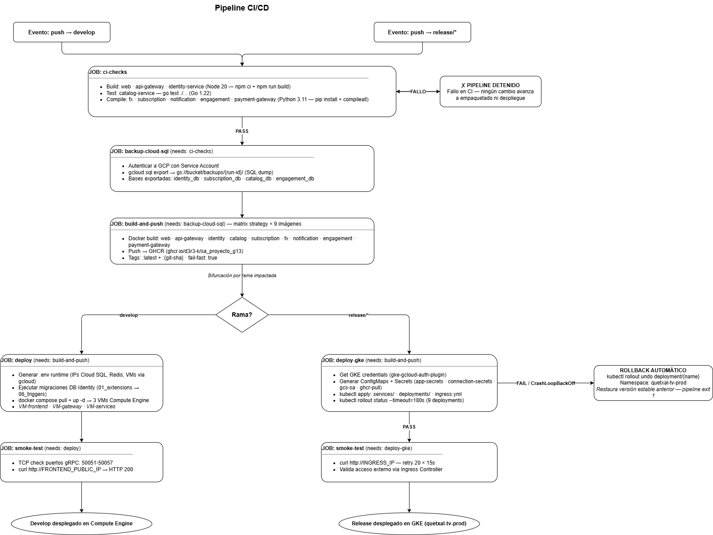
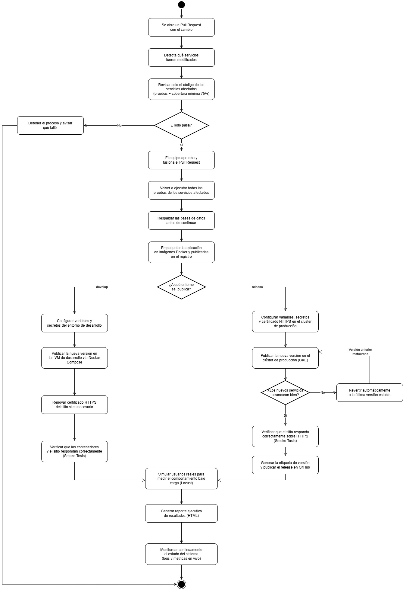

[← Regresar](../../README.md)

[Regresar](../../README.md)

# Diagrama de Flujo del Pipeline CI/CD

---

## Descripcion general

El pipeline CI/CD de Quetxal TV esta implementado con **GitHub Actions** y opera bajo la premisa de **cortocircuito critico**: si cualquier job falla, el pipeline se detiene de inmediato y ningun cambio avanza hacia etapas de empaquetado o despliegue. Existen dos workflows independientes que comparten los mismos tres jobs iniciales y divergen en la etapa de despliegue segun la rama impactada.

| Workflow | Archivo | Trigger | Destino |
| :------- | :------ | :------ | :------ |
| Deploy develop | `.github/workflows/deploy-develop.yml` | `push → develop` | Google Compute Engine (3 VMs) |
| Deploy release | `.github/workflows/deploy-release.yml` | `push → release/*` | Google Kubernetes Engine (GKE) |

---

## Etapas del pipeline

### Etapa 1 — JOB: ci-checks

Es la primera barrera de calidad. Compila y verifica todos los servicios del backend poliglota antes de permitir cualquier empaquetado o despliegue.

| Paso | Servicio | Accion | Runtime |
| :--- | :------- | :----- | :------ |
| 1 | web | `npm ci` + `npm run build` | Node 20 |
| 2 | api-gateway | `npm ci` + `npm run build` | Node 20 |
| 3 | identity-service | `npm ci` + `npm run build` | Node 20 |
| 4 | catalog-service | `go test ./...` | Go 1.22 |
| 5 | fx-service | `pip install` + `python -m compileall src/` | Python 3.11 |
| 6 | subscription-service | `pip install` + `python -m compileall src/` | Python 3.11 |
| 7 | notification-service | `pip install` + `python -m compileall src/` | Python 3.11 |
| 8 | engagement-service | `pip install` + `python -m compileall src/` | Python 3.11 |
| 9 | payment-gateway-service | `pip install` + `python -m compileall src/` | Python 3.11 |

**Cortocircuito:** Si cualquiera de estos pasos falla, el job completo falla y los jobs `backup-cloud-sql` y `build-and-push` no se ejecutan.

---

### Etapa 2 — JOB: backup-cloud-sql

Se ejecuta unicamente si `ci-checks` pasa. Genera un respaldo completo de las cuatro bases de datos operacionales antes de construir o desplegar cualquier imagen nueva.

| Paso | Accion |
| :--- | :----- |
| 1 | Autenticacion a GCP con Service Account (`credentials_json`) |
| 2 | `gcloud sql export sql qx-postgres gs://bucket/backups/{rama}/{run-id}/identity_db.sql` |
| 3 | `gcloud sql export sql qx-postgres gs://bucket/backups/{rama}/{run-id}/subscription_db.sql` |
| 4 | `gcloud sql export sql qx-postgres gs://bucket/backups/{rama}/{run-id}/catalog_db.sql` |
| 5 | `gcloud sql export sql qx-postgres gs://bucket/backups/{rama}/{run-id}/engagement_db.sql` |

Redis queda excluido del respaldo por ser un almacenamiento en memoria de caracter transitorio (cache y cola de eventos).

---

### Etapa 3 — JOB: build-and-push

Construye y publica las imagenes Docker de los 9 servicios hacia el registro privado **GitHub Container Registry (GHCR)** usando una **matrix strategy** con `fail-fast: true`.

| Parametro | Valor |
| :-------- | :---- |
| Registro | `ghcr.io/d3r3-k/sa_proyecto_g13` |
| Imagenes | web, api-gateway, identity-service, catalog-service, subscription-service, fx-service, notification-service, engagement-service, payment-gateway-service |
| Tags | `:latest` + `:{git-sha}` |
| Estrategia | matrix × 9 imagenes — `fail-fast: true` |

---

### Etapa 4A — JOB: deploy (rama develop → Compute Engine)

Despliega la arquitectura completa en tres Maquinas Virtuales de Google Compute Engine usando Docker Compose.

| Paso | Accion |
| :--- | :----- |
| 1 | Generar archivos `.env` runtime consultando IPs dinamicas de Cloud SQL, Redis y VMs via `gcloud` |
| 2 | Ejecutar migraciones DB Identity (directorios `01_extensions` → `06_triggers` en orden) |
| 3 | `docker compose pull + up -d` en VM-services (microservicios + Redis) |
| 4 | `docker compose pull + up -d` en VM-gateway (API Gateway) |
| 5 | `docker compose pull + up -d` en VM-frontend (React/Vite) |

---

### Etapa 4B — JOB: deploy-gke (rama release → GKE)

Despliega la arquitectura en el cluster de Google Kubernetes Engine aplicando los manifiestos declarativos YAML. Ningun cambio se realiza manualmente via CLI.

| Paso | Accion |
| :--- | :----- |
| 1 | Obtener credenciales del cluster (`gcloud container clusters get-credentials`) |
| 2 | Crear/actualizar `ConfigMap: app-config` con variables de entorno genericas |
| 3 | Crear/actualizar `Secret: app-secrets` con credenciales sensibles (JWT, BD passwords, SMTP) |
| 4 | Crear/actualizar `Secret: connection-secrets` con DATABASE_URL de cada servicio Python |
| 5 | Crear/actualizar `Secret: gcs-service-account` con Service Account JSON de GCS |
| 6 | Crear/actualizar `Secret: ghcr-pull-secret` para pull de imagenes privadas |
| 7 | `kubectl apply -f deploy/release/k8s/services/` (9 ClusterIP Services) |
| 8 | `kubectl apply -f deploy/release/k8s/deployments/` (9 Deployments) |
| 9 | `kubectl apply -f deploy/release/k8s/ingress.yml` (Ingress Controller) |
| 10 | `kubectl rollout status deployment/{name} --timeout=180s` x9 |

**Rollback automatico:** Si cualquier deployment falla el rollout (timeout, CrashLoopBackOff, error de inicializacion), el pipeline ejecuta `kubectl rollout undo deployment/{name}` y termina con `exit 1`, restaurando la ultima version estable del cluster.

---

### Etapa 5 — JOB: smoke-test

Verifica que el despliegue responde correctamente antes de dar el pipeline por exitoso.

**Develop:**
| Verificacion | Metodo |
| :----------- | :----- |
| Puertos gRPC 50051-50057 activos | TCP check (`/dev/tcp/127.0.0.1/{port}`) |
| Frontend responde | `curl http://FRONTEND_PUBLIC_IP` → HTTP 200 |

**Release:**
| Verificacion | Metodo |
| :----------- | :----- |
| Ingress responde | `curl http://INGRESS_IP` → HTTP 200 |
| Tolerancia a provision lenta | Retry 20 intentos x 15 segundos (5 minutos maximo) |

---

## Justificacion del diseno del pipeline

### Por que GitHub Actions

GitHub Actions fue seleccionado por ser la herramienta de CI/CD nativa del repositorio en GitHub, eliminando la necesidad de integrar un servidor CI externo (Jenkins, CircleCI). Los workflows viven como codigo YAML dentro del repositorio (`/.github/workflows/`), lo que garantiza que el pipeline evoluciona junto al codigo y es revisado mediante Pull Requests como cualquier otro cambio.

### Por que separar en dos workflows

La separacion en `deploy-develop.yml` y `deploy-release.yml` responde a la politica de ramificacion del proyecto: cada rama tiene un ciclo de vida, un entorno de destino y unas restricciones de etiquetado distintas. Un workflow unico con condicionales hubiera dificultado la auditoria y el mantenimiento. Al tener workflows separados, es posible ajustar permisos, environments de GitHub y secrets de forma independiente para `develop` y `release`.

### Por que el orden ci-checks → backup → build → deploy

El orden es deliberado y aplica el principio de **falla rapida con minimo costo**:

1. **ci-checks primero:** Las compilaciones y pruebas no requieren acceso a GCP. Si el codigo esta roto, el pipeline falla antes de consumir cuota de red o almacenamiento en la nube.
2. **backup antes de build:** El respaldo se hace antes de construir nuevas imagenes para garantizar que, si el despliegue corrompe datos, existe un punto de restauracion tomado justo antes del cambio.
3. **build antes de deploy:** Las imagenes deben estar publicadas en GHCR antes de que las VMs o los Pods de Kubernetes puedan descargarlas.

### Por que matrix strategy en build-and-push

Los 9 servicios son independientes entre si a nivel de build. La matrix strategy permite construirlos en paralelo, reduciendo el tiempo total de empaquetado. `fail-fast: true` garantiza que si un servicio falla el build, el resto de builds paralelos se cancelan y el pipeline no avanza con un conjunto incompleto de imagenes.

### Por que el smoke-test al final

El smoke-test es la unica verificacion post-despliegue que confirma que el sistema es accesible desde afuera. Sin el, el pipeline podria reportar exito aunque los contenedores arrancaran pero el trafico de red no llegara al servicio. Es una red de seguridad minima que no reemplaza las pruebas de integracion, pero si detecta fallos catastroficos de configuracion de red, DNS o Ingress antes de que los usuarios los reporten.

### Por que el rollback automatico solo en GKE

En Compute Engine (develop), un fallo de despliegue es recuperable manualmente porque el entorno de desarrollo tolera breves periodos de inestabilidad. En GKE (release), que es el entorno de produccion/staging, cualquier version inestable afecta a usuarios reales. Por eso el pipeline ejecuta `kubectl rollout undo` automaticamente ante cualquier fallo de rollout, garantizando que el cluster siempre vuelve a una version 100% estable sin intervencion humana.
