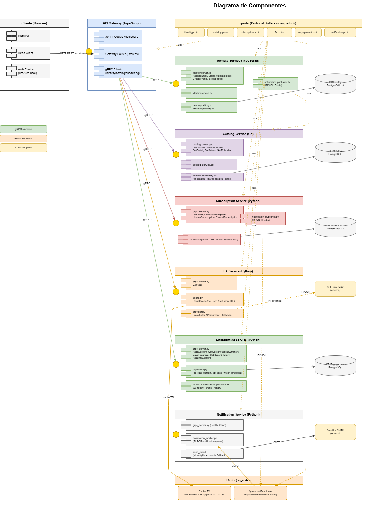

# Diagrama de Componentes

Este diagrama describe la estructura interna del sistema, mostrando todos los componentes de software, sus responsabilidades, las interfaces que exponen y cómo se interconectan entre sí. Está organizado en tres columnas: la capa del cliente a la izquierda, la capa de entrada al centro-izquierda, los microservicios al centro-derecha y los recursos externos a la derecha.

---

### Cliente (Browser)

Es el punto de inicio de toda interacción. Está compuesto por tres componentes: **React UI**, que renderiza las vistas de la aplicación; **Axios Client**, que centraliza todas las llamadas HTTP hacia el API Gateway incluyendo el manejo de cookies; y **Auth Context** con el hook `useAuth`, que mantiene el estado de autenticación y perfil activo en memoria durante la sesión.

---

### API Gateway (TypeScript)

Es el único punto de entrada al sistema. Ningún cliente externo puede comunicarse directamente con los microservicios. Internamente tiene tres componentes: el **JWT + Cookie Middleware**, que intercepta cada solicitud entrante, valida la cookie segura y extrae el JWT para propagar la identidad del usuario; el **Gateway Router** basado en Express, que mapea cada ruta HTTP hacia el microservicio gRPC correspondiente; y los **gRPC Clients**, uno por cada microservicio backend, generados a partir de los archivos `.proto` compartidos.

---

### /proto (compartido)

Es el contrato central del sistema. Contiene los seis archivos Protocol Buffers que definen los mensajes y métodos gRPC de cada dominio: `identity.proto`, `catalog.proto`, `subscription.proto`, `fx.proto`, `engagement.proto` y `notification.proto`. Todos los servicios dependen de esta carpeta para generar su código de cliente o servidor gRPC, garantizando contratos estrictos entre lenguajes distintos.

---

### Identity Service (TypeScript — :50051)

Gestiona usuarios, autenticación y perfiles. Su componente `identity.server.ts` expone los métodos gRPC: `RegisterUser`, `Login`, `ValidateToken`, `CreateProfile` y `SelectProfile`. La capa de servicio `identity.service.ts` orquesta la lógica de negocio usando bcrypt para contraseñas y JWT para tokens. Los repositorios `user.repository.ts` y `profile.repository.ts` acceden a la base de datos PostgreSQL mediante stored procedures (`sp_register_user`, `sp_create_profile`) y la función `fn_can_create_profile`. El componente `notification.publisher.ts` publica eventos `registration` en la cola Redis al completar un registro exitoso.

---

### Catalog Service (Go — :50055)

Gestiona el contenido multimedia. Expone los métodos `ListContent`, `SearchContent`, `GetDetail`, `GetActors` y `GetEpisodes`. El `catalog_service.go` orquesta la lógica y el `content_repository.go` accede a PostgreSQL mediante las funciones de base de datos `fn_catalog_list`, `fn_catalog_detail`, `fn_catalog_cast` y `fn_catalog_episodes`, todas construidas sobre las vistas `vw_catalog_card` y `vw_content_detail`.

---

### Subscription Service (Python — :50053)

Gestiona planes y suscripciones. Expone `ListPlans`, `CreateSubscription`, `UpdateSubscription` y `CancelSubscription`. El `repository.py` accede a PostgreSQL usando la vista `vw_user_active_subscription` y el índice único `ux_subscriptions_one_active_per_user` que garantiza una sola suscripción activa por usuario. El componente `notification_publisher.py` publica eventos `purchase_receipt` o `subscription_update` en la cola Redis al crear o modificar una suscripción.

---

### FX Service (Python — :50052)

Consulta tipos de cambio de divisas. Expone un único método `GetRate`. El componente `cache.py` implementa `RedisCache` con operaciones `get_json` y `set_json` con TTL configurable, usando la clave `fx:rate:{BASE}:{TARGET}`. Si hay cache miss, el componente `provider.py` consulta la API externa Frankfurter usando el endpoint primario con fallback automático. El resultado se guarda en Redis para evitar llamadas repetitivas.

---

### Engagement Service (Python — :50056)

Gestiona calificaciones e historial de reproducción. Expone `RateContent`, `GetContentRatingSummary`, `SaveProgress`, `GetRecentHistory` y `ResumeContent`. El `repository.py` accede a PostgreSQL mediante los stored procedures `sp_rate_content` y `sp_save_watch_progress`. Los componentes de base de datos incluyen la función `fn_recommendation_percentage` para calcular el porcentaje global de recomendación y la vista `vw_recent_profile_history` para el historial reciente por perfil.

---

### Notification Service (Python — :50054)

Envía notificaciones por correo de forma desacoplada. El `notification_worker.py` consume eventos de la cola Redis mediante `BLPOP notification:queue` de forma bloqueante. Según el tipo de evento recibido (`registration`, `purchase_receipt`, `subscription_update`, `content-publication`), construye el contenido del email y lo envía mediante `aiosmtplib` al servidor SMTP externo. Si SMTP no está disponible, usa un console fallback registrando el evento en logs.

---

### Redis (sa_redis)

Cumple dos roles completamente separados. Como **cache del FX Service** almacena tasas de cambio con TTL bajo la clave `fx:rate:{BASE}:{TARGET}`, evitando llamadas repetitivas a la API Frankfurter. Como **broker de notificaciones** mantiene la lista `notification:queue` donde Identity Service y Subscription Service publican eventos con `RPUSH` y Notification Service los consume con `BLPOP`.

---

### Flujo general del sistema

El usuario interactúa con la Web App, que envía solicitudes HTTP al API Gateway. El Gateway valida la cookie y el JWT, luego redirige la solicitud al microservicio correspondiente mediante gRPC usando los contratos definidos en `/proto`. Cada microservicio procesa la solicitud de forma autónoma, accede a su propia base de datos mediante objetos programables (stored procedures, vistas y funciones), y retorna la respuesta al Gateway. Los flujos de notificación se ejecutan de forma asíncrona: los servicios publican eventos en Redis y el Notification Service los procesa de manera independiente sin bloquear el flujo principal.