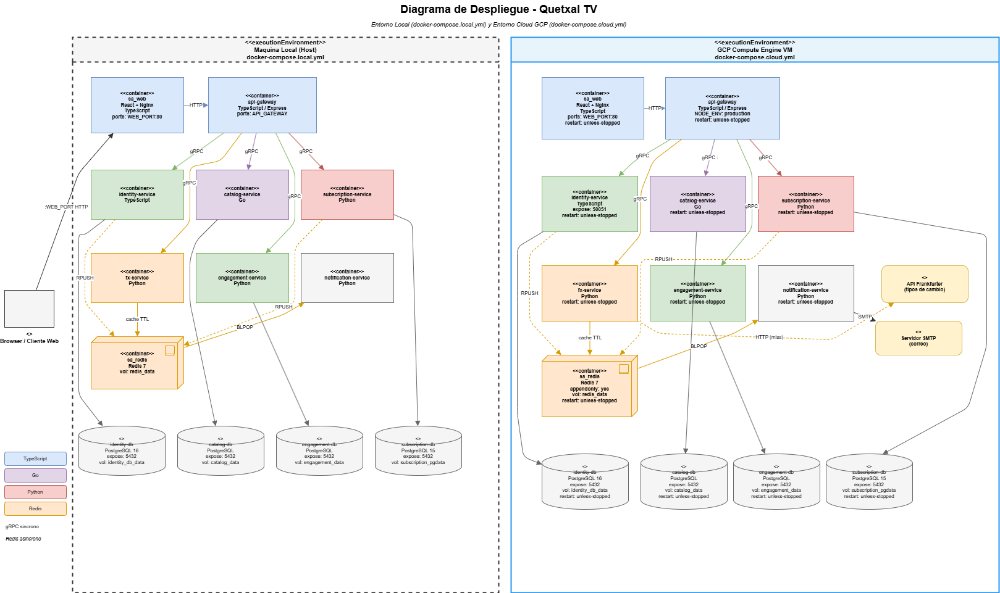

[← Regresar](../../README.md)

## Diagrama de Despliegue — Quetxal TV

Este diagrama muestra el mapeo físico de todos los componentes del sistema a sus contenedores Docker en los dos entornos requeridos por el proyecto.

---

### Entorno Local — `docker-compose.local.yml`

Pensado para desarrollo y pruebas en la máquina del desarrollador. Todos los contenedores comparten la red interna `sa_net` de tipo bridge.

| Contenedor | Lenguaje | Puerto | Rol |
| :--------- | :------- | :----- | :-- |
| sa_web | TypeScript (React + Nginx) | WEB_PORT:80 | Frontend — único puerto público al host |
| api-gateway | TypeScript (Express) | API_GATEWAY_PORT:3000 | Punto de entrada único — único puerto público al host |
| identity-service | TypeScript | expose 50051 | Autenticación y perfiles — solo red interna |
| catalog-service | Go | expose 50055 | Catálogo y búsqueda — solo red interna |
| subscription-service | Python | expose 50053 | Planes y suscripciones — solo red interna |
| fx-service | Python | expose 50052 | Tipos de cambio + Redis cache — solo red interna |
| engagement-service | Python | expose 50056 | Calificaciones e historial — solo red interna |
| notification-service | Python | expose 50054 | Envío de correos vía Redis queue — solo red interna |
| sa_redis | Redis 7 | expose 6379 | Cache FX + Queue notificaciones |
| identity-db | PostgreSQL 16 | expose 5432 | BD de usuarios y perfiles |
| catalog-db | PostgreSQL | expose 5432 | BD de contenido multimedia |
| subscription-db | PostgreSQL 15 | expose 5432 | BD de planes y suscripciones |
| engagement-db | PostgreSQL | expose 5432 | BD de calificaciones e historial |

---

### Entorno Cloud — `docker-compose.cloud.yml` *(único entorno calificado)*

Desplegado sobre una VM de Google Cloud Platform Compute Engine. La topología es idéntica al entorno local pero con configuración de producción.

| Diferencia clave | Local | Cloud GCP |
| :--------------- | :---- | :-------- |
| Política de reinicio | No configurada | `restart: unless-stopped` en todos |
| Entorno Node | Variable `.env` | `NODE_ENV: production` |
| Cookie segura | Variable `.env` | `COOKIE_SECURE: true` |
| Redis persistencia | Sin appendonly | `appendonly: yes` |
| Acceso externo | localhost del dev | IP pública via GCP Firewall Rules |
| Variables sensibles | `.env` local | `.env` creado manualmente en la VM |

---

### Comunicación entre contenedores

Toda la comunicación interna ocurre dentro de la red `sa_net`. El cliente web envía solicitudes HTTP al API Gateway, que las transforma en llamadas gRPC hacia cada microservicio usando los contratos definidos en `/proto`. Ningún servicio backend es accesible desde fuera de la red Docker. Redis cumple dos roles: como cache TTL para el FX Service bajo la clave `fx:rate:{BASE}:{TARGET}`, y como cola FIFO para notificaciones bajo la clave `notification:queue`.

---

### Sistemas externos

| Sistema | Comunicación | Propósito |
| :------ | :----------- | :-------- |
| API Frankfurter | HTTP (solo en cache miss) | Proveedor de tipos de cambio de divisas |
| Servidor SMTP | SMTP | Envío de correos de confirmación, recibos y alertas |