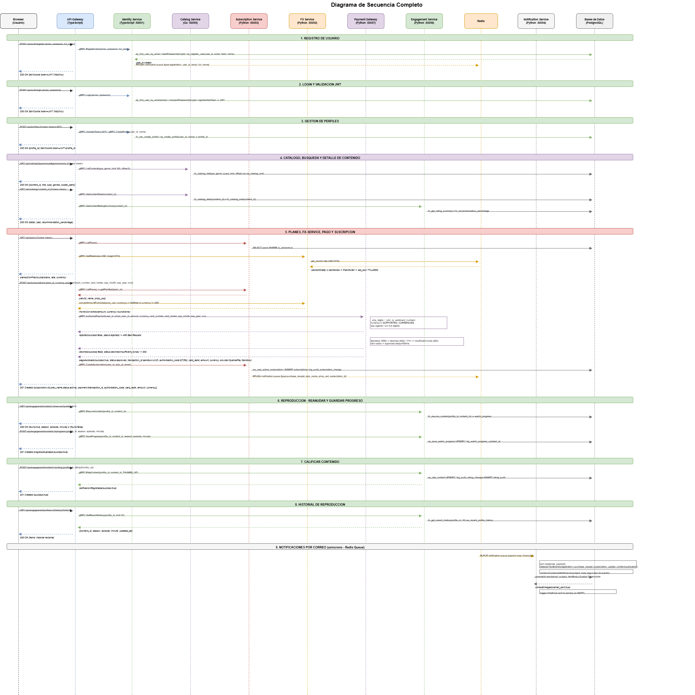
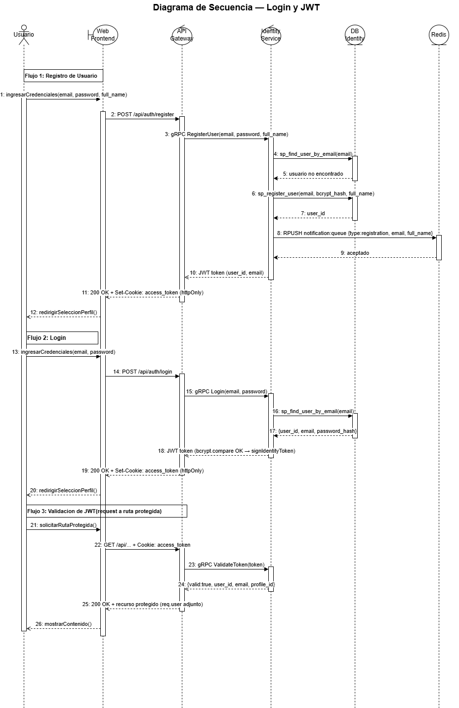
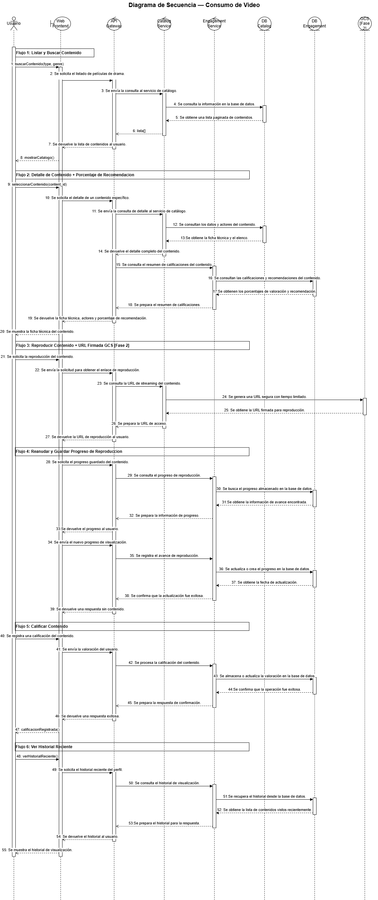
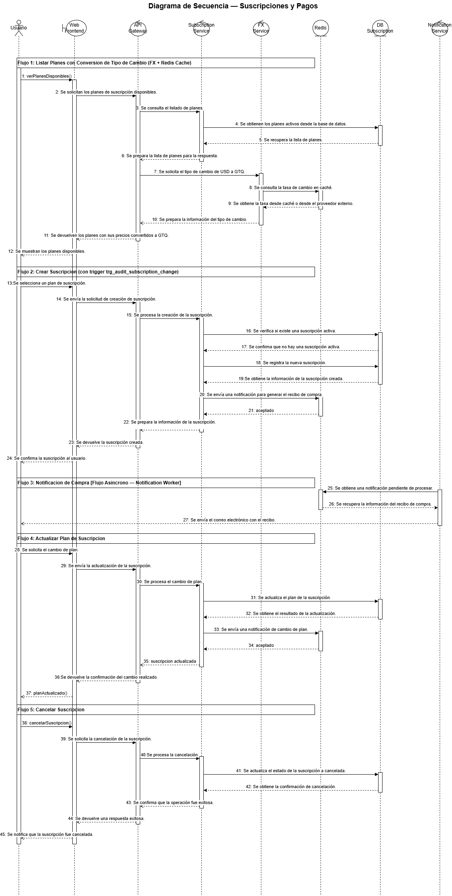
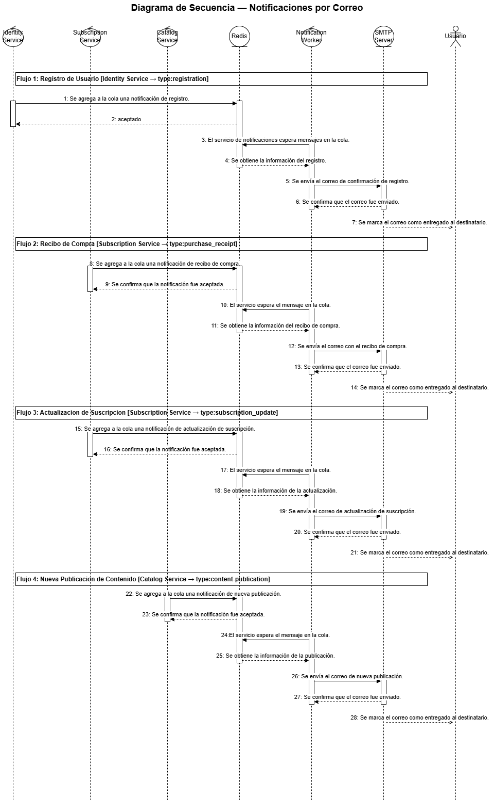
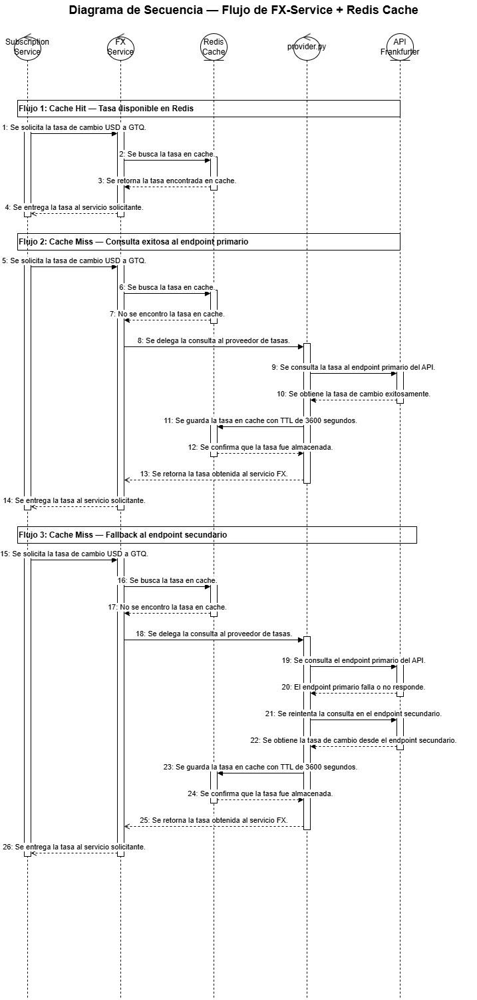
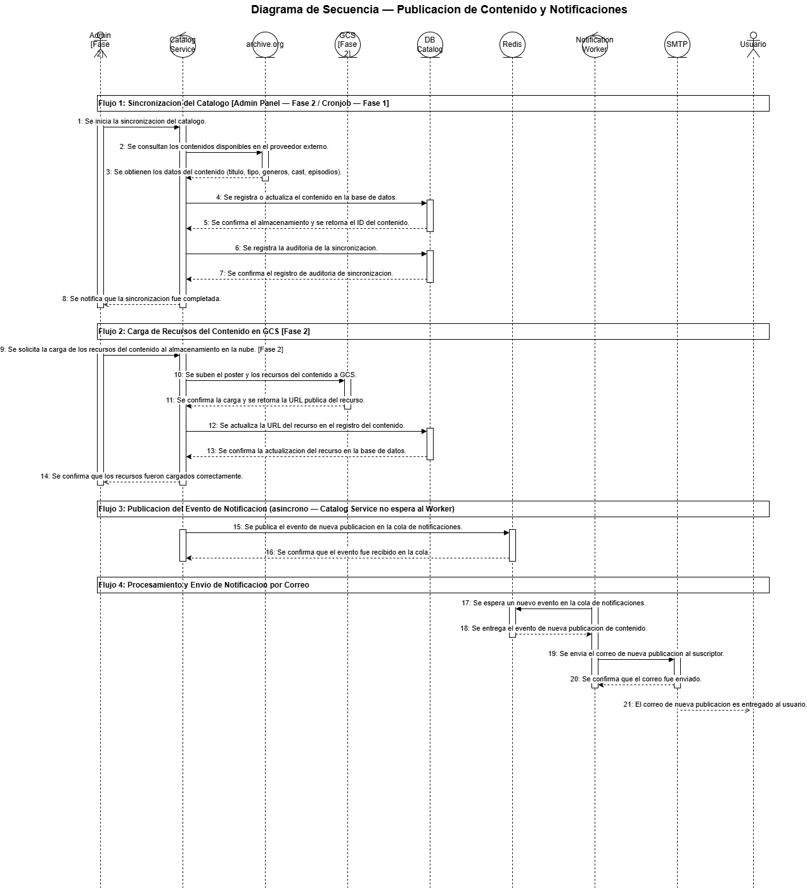

[Regresar](../../README.md)

# Diagrama de Secuencia

### Diagrama de Secuencia — Login y Validacion JWT

### Diagrama de Secuencia Completo

Este diagrama unifica todos los flujos del sistema en una sola vista temporal, mostrando la interaccion entre diez participantes: Browser, API Gateway, Identity Service, Catalog Service, Subscription Service, FX Service, Engagement Service, Redis, Notification Service y las Bases de Datos PostgreSQL. El diagrama cubre nueve modulos en orden cronologico tal como los experimenta un usuario real.

---

#### Modulo 1 — Registro de Usuario

El Browser envia `POST /api/auth/register` con email, password y full_name. El Gateway llama a `gRPC RegisterUser` al Identity Service, que verifica que el email no exista con `sp_find_user_by_email`, hashea la contrasena con bcrypt salt=10 y ejecuta `sp_register_user` para persistir el usuario. Inmediatamente despues publica un evento `registration` en Redis con `RPUSH notification:queue`. Genera un JWT con `signIdentityToken({user_id, email})` y lo retorna al Gateway, que establece la cookie `httpOnly sameSite secure` y responde 200 OK.

---

#### Modulo 2 — Login y Validacion JWT

El Browser envia `POST /api/auth/login`. El Gateway llama a `gRPC Login`, que busca al usuario con `sp_find_user_by_email` y compara la contrasena con `bcrypt.compare`. Si las credenciales son validas genera un nuevo JWT y lo retorna. El Gateway establece la cookie y responde 200 OK. En cada request posterior a rutas protegidas, el `authMiddleware` del Gateway llama a `gRPC ValidateToken` al Identity Service, que ejecuta `verifyIdentityToken` con `jwt.verify`. Si el token es valido adjunta `{user_id, email, profile_id}` al request y continua al servicio destino.

---

#### Modulo 3 — Gestion de Perfiles

El Browser solicita crear un perfil con `POST /api/profiles`. El Gateway valida el JWT y llama a `gRPC CreateProfile(user_id, name)` al Identity Service. El servicio verifica que el usuario no haya alcanzado el limite de perfiles con `fn_can_create_profile` y crea el perfil con `sp_create_profile`. Al seleccionar el perfil activo, el Identity Service genera un nuevo JWT que incluye el `profile_id` ademas del `user_id`, actualizando la cookie del Browser. Todos los requests posteriores incluyen este `profile_id` en el token para que los servicios de Engagement sepan a que perfil pertenecen las acciones.

---

#### Modulo 4 — Catalogo, Busqueda y Detalle de Contenido

El Browser solicita el catalogo con `GET /api/catalog?type=movie&genre=drama`. El Gateway llama a `gRPC ListContent(type, genre, limit:100, offset:0)` al Catalog Service, que ejecuta `fn_catalog_list` sobre la vista `vw_catalog_card` y retorna la lista paginada. Al seleccionar un contenido, el Gateway ejecuta dos llamadas en paralelo: `gRPC GetContentDetail` al Catalog Service que ejecuta `fn_catalog_detail` y `fn_catalog_cast`, y `gRPC GetContentRatingSummary` al Engagement Service que ejecuta `fn_get_rating_summary` y `fn_recommendation_percentage`. El Gateway consolida ambas respuestas y retorna la ficha tecnica completa con actores y porcentaje de recomendacion.

---

#### Modulo 5 — Planes, FX-Service y Suscripcion

El Browser solicita los planes disponibles con `GET /api/subscriptions/plans`. El Gateway llama a `gRPC ListPlans` al Subscription Service, que consulta la tabla `plans` filtrando activos. Simultaneamente el Gateway llama a `gRPC GetRate(base:USD, target:GTQ)` al FX Service. El FX Service construye la cache key `fx:rate:USD:GTQ` y consulta Redis. Si hay cache hit retorna la tasa directamente. Si hay cache miss consulta la API Frankfurter con fallback entre endpoint primario `/rate/{BASE}/{TARGET}` y el secundario `/rates?base=X&quotes=Y`, guarda el resultado con `set_json(key, rate, TTL=3600)` y retorna la tasa. El Gateway calcula los precios locales y retorna los planes con conversion. Al confirmar la suscripcion, `gRPC CreateSubscription` verifica que no exista suscripcion activa con `vw_user_active_subscription`, inserta el registro, el trigger `trg_audit_subscription_change` registra el evento en `subscription_audit` y publica `RPUSH notification:queue {type:purchase_receipt, plan_name, price_usd}`.

---

#### Modulo 6 — Reproduccion, Reanudar y Guardar Progreso

El Browser solicita reproducir un contenido. El Gateway llama a `gRPC ResumeContent(profile_id, content_id)` al Engagement Service, que ejecuta `fn_resume_content` buscando en `watch_progress`. Si existe progreso previo retorna `{found:true, season, episode, minute}` y el frontend inicia desde ese punto exacto. Si no existe retorna `{found:false}` e inicia desde el principio. Durante la reproduccion el frontend envia periodicamente `POST /api/engagement/content/:id/progress` con season, episode y minute actuales. El Gateway llama a `gRPC SaveProgress` y el Engagement Service ejecuta `sp_save_watch_progress` con un UPSERT en `watch_progress`. El trigger `trg_watch_progress_updated_at` actualiza automaticamente el timestamp.

---

#### Modulo 7 — Calificar Contenido

El Browser envia una calificacion con `POST /api/engagement/content/:id/rating {profile_id, rating:thumbs_up}`. El Gateway normaliza el valor a `THUMBS_UP` y llama a `gRPC RateContent(profile_id, content_id, THUMBS_UP)` al Engagement Service. El servicio ejecuta `sp_rate_content` con un UPSERT en la tabla `ratings`. El trigger `trg_audit_rating_changes` inserta automaticamente un registro en `rating_audit` con el valor anterior y el nuevo. El sistema retorna `calificacionRegistrada(success:true)`.

---

#### Modulo 8 — Historial de Reproduccion

El Browser solicita la seccion de continuar viendo con `GET /api/engagement/profiles/:id/history?limit=10`. El Gateway llama a `gRPC GetRecentHistory(profile_id, limit:10)` al Engagement Service, que consulta `fn_get_recent_history` sobre la vista `vw_recent_profile_history`. Esta vista une `watch_progress` con los datos de contenido y retorna los registros ordenados por `updated_at` descendente. El Gateway retorna la lista al Browser con `content_id`, `season`, `episode`, `minute` y `updated_at` para que el frontend muestre el progreso de cada titulo.

---

#### Modulo 9 — Notificaciones por Correo (Flujo Asincrono)

Este modulo corre en paralelo e independiente de todos los anteriores. El Notification Worker ejecuta un loop de `asyncio` que consume eventos de Redis con `BLPOP notification:queue` con timeout de 5 segundos. Cuando llega un mensaje, deserializa el JSON con `json.loads`, detecta el tipo de evento entre los cuatro posibles: `registration`, `purchase_receipt`, `subscription_update` o `content-publication`, y llama a `_build_notification_content` que genera el subject y el body especificos para cada tipo. Si SMTP esta configurado envia el email HTML con el template de Quetxal TV via `aiosmtplib.send`. Si no esta configurado usa console fallback con `logger.info(payload)`. El Gateway y los servicios productores nunca esperan confirmacion del Notification Worker, Redis actua como buffer desacoplado que garantiza que ninguna notificacion se pierda aunque el worker este temporalmente fuera de servicio.

---
## Diagrama de Secuencia por Modulos

### Diagrama de Secuencia — Login y JWT

Este diagrama muestra la interaccion temporal entre cinco participantes: Browser, API Gateway, Identity Service, DB Identity y Redis, cubriendo los tres flujos criticos de autenticacion del sistema.

En el flujo de registro el Browser envia `POST /api/auth/register` con email, password y full_name. El Gateway lo recibe y llama a `gRPC RegisterUser` al Identity Service. El servicio valida el formato del email y la longitud del password, llama a `sp_find_user_by_email` para verificar que no exista, hashea la contrasena con bcrypt salt=10, ejecuta `sp_register_user` para persistir el usuario, genera un JWT con `signIdentityToken` y en paralelo publica un evento `registration` en Redis. Retorna el token al Gateway, que establece la cookie `httpOnly sameSite secure` y responde 200 OK.

En el flujo de login el Browser envia `POST /api/auth/login`. El Gateway llama a `gRPC Login`. El Identity Service busca al usuario con `sp_find_user_by_email`, compara la contrasena con `bcrypt.compare`, genera un nuevo JWT con `signIdentityToken` y lo retorna. El Gateway establece la cookie y responde 200 OK.

En el flujo de validacion JWT, que ocurre en cada request a ruta protegida, el Gateway ejecuta `authMiddleware` que lee la cookie, llama a `gRPC ValidateToken` al Identity Service, que ejecuta `verifyIdentityToken` usando `jwt.verify`. Si el token es valido retorna `{valid:true, user_id, email, profile_id}`, el Gateway adjunta esos datos al request con `req.user` y continua al servicio destino con `next()`. Si el token es invalido o expirado retorna 401. Si la cookie no esta presente el Gateway retorna 401 directamente sin llamar al Identity Service.

---
### Diagrama de Secuencia — Consumo de video

Este diagrama representa el flujo principal de consumo de video dentro de la plataforma, mostrando la interacción entre el navegador, el API Gateway, los microservicios y las bases de datos.

La arquitectura se encuentra dividida en dos dominios principales:

- **Catalog Service**: encargado de la búsqueda, listado y detalle del contenido.
- **Engagement Service**: encargado del historial, progreso de reproducción y calificaciones.

**Flujo del diagrama**

**1. Listar y buscar contenido**
El usuario realiza una búsqueda de contenido desde el navegador.  
El API Gateway redirige la solicitud hacia el Catalog Service mediante gRPC, el cual consulta la base de datos de catálogo y retorna la lista filtrada de contenido.

**2. Ver detalle de contenido y porcentaje de recomendación**
Cuando el usuario selecciona un contenido, el Catalog Service obtiene la ficha técnica y el reparto desde DB Catalog.  
Posteriormente, el Engagement Service consulta las calificaciones y calcula el porcentaje de recomendación dinámicamente desde DB Engagement.

**3. Verificar progreso y reanudar**
Antes de iniciar la reproducción, el sistema verifica si el usuario posee progreso guardado para reanudar el contenido desde el último minuto registrado.

**4. Guardar progreso durante reproducción**
Mientras el usuario consume el contenido, el sistema almacena periódicamente el avance de reproducción utilizando procedimientos almacenados y triggers para actualizar la fecha de modificación.

**5. Calificar contenido**
El usuario puede registrar una reacción de tipo pulgar arriba o pulgar abajo.  
La calificación se almacena en DB Engagement y se registra automáticamente una auditoría de cambios.

**6. Ver historial reciente**
El sistema consulta el historial reciente de visualización del perfil y retorna la lista de contenidos vistos recientemente junto con su progreso.

---
### Diagrama de Secuencia — Suscripciones y Pagos

Este diagrama modela la interaccion temporal entre siete participantes: Usuario, API Gateway, Subscription Service, FX Service, Redis, DB Subscription y Notification Service, cubriendo el ciclo de vida completo de una suscripcion.

En la primera seccion el usuario solicita ver los planes. El Gateway llama a `gRPC ListPlans` al Subscription Service, que consulta la tabla `plans` filtrando activos. Luego el Gateway llama a `gRPC GetRate(base:USD, target:GTQ)` al FX Service, que construye la key `fx:rate:USD:GTQ` y consulta Redis. Si hay cache hit retorna la tasa directamente. Si hay cache miss llama a Frankfurter, guarda en Redis con TTL y retorna. El Gateway combina los planes con el tipo de cambio y retorna los precios en moneda local.

En la segunda seccion el usuario selecciona un plan y confirma. El Gateway llama a `gRPC CreateSubscription(user_id, plan_id, email)`. El Subscription Service verifica mediante `vw_user_active_subscription` si el usuario ya tiene una suscripcion activa. Si no existe, inserta en `subscriptions` con status `active` y el trigger `trg_audit_subscription_change` registra el evento en `subscription_audit` automaticamente. Retorna `subscription_id`, `plan_name` y `price_usd`.

En la tercera seccion el Subscription Service publica un evento `purchase_receipt` en Redis con `RPUSH notification:queue`. El Notification Service consume con `BLPOP` y envia el recibo de compra por correo con `subject`, `body`, `plan_name` y `price_usd` via SMTP.

En la cuarta seccion el usuario cambia de plan. El Gateway llama a `gRPC UpdateSubscription(subscription_id, plan_id, user_id, email)`. El Subscription Service actualiza el `plan_id` en la tabla y el trigger registra el cambio con `old_plan_id` y `new_plan_id`. Publica un evento `subscription_update` en Redis y retorna la suscripcion actualizada.

En la quinta seccion el usuario cancela su suscripcion. El Gateway llama a `gRPC CancelSubscription(subscription_id)`. El Subscription Service ejecuta `delete_subscription` que actualiza el status a `cancelled`. El trigger registra el cambio de `active` a `cancelled` en auditoria. Si no se encuentra la suscripcion retorna `subscription not found`.

---

### Diagrama de Secuencia — Notificaciones por correo

Este diagrama muestra la interaccion temporal entre siete participantes: Identity Service, Subscription Service, Catalog Service, Redis, Notification Worker, SMTP y Usuario destinatario, cubriendo los cuatro tipos de notificacion del sistema.

En la primera seccion el Identity Service publica un evento `registration` en Redis con `RPUSH notification:queue` incluyendo `user_id`, `email` y `full_name`. El Notification Worker consume con `BLPOP` y llama a `construirContenidoNotificacion` que detecta el tipo y genera el subject "Confirmacion de registro en Quetxal TV" y el body personalizado con `full_name`. Envia el email HTML via `aiosmtplib` al SMTP y retorna `confirmacionEnviada(email_sent:true)`.

En la segunda seccion el Subscription Service publica un evento `purchase_receipt` con `plan_name`, `price_usd` y `subscription_id`. El worker construye el subject "Recibo de compra en Quetxal TV" y el body con el detalle del plan y precio. Envia el correo y retorna `reciboEnviado(email_sent:true)`.

En la tercera seccion el Subscription Service publica un evento `subscription_update` con `action:updated` y `plan_name`. El worker detecta el tipo y el campo `action == updated` para construir el subject "Actualizacion de tu suscripcion en Quetxal TV" y el body correspondiente. Envia el correo y retorna `actualizacionNotificada(email_sent:true)`.

En la cuarta seccion el Catalog Service publica un evento `content-publication` con `content_title` y `category`. El worker construye el subject "Nueva publicacion en Quetxal TV" y el body con el titulo y categoria. Envia el correo y retorna `correoNotificacionEnviado(email_sent:true)`.

En todos los flujos, si SMTP no esta configurado o `aiosmtplib` no esta instalado, el worker usa console fallback registrando el payload completo con `logger.info` sin interrumpir el procesamiento. Si Redis no esta disponible al momento de publicar el evento, el servicio productor registra un warning en logs pero no interrumpe su flujo principal.

---

### Diagrama de Secuencia — Flujo de FX-Service + Redis Cache

Este diagrama muestra la interaccion temporal entre cinco participantes: Subscription Service, FX Service, Redis Cache, provider.py y API Frankfurter, cubriendo los tres caminos posibles del flujo de consulta de tipo de cambio.

En la primera seccion el Subscription Service llama a `consultarTipoCambio(base:USD, target:GTQ)`. El FX Service ejecuta `normalizarCodigoMoneda` aplicando `strip().upper()`, verificando longitud exacta de 3 caracteres y que sean solo alfabeticos con `isalpha()`. Luego construye la cache key `fx:rate:USD:GTQ`.

En la segunda seccion el FX Service llama a `verificarCacheRedis(fx:rate:USD:GTQ)`. El RedisCache ejecuta `redis.get(key)` y retorna el valor o `None`.

En la tercera seccion de cache HIT, Redis retorna el payload JSON con `base`, `target`, `rate` y `timestamp`. El FX Service ejecuta `json.loads(value)` y registra `logger.info(cache hit key=fx:rate:USD:GTQ)`. Retorna directamente `retornarConversion(success:True, rate, timestamp, cached:True)` con el mensaje `rate resolved from cache` sin ninguna llamada a la API externa.

En la cuarta seccion de cache MISS, Redis retorna `None`. El FX Service registra `logger.info(cache miss)` y llama a `consultarAPIExterna(fx_api_base_url, USD, GTQ)`. El provider envia `GET /rate/USD/GTQ` con `follow_redirects=True` a Frankfurter y recibe el JSON con la tasa.

En la quinta seccion de fallback, si el endpoint primario retorna `HTTPStatusError`, el provider hace fallback automatico enviando `GET /rates?base=USD&quotes=GTQ`. Frankfurter retorna una lista con `[{quote:GTQ, rate:7.75}]` que el provider parsea y retorna como `tasaObtenida(base, target, rate, provider:frankfurter-v2)`.

En la sexta seccion el FX Service guarda el resultado con `guardarEnCache(fx:rate:USD:GTQ, payload, FX_CACHE_TTL=3600)`. El RedisCache ejecuta `redis.set(key, json.dumps(payload), ex=3600)`. Si Redis no esta disponible al escribir, registra `logger.warning(could not persist cache)` pero no interrumpe el flujo y retorna igual `retornarConversion(success:True, rate:7.75, timestamp, cached:False)` con el mensaje `rate resolved from provider`.

---

### Diagrama de Secuencia — Publicacion de Contenido y Notificaciones

En la primera seccion el proceso de sincronizacion llama a `sincronizarCatalogo(SyncMinimumCatalog, force:false)`. El Catalog Service consulta la API externa de archive.org con `fetchContenidoExterno` obteniendo `title`, `type`, `overview`, `genres`, `cast` y `episodes`. Llama a la base de datos con `CALL sp_upsert_content_from_external(external_id, provider, type, title, overview, poster_path, genres::jsonb, cast::jsonb, episodes::jsonb)`. El trigger `trg_catalog_updated_at` actualiza `updated_at=NOW()` automaticamente antes de cada UPDATE. La DB retorna el `content_id` como UUID. Finalmente llama a `sp_insert_sync_audit(provider, success:true, message, contents_synced, episodes_synced)` y retorna `sincronizacionCompletada`.

En la segunda seccion el Catalog Service publica el evento con `RPUSH notification:queue` incluyendo `type:content-publication`, `content_title`, `category` y `email`. Redis ejecuta `lpush` y retorna `eventoPublicado(accepted:true, message_id:UUID)`. Este paso es completamente asincrono: el Catalog Service no espera al Notification Worker. El contenido queda disponible en el catalogo inmediatamente despues de la sincronizacion.

En la tercera seccion el Notification Worker, corriendo en su propio loop de `asyncio`, consume el evento con `BLPOP notification:queue` con timeout de 5 segundos. Deserializa con `json.loads(raw_payload)`, registra `logger.info(dequeued_redis)` y llama a `construirContenidoNotificacion` que detecta `type:content-publication` y genera el subject "Nueva publicacion en Quetxal TV" y el body con `content_title` y `category`.

En la cuarta seccion el worker envia el correo con `enviarCorreo(email, subject, htmlBody)`. `aiosmtplib.send` conecta al servidor SMTP con `hostname`, `port` y `start_tls` configurados via variables de entorno. El SMTP confirma el envio y el worker registra `logger.info(Email sent to {email} via {SMTP_HOST}:{SMTP_PORT)`.

---

### Diagrama de Secuencia — Panel de Administracion [Fase 2]

![Diagrama de Secuencia — Panel de Administracion [Fase 2]](../00_assets/diagrams/04_diagramas/paneladminf2.drawio.png)

Este diagrama muestra la interaccion temporal entre ocho participantes: Administrador, Panel Admin, API Gateway, Catalog Service, Subscription Service, GCS, DB Catalog y DB Subscription, cubriendo los cinco flujos del panel de administracion de Fase 2.

En el primer flujo el administrador ingresa la clave `x-admin-key` en el panel. El Panel Admin envia la cabecera al API Gateway donde el `adminMiddleware` valida que el valor coincida con la variable de entorno `ADMIN_KEY`. Si es valida concede acceso al panel.

En el segundo flujo el administrador crea contenido nuevo enviando tipo, titulo, generos, reparto y episodios. El Gateway llama a `gRPC CreateContent` al Catalog Service, que persiste el contenido en DB Catalog con `sp_upsert_content` y retorna el `content_id` UUID. El trigger `trg_catalog_updated_at` actualiza el timestamp automaticamente.

En el tercer flujo el administrador carga un archivo de media. El Gateway llama a `gRPC GenerateUploadUrl` al Catalog Service, que genera una URL firmada de GCS con tiempo de expiracion. El Panel Admin sube el archivo directamente a GCS usando esa URL sin pasar por el Gateway. Luego confirma la carga llamando a `gRPC ConfirmMedia`, que actualiza el estado del media en DB Catalog.

En el cuarto flujo el administrador elimina un contenido. El Gateway llama a `gRPC DeleteContent` al Catalog Service, que elimina el registro y sus recursos asociados de DB Catalog y retorna la cantidad de objetos eliminados.

En el quinto flujo el administrador actualiza un plan de suscripcion. El Gateway llama a `gRPC UpdatePlan` al Subscription Service, que actualiza nombre y precio en DB Subscription y retorna el plan actualizado.

---

### Diagrama de Secuencia — Auditoria y Reportes [Fase 2]

![Diagrama de Secuencia — Auditoria y Reportes [Fase 2]](../00_assets/diagrams/04_diagramas/auditoriaf2.drawio.png)

Este diagrama muestra la interaccion temporal entre cinco participantes: Administrador, Panel Admin, API Gateway, Servicio Auditado y DB Auditoria, cubriendo los cuatro flujos de auditoria y reportes de Fase 2. El participante "Servicio Auditado" representa genericamente a todos los microservicios que poseen tablas de auditoria: Subscription Service con `subscription_audit`, Identity Service con `credential_audit`, Engagement Service con `rating_audit` y Catalog Service con `sync_audit`.

En el primer flujo se muestra el registro automatico por trigger. Cuando el Servicio Auditado ejecuta una operacion que modifica datos en la tabla principal, la DB activa automaticamente el trigger correspondiente, el cual inserta un registro en la tabla de auditoria sin intervencion adicional del servicio. El trigger captura la tabla afectada, el tipo de operacion, el usuario responsable, el timestamp y los valores anterior y nuevo cuando aplica.

En el segundo flujo el administrador solicita ver el log completo de auditoria. El Panel Admin envia la solicitud al API Gateway con la clave de administrador en el encabezado `x-admin-key`. El Gateway la enruta al Servicio Auditado, que ejecuta una consulta sobre la tabla de auditoria ordenada por fecha descendente. La DB retorna los registros con tabla afectada, tipo de operacion, usuario responsable y timestamp. El resultado sube por la cadena hasta mostrarse en el panel como un log paginado.

En el tercer flujo el administrador aplica filtros por tabla afectada, tipo de operacion y rango de fechas. El panel envia los parametros al Gateway, que los propaga al servicio. El servicio ejecuta la consulta filtrada sobre la tabla de auditoria y retorna unicamente los registros que coinciden con los criterios. La vista del panel se actualiza con el resultado filtrado.

En el cuarto flujo el administrador solicita descargar el reporte en formato CSV o PDF. El panel envia la solicitud con los filtros activos al Gateway, que la propaga al servicio. El servicio consulta todos los registros que deben incluirse en el reporte, genera el archivo en el formato solicitado y lo retorna por la cadena hasta que el navegador del administrador inicia la descarga automaticamente.

