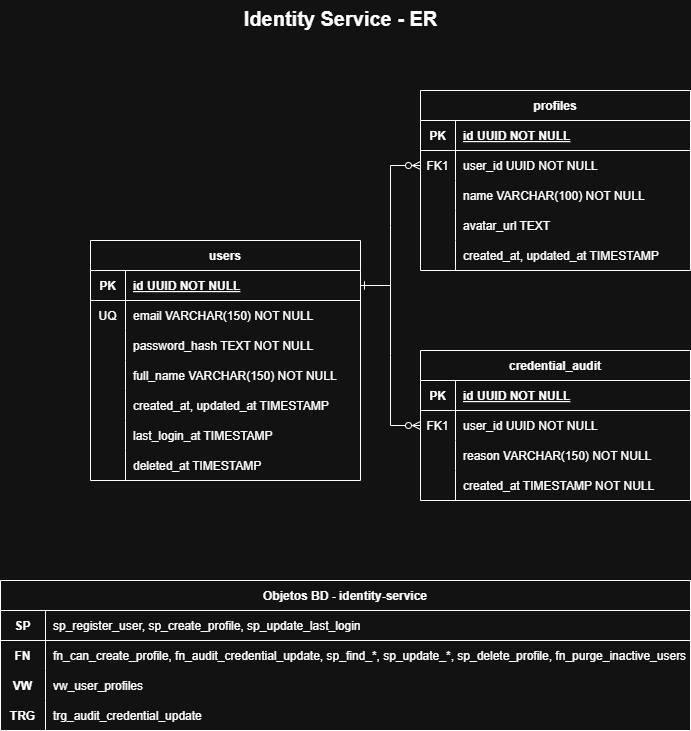

# Entidad relacion

## Diagramas

### Identity Service

Fuente: [identity-er.drawio](../diagramas/src/auth/identity-er.drawio)

#### Cambios aplicados en Fase 3

Se agregaron dos columnas a la tabla `users`:

| Columna | Tipo | Motivo |
| :------ | :--- | :----- |
| `last_login_at` | `TIMESTAMP` (nullable) | Registra el timestamp del último inicio de sesión exitoso. Es actualizado por el procedimiento `sp_update_last_login` cada vez que un usuario se autentica correctamente. El CronJob de depuración utiliza este campo para determinar si una cuenta ha estado inactiva más del umbral configurado. |
| `deleted_at` | `TIMESTAMP` (nullable) | Implementa el patrón de **soft delete**. Cuando el CronJob identifica una cuenta inactiva, escribe la fecha y hora actual en este campo en lugar de eliminar el registro físicamente. Los procedimientos `sp_find_user_by_email` y `sp_find_user_by_id` filtran `WHERE deleted_at IS NULL`, por lo que un usuario con este campo poblado no puede iniciar sesión. |

También se actualizó la tabla de objetos de base de datos:
- **SP**: se añadió `sp_update_last_login` — procedimiento que actualiza `last_login_at` en cada login exitoso.
- **FN**: se añadió `fn_purge_inactive_users` — función que ejecuta el soft delete masivo de usuarios inactivos, invocada por el CronJob de Kubernetes.

### Catalog Service

Fuente: [catalog-er.drawio](../diagramas/src/catalog/catalog-er.drawio)

### Subscription Service

Fuente: [subscription-er.drawio](../diagramas/src/subscriptions/subscription-er.drawio)

### Engagement Service

Fuente: [engagement-er.drawio](../diagramas/src/engagement/engagement-er.drawio)
