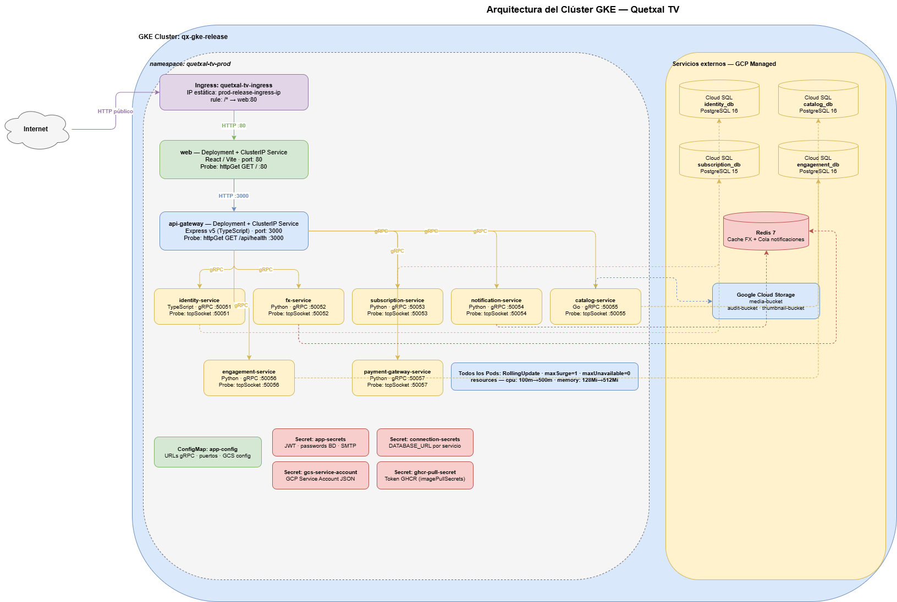

[Regresar](../../README.md)

# Documentación del Entorno de Kubernetes



---

**1. El usuario accede desde Internet.**
La petición HTTP entra al clúster por un único punto de entrada: el recurso **Ingress** quetxal-tv-ingress. Este Ingress tiene asociada una IP pública estática reservada en GCP, lo que garantiza que la dirección no cambia entre despliegues. Su única regla enruta todo el tráfico hacia el Service interno del frontend.

**2. El frontend sirve la aplicación.**
El pod **`web`** (React/Vite) recibe la petición del Ingress en el puerto 80 y devuelve la interfaz de usuario. Su sonda de salud es un HTTP GET a `/`, lo que confirma que el servidor Nginx está respondiendo antes de aceptar tráfico real.

**3. El frontend habla con el backend a través del API Gateway.**
Cuando el usuario hace login, busca contenido o paga una suscripción, el frontend llama al pod **`api-gateway`** (Express v5, puerto 3000). El Gateway es el único componente del backend que expone HTTP hacia el interior del clúster. Todos los demás servicios son internos. Su sonda verifica el endpoint `/api/health`.

**4. El API Gateway orquesta los microservicios con gRPC.**
Desde el Gateway salen siete flechas hacia los siete microservicios, todas en amarillo porque usan **gRPC** (Protocol Buffers sobre HTTP/2). Cada microservicio tiene su propio puerto:
- `identity-service` (50051) — login, registro, JWT
- `fx-service` (50052) — tasas de cambio de divisas
- `subscription-service` (50053) — planes y suscripciones
- `notification-service` (50054) — correos y eventos Redis
- `catalog-service` (50055) — películas, series, GCS
- `engagement-service` (50056) — ratings, historial
- `payment-gateway-service` (50057) — autorización de pago sandbox

Todos usan `tcpSocket` como sonda de salud: Kubernetes abre una conexión TCP al puerto gRPC del servicio para confirmar que el servidor está escuchando.

**5. Cada microservicio persiste en su propia base de datos.**
Las flechas punteadas muestran las conexiones a servicios externos. Los cuatro microservicios con estado propio apuntan a instancias **Cloud SQL** independientes (Database per Microservice): `identity_db`, `catalog_db`, `subscription_db` y `engagement_db`. `fx-service` y `notification-service` acceden a **Redis 7** — el primero para cache de tasas de cambio, el segundo para la cola de notificaciones. `catalog-service` también escribe y lee archivos multimedia en **Google Cloud Storage**.

**6. La configuración se inyecta, no se hardcodea.**
En la parte inferior del namespace se ven el **ConfigMap** y los cuatro **Secrets**. Ningún valor sensible está escrito en los manifiestos YAML del repositorio. Los Secrets se crean en cada despliegue por el pipeline CI/CD y se inyectan en los Pods como variables de entorno.

**7. El badge de Rollout aplica a todos los Pods.**
La caja azul central indica que los nueve Deployments comparten la misma estrategia: `RollingUpdate` con `maxSurge=1` y `maxUnavailable=0`. Esto significa que durante un despliegue siempre hay al menos una réplica de cada servicio activa, garantizando cero interrupciones para los usuarios.

---

## 1. Arquitectura Lógica del Clúster en GKE

El clúster `qx-gke-release` en Google Kubernetes Engine aloja el entorno de producción de Quetxal TV. Todos los recursos del sistema viven bajo un único namespace lógico `quetxal-tv-prod`, lo que permite agrupar, monitorear y aplicar políticas de acceso de forma unificada sin interferir con otros workloads del proyecto GCP.

### Composición del clúster

| Componente | Cantidad | Descripción |
| :--------- | :------- | :---------- |
| Namespace | 1 | `quetxal-tv-prod` — aísla todos los recursos de producción |
| Deployments | 9 | Uno por cada microservicio/aplicación |
| Services (ClusterIP) | 9 | Canal de red interno por servicio |
| Ingress | 1 | Punto de entrada externo único |
| ConfigMaps | 1 | Variables de entorno genéricas (`app-config`) |
| Secrets | 4 | Credenciales sensibles por dominio |

### Mapa de servicios y puertos

| Deployment | Imagen | Puerto interno | Protocolo |
| :--------- | :----- | :------------- | :-------- |
| `web` | `ghcr.io/.../web` | 80 | HTTP |
| `api-gateway` | `ghcr.io/.../api-gateway` | 3000 | HTTP |
| `identity-service` | `ghcr.io/.../identity-service` | 50051 | gRPC |
| `fx-service` | `ghcr.io/.../fx-service` | 50052 | gRPC |
| `subscription-service` | `ghcr.io/.../subscription-service` | 50053 | gRPC |
| `catalog-service` | `ghcr.io/.../catalog-service` | 50055 | gRPC |
| `engagement-service` | `ghcr.io/.../engagement-service` | 50056 | gRPC |
| `payment-gateway-service` | `ghcr.io/.../payment-gateway-service` | 50057 | gRPC |
| `notification-service` | `ghcr.io/.../notification-service` | 50054 | gRPC |

### Recursos por Pod

Todos los Pods del clúster comparten la misma configuración de recursos para garantizar predictibilidad en el scheduler:

| Parámetro | Valor |
| :-------- | :---- |
| CPU request | `100m` (0.1 vCPU) |
| CPU limit | `500m` (0.5 vCPU) |
| Memory request | `128Mi` |
| Memory limit | `512Mi` |

Los `requests` definen el mínimo garantizado que Kubernetes reserva al Pod en el nodo. Los `limits` establecen el techo máximo; si un Pod excede el límite de memoria, el kernel lo termina (`OOMKilled`), protegiendo a los demás Pods del mismo nodo.

---

## 2. Ingress como Puerta de Acceso Única

### Qué es el Ingress en este contexto

El recurso `quetxal-tv-ingress` es el único punto de entrada externo al clúster. Opera como un balanceador de carga L7 administrado por GKE que recibe tráfico HTTP desde Internet y lo enruta hacia los Services internos.

```yaml
# deploy/release/k8s/ingress.yml
apiVersion: networking.k8s.io/v1
kind: Ingress
metadata:
  name: quetxal-tv-ingress
  namespace: quetxal-tv-prod
  annotations:
    kubernetes.io/ingress.global-static-ip-name: prod-release-ingress-ip
spec:
  rules:
    - http:
        paths:
          - path: /*
            pathType: ImplementationSpecific
            backend:
              service:
                name: web
                port:
                  number: 80
```

### Justificación del uso de Ingress

**Problema sin Ingress:** Exponer cada Service directamente con tipo `LoadBalancer` asignaría una IP pública por servicio. Para 9 microservicios significaría 9 IPs externas, 9 balanceadores de carga facturados por GCP y 9 puntos de entrada sin control centralizado de enrutamiento.

**Por qué un único Ingress:**
- **IP estática única:** La anotación `ingress.global-static-ip-name: prod-release-ingress-ip` vincula el Ingress a una IP reservada previamente en GCP, garantizando que la dirección de acceso no cambie entre despliegues.
- **Todos los Services son ClusterIP:** Los microservicios internos (gRPC) no necesitan IP pública. Solo el frontend (`web:80`) recibe tráfico externo a través del Ingress; el API Gateway y los microservicios se comunican exclusivamente dentro del clúster mediante DNS interno de Kubernetes.
- **Control centralizado:** Cualquier regla de enrutamiento, redirección o path-based routing se gestiona en un único archivo `ingress.yml`, sin tocar los manifiestos de cada servicio.
- **Seguridad perimetral:** Al concentrar el tráfico externo en un punto, es posible aplicar políticas de red, WAF o TLS en un único lugar en el futuro sin modificar los Services individuales.

---

## 3. Objetos Declarativos del Clúster

### 3.1 Deployments

Cada microservicio tiene su propio Deployment en `deploy/release/k8s/deployments/`. Un Deployment describe el estado deseado del Pod: qué imagen usar, cuántas réplicas mantener, qué recursos asignar y cómo actualizar. Kubernetes reconcilia continuamente el estado real del clúster con el estado declarado, reiniciando Pods caídos automáticamente.

Estructura común de todos los Deployments:

```yaml
spec:
  replicas: 1
  strategy:
    type: RollingUpdate
    rollingUpdate:
      maxSurge: 1
      maxUnavailable: 0
  template:
    spec:
      imagePullSecrets:
        - name: ghcr-pull-secret
      containers:
        - resources:
            requests:
              cpu: "100m"
              memory: "128Mi"
            limits:
              cpu: "500m"
              memory: "512Mi"
          envFrom:
            - configMapRef:
                name: app-config
            - secretRef:
                name: app-secrets
```

### 3.2 Services (ClusterIP)

Cada Deployment tiene un Service de tipo `ClusterIP` en `deploy/release/k8s/services/`. El Service actúa como nombre DNS estable dentro del clúster: aunque los Pods se reinicien y cambien de IP, el Service mantiene la misma dirección DNS interna (`api-gateway.quetxal-tv-prod.svc.cluster.local`).

```yaml
# deploy/release/k8s/services/api-gateway.yml
apiVersion: v1
kind: Service
metadata:
  name: api-gateway
  namespace: quetxal-tv-prod
spec:
  type: ClusterIP
  selector:
    app: api-gateway
  ports:
    - name: http
      port: 3000
      targetPort: 3000
```

Todos los Services usan `ClusterIP` porque ningún microservicio gRPC necesita ser accesible desde fuera del clúster. Solo el tráfico externo entra por el Ingress hacia `web:80`.

### 3.3 ConfigMaps

El ConfigMap `app-config` inyecta variables de entorno no sensibles a todos los Pods que lo referencian mediante `configMapRef`. Almacena configuración de entorno: URLs internas de servicios, nombres de cola Redis, puertos gRPC, configuración de GCS y parámetros de la aplicación.

**Por qué ConfigMap y no variables hardcodeadas en el YAML:**
- Permite cambiar la configuración de todos los Pods en un solo lugar sin reconstruir imágenes.
- Separa la configuración del código, siguiendo el principio de [12-Factor App](https://12factor.net/config).
- El mismo Deployment YAML puede funcionar en distintos entornos simplemente apuntando a un ConfigMap diferente.

### 3.4 Secrets

El clúster utiliza cuatro Secrets para gestionar credenciales sensibles. Ningún valor sensible está escrito en los archivos YAML del repositorio:

| Secret | Contenido | Referenciado por |
| :----- | :-------- | :--------------- |
| `app-secrets` | JWT_SECRET, passwords de BD, credenciales SMTP | Todos los Pods vía `secretRef` |
| `connection-secrets` | DATABASE_URL de cada servicio Python | Servicios Python vía `secretRef` |
| `gcs-service-account` | Service Account JSON de Google Cloud Storage | Catalog Service |
| `ghcr-pull-secret` | Token de autenticación para pull de GHCR | `imagePullSecrets` en todos los Pods |

Los Secrets son creados o actualizados por el pipeline CI/CD en la etapa `deploy-gke` mediante `kubectl create secret` con `--dry-run=client | kubectl apply -f -`, garantizando idempotencia en cada despliegue.

---

## 4. Estrategia de Rollout

### Configuración declarada

Todos los Deployments del clúster utilizan la estrategia `RollingUpdate` con los siguientes parámetros:

```yaml
strategy:
  type: RollingUpdate
  rollingUpdate:
    maxSurge: 1
    maxUnavailable: 0
```

### Comportamiento detallado

| Parámetro | Valor | Significado |
| :-------- | :---- | :---------- |
| `maxSurge: 1` | 1 Pod adicional | Durante la actualización, Kubernetes puede crear hasta 1 Pod nuevo antes de terminar el antiguo |
| `maxUnavailable: 0` | Cero Pods no disponibles | En ningún momento puede haber menos Pods disponibles que el número de réplicas deseado |

**Secuencia de un despliegue:**

1. Kubernetes crea el Pod nuevo con la imagen actualizada (`replicas + maxSurge = 2 Pods activos`).
2. Espera a que el Pod nuevo supere su `readinessProbe` y entre en estado `Ready`.
3. Solo entonces termina el Pod antiguo, volviendo a `1 réplica` activa.
4. El servicio nunca queda sin réplica disponible durante el proceso.

Esta configuración garantiza **zero-downtime deployments**: el frontend y los microservicios continúan atendiendo tráfico durante toda la actualización.

### Rollback automático

El pipeline monitorea cada Deployment con:

```bash
kubectl rollout status deployment/{name} --namespace=quetxal-tv-prod --timeout=180s
```

Si el nuevo Pod no alcanza el estado `Ready` en 180 segundos (por `CrashLoopBackOff`, error de inicialización o fallo de readinessProbe), el pipeline ejecuta:

```bash
kubectl rollout undo deployment/{name} --namespace=quetxal-tv-prod
```

Esto restaura la revisión anterior del Deployment de forma inmediata, sin intervención manual, garantizando que el clúster siempre vuelve a una versión estable.

---

## 5. Sondas de Salud: Liveness y Readiness Probes

### Qué resuelven las sondas

Kubernetes no puede determinar por sí solo si un Pod está listo para recibir tráfico o si ha entrado en un estado irrecuperable. Sin sondas configuradas, el scheduler marca un Pod como `Ready` en cuanto el proceso arranca, aunque la aplicación aún esté inicializándose. Las sondas de salud corrigen este comportamiento.

### Readiness Probe

**Propósito:** Indica a Kubernetes cuándo el Pod está listo para recibir tráfico del Service. Mientras la sonda no pase, el Pod se excluye del balanceo de carga.

**Cuándo importa:** Durante el RollingUpdate, el nuevo Pod no reemplaza al antiguo hasta pasar la readinessProbe. Esto garantiza que ninguna petición llega a un Pod que aún está iniciando conexiones a la base de datos o cargando configuración.

### Liveness Probe

**Propósito:** Detecta si el proceso dentro del Pod ha entrado en un estado irrecuperable (deadlock, memoria agotada, ciclo infinito) y lo reinicia automáticamente.

**Cuándo importa:** Un Pod puede superar la readinessProbe al arrancar pero degradarse después en producción. La livenessProbe monitorea continuamente la salud del proceso durante toda su vida.

### Configuración por tipo de servicio

**Servicios HTTP** (`web`, `api-gateway`) — verifican un endpoint HTTP real:

```yaml
# deploy/release/k8s/deployments/web.yml
readinessProbe:
  httpGet:
    path: /
    port: 80
  initialDelaySeconds: 10
  periodSeconds: 10
livenessProbe:
  httpGet:
    path: /
    port: 80
  initialDelaySeconds: 30
  periodSeconds: 20
```

```yaml
# deploy/release/k8s/deployments/api-gateway.yml
readinessProbe:
  httpGet:
    path: /api/health
    port: 3000
  initialDelaySeconds: 10
  periodSeconds: 10
livenessProbe:
  httpGet:
    path: /api/health
    port: 3000
  initialDelaySeconds: 30
  periodSeconds: 20
```

**Microservicios gRPC** (`identity-service`, `catalog-service`, y demás) — verifican apertura del socket TCP en el puerto gRPC:

```yaml
# deploy/release/k8s/deployments/identity-service.yml
readinessProbe:
  tcpSocket:
    port: 50051
  initialDelaySeconds: 10
  periodSeconds: 10
livenessProbe:
  tcpSocket:
    port: 50051
  initialDelaySeconds: 30
  periodSeconds: 20
```

### Parámetros de temporización

| Parámetro | Readiness | Liveness | Justificación |
| :-------- | :-------- | :------- | :------------ |
| `initialDelaySeconds` | 10s | 30s | Readiness verifica rápido para no demorar el RollingUpdate; Liveness espera más para no reiniciar un Pod que aún está iniciando |
| `periodSeconds` | 10s | 20s | Readiness chequea frecuente para detectar recuperación pronto; Liveness chequea menos frecuente para no generar ruido en Pods saludables |

### Resumen de sondas por servicio

| Servicio | Tipo Readiness | Tipo Liveness | Puerto |
| :------- | :------------- | :------------ | :----- |
| `web` | HTTP GET `/` | HTTP GET `/` | 80 |
| `api-gateway` | HTTP GET `/api/health` | HTTP GET `/api/health` | 3000 |
| `identity-service` | TCP Socket | TCP Socket | 50051 |
| `fx-service` | TCP Socket | TCP Socket | 50052 |
| `subscription-service` | TCP Socket | TCP Socket | 50053 |
| `notification-service` | TCP Socket | TCP Socket | 50054 |
| `catalog-service` | TCP Socket | TCP Socket | 50055 |
| `engagement-service` | TCP Socket | TCP Socket | 50056 |
| `payment-gateway-service` | TCP Socket | TCP Socket | 50057 |

---
