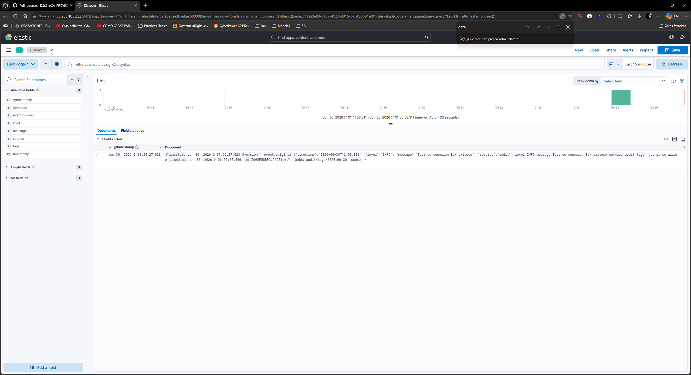
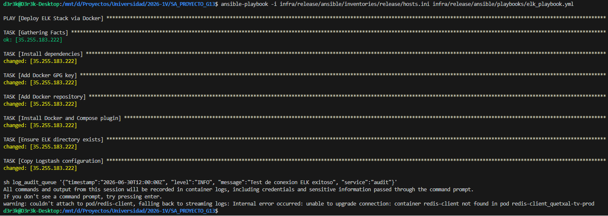

# Documentación: Stack ELK (Elasticsearch, Logstash, Kibana)

## ¿Qué es y Cómo funciona?
El **Stack ELK** es el corazón de nuestra arquitectura de observabilidad centralizada, diseñado para ingerir, procesar, almacenar y visualizar registros (logs) provenientes de diversas fuentes en tiempo real. 

Nuestra arquitectura utiliza un enfoque dual para capturar dos dimensiones críticas de la aplicación:
1. **Logs del Sistema (Observabilidad Pura):** Capturan el tráfico de red, errores HTTP (500, 404), reinicios de pods y el flujo estándar `stdout/stderr` de los contenedores para entender la salud del sistema.
2. **Logs Transaccionales (Auditoría de Seguridad):** Capturan el rastro exacto de quién alteró información crítica en la base de datos (Ej: `old_state` vs `new_state`).

### Componentes de la Arquitectura
* **Elasticsearch (Almacenamiento y Búsqueda):** Actúa como el motor de base de datos NoSQL orientado a documentos. Almacena todos los logs indexados permitiendo consultas ultrarrápidas. Recibe los logs desde Logstash en dos índices separados: `system-logs-*` y `audit-transactional-*`.
* **Logstash (Filtrado y Transformación):** Es el pipeline de procesamiento de datos central. Se configuró con dos flujos de entrada (Inputs):
    * *Beats Input (Puerto 5044):* Escucha los logs del sistema empujados por Filebeat desde el clúster de Kubernetes.
    * *JDBC Input (Database Polling):* Utiliza el driver de PostgreSQL para conectarse a Cloud SQL, consultando cada minuto la tabla `audit_log` generada por los Triggers, asegurando una recolección exacta y no repudiable de transacciones.
* **Kibana (Visualización):** Es la interfaz gráfica que lee desde Elasticsearch. Permite a los administradores crear Data Views y Dashboards dinámicos para buscar, filtrar y analizar anomalias en tiempo real.

---

## Configuración Paso a Paso (Flujo de Logs)

### 1. Inyección de Agentes (Logs del Sistema)
Para recolectar la telemetría viva de los microservicios, desplegamos **Filebeat** como un agente recolector dentro del clúster de GKE:
* **DaemonSet:** Filebeat corre en cada nodo del clúster.
* **Recolección:** Está configurado para escuchar el directorio `/var/log/containers/*.log`, capturando automáticamente las salidas de cada microservicio sin tener que modificar su código fuente.
* **Enriquecimiento:** A través de procesadores de Kubernetes, inyecta metadatos (nombre del pod, namespace, nodo) para facilitar el filtrado.
* **Redirección:** Filebeat empuja estos logs a la máquina virtual central (ELK) por el puerto 5044 apuntando directamente al contenedor de Logstash.

### 2. Extracción de Auditoría (Logs Transaccionales)
En lugar de depender de los microservicios para enviar historiales de cambios (lo cual introduce riesgos de seguridad y latencia), utilizamos una extracción activa:
* **DB Triggers:** Cada base de datos (Identity, Subscription, etc.) cuenta con triggers que, ante cada `INSERT`, `UPDATE` o `DELETE`, generan un registro detallado en una tabla interna `audit_log`.
* **Plugin JDBC:** Logstash se configuró con el plugin JDBC para autenticarse contra la instancia de Cloud SQL en su red privada, realizando un `SELECT` sobre esta tabla e ingiriendo únicamente los registros nuevos (basado en el tracking de la columna `created_at`).

### 3. Evidencias de Indexación (Kibana)

