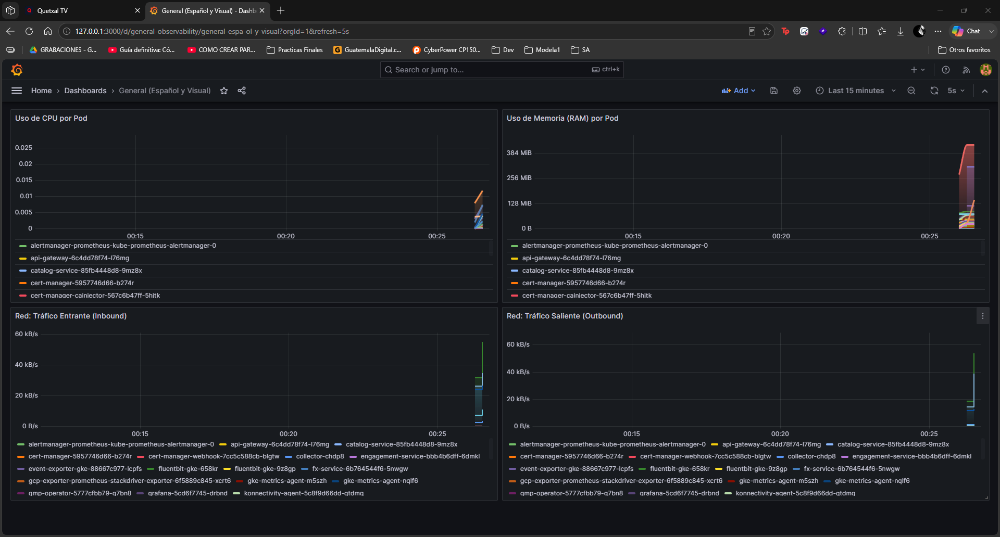
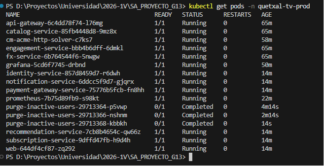

# Guía de Observabilidad y Monitoreo de Métricas

## 1. ¿Qué es y cómo funciona?

### 1.1 Modelo de Monitoreo basado en Series Temporales (Prometheus)
El modelo de monitoreo se basa en **series temporales por recolección activa (scraping)**. Prometheus actúa como el motor central que realiza peticiones HTTP a los endpoints expuestos (exporters) a intervalos regulares. En lugar de que los servicios envíen sus datos (push), Prometheus los extrae (pull) y los almacena localmente con marcas de tiempo. Esta arquitectura garantiza un bajo impacto en los microservicios y permite consultar el estado histórico de la red y el hardware.

### 1.2 Aprovisionamiento de Métricas en Tableros (Grafana)
El aprovisionamiento de métricas en tableros se realiza a través de Grafana. Actúa como la capa de visualización interactiva conectándose al origen de datos de Prometheus. Mediante el uso del lenguaje PromQL, se transforman las series temporales brutas en paneles gráficos que facilitan el análisis en tiempo real de picos de CPU, consumo de memoria y cuellos de botella en la red.

## 2. Configuración Paso a Paso

### 2.1 Guía del despliegue de los exporters en el clúster y servidores externos
La infraestructura de monitoreo se despliega utilizando manifiestos YAML estandarizados dentro del namespace `quetxal-tv-prod`.

1. **Despliegue de Exporters (Nodos y Pods):** 
   - La recolección de hardware se realiza integrándose nativamente con `cAdvisor`, el cual actúa como exporter a nivel de Nodo en GKE, exponiendo métricas de CPU y Memoria sin necesidad de instalar agentes adicionales.
   - Para habilitar la lectura de estos exporters, se implementó un `ServiceAccount`, `ClusterRole` y `ClusterRoleBinding` otorgando privilegios (`get`, `list`, `watch`) sobre la API de Kubernetes.

2. **ConfigMap de Prometheus (`prometheus.yml`):** Define las tareas de scraping centralizadas.
   - `kubernetes-cadvisor`: Tarea que localiza dinámicamente los nodos del clúster y extrae las métricas de hardware directamente de sus proxies.
   - `kubernetes-pods`: Tarea configurada para el auto-descubrimiento de métricas expuestas a nivel aplicativo.

3. **Despliegue de Motores:** 
   - Se inicializó el contenedor de `prom/prometheus:v2.45.0` (puerto `9090`).
   - Se inicializó el contenedor de `grafana/grafana:10.0.3` (puerto `3000`).

### 2.2 Conexión Manual y Acceso Seguro
El acceso a Grafana se realiza mediante un túnel seguro local (Port-Forwarding):
```bash
kubectl port-forward svc/grafana-service 3000:80 -n quetxal-tv-prod
```
El panel de control queda disponible en: `http://localhost:3000` (Credenciales por defecto).

### 2.3 Configuración del Data Source
Desde la interfaz gráfica de Grafana:
1. Navegar a **Connections -> Data sources -> Add data source**.
2. Seleccionar **Prometheus**.
3. En el campo de URL, especificar la ruta interna del servicio: `http://prometheus-service:9090`.
4. Seleccionar **Save & test** para confirmar la conectividad.

### 2.4 Importación del Dashboard (Telemetría Viva)
Se generó el archivo `grafana-dashboard-general.json` para la importación automática de las siguientes métricas críticas:
- Uso de CPU por Pod.
- Uso de Memoria por Pod.
- Tráfico de Red Entrante (Receive) por Pod.
- Tráfico de Red Saliente (Transmit) por Pod.

El archivo JSON está preconfigurado para inyectar el código PromQL correspondiente a cada panel.

## 3. Capturas de los Dashboards reflejando la telemetría viva del sistema

### Captura 1: Dashboards Interactivos (Grafana)


### Captura 2: Estado de los Pods de Observabilidad

