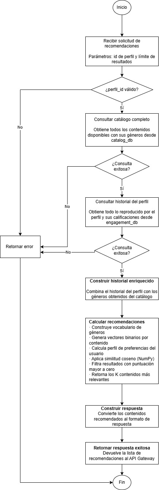

# recommendation-service

Se utilizo un nuevo servicio recomendacion en lugar de usar o agregarlo a **engagement-service** ya que este servicio ya tiene un rol definido que es el de registrar y consultar interacciones del usuario como el  historial de reproducción y ratings. Se considero que  agregarle el algoritmo de recomendación lo convertiría en un servicio con dos responsabilidades distintas.

Además, el algoritmo de recomendación necesita datos de dos fuentes distintas: engagement-service (historial + ratings) y catalog-service (géneros del contenido). Entonces se decidio crear un servicio dedicado, lo cual nos permite también escalar independientemente.

---

## 1. Descripción general

`recommendation-service` es un microservicio Python que expone una interfaz gRPC para devolver recomendaciones de contenido personalizadas por perfil de usuario. Se basa en el historial de visualización y las calificaciones del perfil activo para estimar qué contenidos del catálogo son más afines al gusto del usuario.

El servicio no tiene base de datos propia. Lee datos de dos bases distintas:

- **engagement_db** — historial de visualización y calificaciones.
- **catalog_db** — catálogo de contenido con géneros.

El cálculo se realiza en memoria por cada solicitud usando el módulo recommender.py, que implementa el algoritmo de **Content-Based Filtering** con similitud del coseno sobre vectores binarios de géneros.


---

## 2. Algoritmo seleccionado: Content-Based Filtering

### ¿Por qué Content-Based Filtering y no Filtrado Colaborativo?

| Criterio | Content-Based Filtering (CBF) | Filtrado Colaborativo (CF) |
|---|---|---|
| Datos necesarios | Historial propio del usuario + atributos del contenido | Historial de muchos usuarios |
| Problema del arranque en frío (item) | No aplica — los atributos del ítem están disponibles desde el inicio | Requiere que el ítem tenga interacciones previas de otros usuarios |
| Problema del arranque en frío (usuario nuevo) | Moderado — si el perfil no tiene historial, no hay recomendación | Severo — sin historial no hay vecinos similares |
| Privacidad | Solo usa datos propios del perfil | Requiere compartir comportamiento entre usuarios |
| Escalabilidad de cómputo | Proporcional al tamaño del catálogo por solicitud — viable con catálogos medianos | Requiere factorización matricial o cálculo de vecinos sobre todos los usuarios |
| Explicabilidad | Alta — "se recomienda X porque comparte géneros con Y" | Baja — depende de similitud latente entre usuarios |

**Decisión:** Se eligió CBF porque:

1. El catálogo de Quetxal TV es de tamaño mediano con una carga no tan grande, lo que hace viable el cómputo en memoria por solicitud.
2. No existe una masa crítica de usuarios que permita extraer patrones colaborativos significativos en un entorno de laboratorio.
3. Los géneros son el atributo más consistente disponible en el esquema de `catalog_db`, lo que convierte a CBF en el enfoque natural.
4. La explicabilidad del modelo facilita la depuración y la verificación académica del algoritmo.

---

## 3. Modelo matemático

### 3.1 Vectores binarios de géneros

Se construye un **vocabulario global** `V` formado por la unión de todos los géneros presentes en el historial del perfil y en el catálogo completo. El vocabulario se ordena alfabéticamente para garantizar un índice determinista.

Cada contenido `i` se representa como un vector binario `cᵢ ∈ {0, 1}^|V|`:

```
cᵢ[j] = 1   si el contenido i pertenece al género j
cᵢ[j] = 0   en caso contrario
```

### 3.2 Vector de perfil del usuario

El perfil del usuario se construye como una **suma ponderada** de los vectores de los contenidos ya vistos:

```
p = Σ wₖ · cₖ    para cada contenido k en el historial
```

Donde el peso `wₖ` depende de la calificación del usuario:

```
wₖ = +1.0   si el usuario calificó el contenido con THUMBS_UP
wₖ = -1.0   si el usuario calificó con THUMBS_DOWN
wₖ = +1.0   si el usuario vio el contenido sin calificarlo (señal positiva implícita)
```

El vector `p` captura las preferencias acumuladas del perfil: géneros con valores positivos altos indican afinidad; valores negativos indican rechazo.

### 3.3 Similitud del coseno

Para cada contenido candidato `i` (no visto por el perfil), se calcula la **similitud del coseno** entre su vector `cᵢ` y el perfil `p`:

```
          cᵢ · p
sim(i) = ---------
          ‖cᵢ‖ · ‖p‖
```

donde `‖·‖` denota la norma L2 (euclidiana) del vector.

La similitud del coseno toma valores en el intervalo `[-1, 1]`:
- `sim = 1` → géneros idénticos al perfil
- `sim = 0` → sin géneros en común
- `sim < 0` → géneros opuestos al perfil (rechazados)

Solo se incluyen en la respuesta los contenidos con `sim > 0`, ordenados de mayor a menor similitud.

### 3.4 Cómputo vectorizado (implementación)

El cálculo se realiza en batch usando NumPy para eficiencia:

```python
# catalog_matrix: shape (n_candidatos, |V|)
# profile:        shape (|V|,)
# catalog_norms:  shape (n_candidatos,)
# profile_norm:   escalar

scores[valid] = (catalog_matrix[valid] @ profile) / (catalog_norms[valid] * profile_norm)
```

`valid` es una máscara booleana que excluye contenidos con norma cero (sin géneros asignados), evitando divisiones por cero.

---

## 4. Flujo de recommendation-services





---
