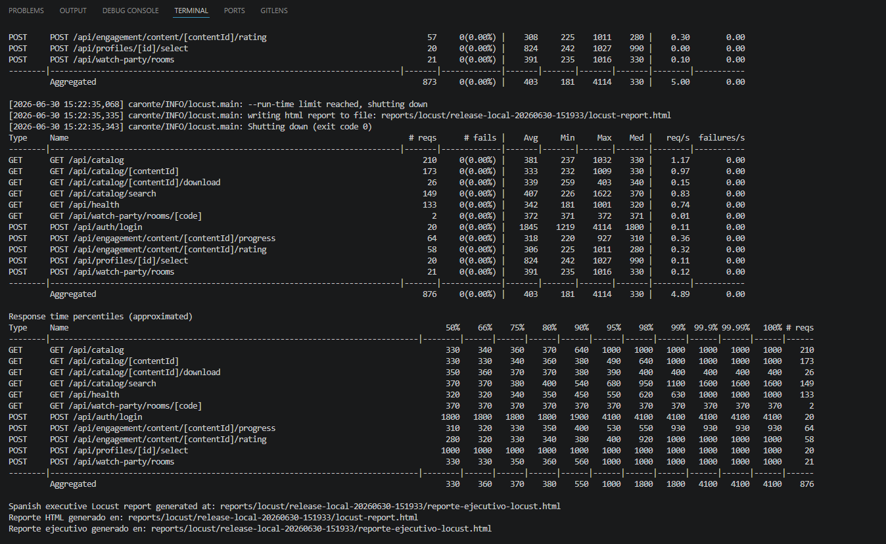
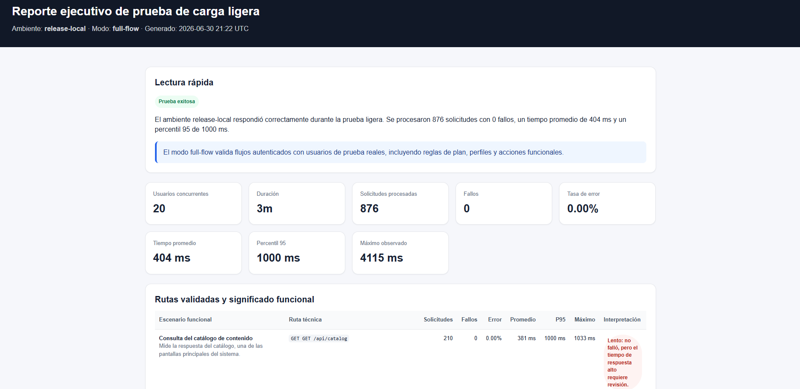
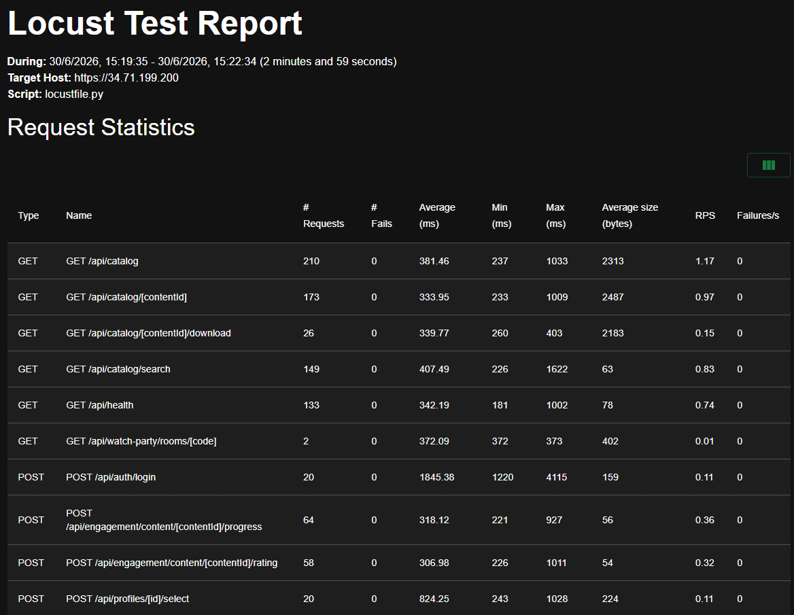
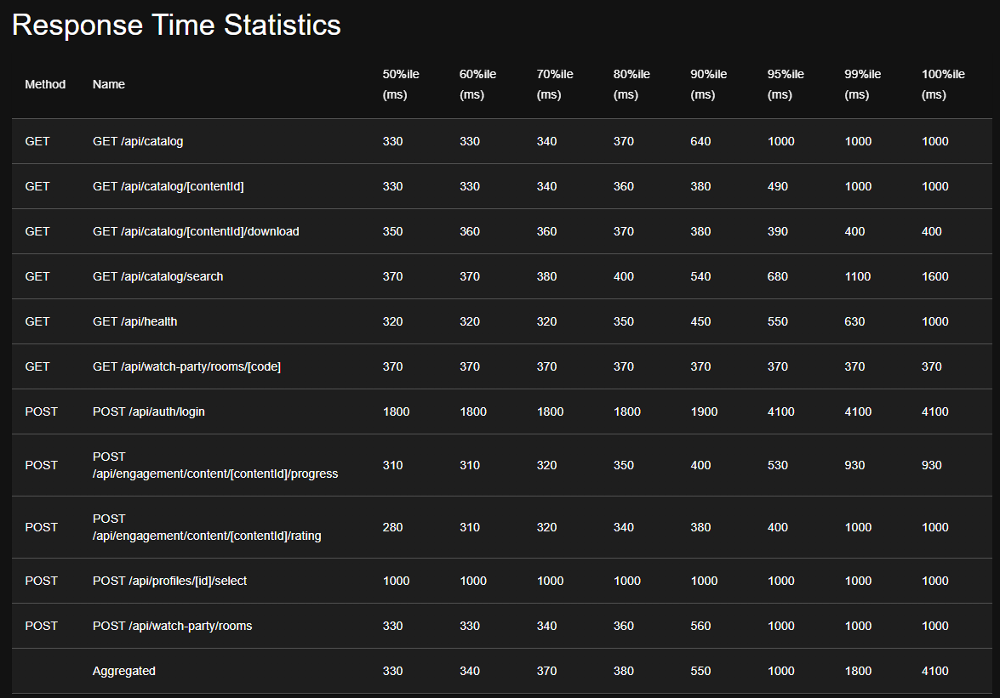
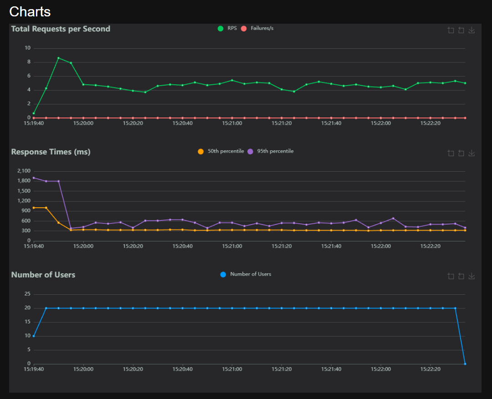
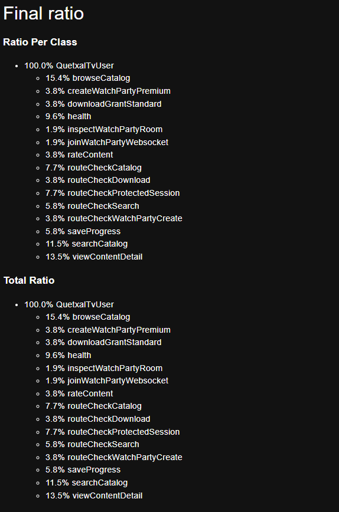

[← Regresar](../../README.md)

# Documentacion de Locust - Release local

## Objetivo

Validar con una prueba de carga ligera que el ambiente **release en nube** responde correctamente bajo concurrencia controlada. La prueba se ejecuta **solo desde una maquina local**, pero el destino siempre es la **IP o URL publica de release**.

Adicional existe un flujo que se puede ejectuar desde las acciones de github, para validarlo contra develop.

## Que es Locust

Locust es una herramienta de pruebas de carga basada en Python. Permite modelar usuarios virtuales como codigo, ejecutar solicitudes HTTP contra rutas reales del sistema y generar metricas como cantidad de solicitudes, fallos, tiempo promedio, maximo, percentiles y solicitudes por segundo.

## Como funciona en Quetxal TV

El archivo principal es `tests/load/locustfile.py`. Alli se define el comportamiento de usuarios virtuales que consumen rutas criticas del API Gateway.

Flujos incluidos:

| Flujo | Ruta principal | Objetivo |
|---|---|---|
| Check del sistema | `GET /api/health` | Verificar disponibilidad general. |
| Autenticacion | `POST /api/auth/login` | Iniciar sesion con usuarios del CSV. |
| Perfil | `GET /api/auth/me` y `POST /api/profiles/{id}/select` | Validar sesion y seleccion de perfil. |
| Catalogo | `GET /api/catalog` | Medir consulta principal de contenido. |
| Busqueda | `GET /api/catalog/search` | Simular busquedas frecuentes. |
| Detalle | `GET /api/catalog/{id}` | Consultar contenido especifico. |
| Progreso y calificacion | Rutas de engagement | Simular actividad de reproduccion. |
| Descarga | `GET /api/catalog/{id}/download` | Validar regla de plan estandar. |
| Watch Party | `POST /api/watch-party/rooms` | Validar creacion solo para premium. |


## Variables necesarias

| Variable | Obligatoria | Descripcion |
|---|---:|---|
| `LOCUST_HOST` | Si | URL final de release. Ejemplo: `http://34.10.20.30`. |
| `LOCUST_USERS_FILE` | Si | CSV con usuarios. Por defecto: `tests/load/users.example.csv`. |
| `LOCUST_MODE` | Si | `full-flow` para usuarios reales o `route-check` para validar rutas. |
| `LOCUST_USERS` | No | Usuarios concurrentes. Valor recomendado: `20`. |
| `LOCUST_SPAWN_RATE` | No | Usuarios nuevos por segundo. Valor recomendado: `2`. |
| `LOCUST_RUN_TIME` | No | Duracion. Valor recomendado: `3m`. |
| `LOCUST_ENABLE_WS` | No | `false` por defecto en local para evitar fallos de red con WebSocket. |
| `LOCUST_CONTENT_IDS` | No | IDs fijos de contenido. Si se omite, se descubren desde catalogo. |

## CSV de usuarios

Formato requerido:

```csv
email,password,plan_tier,profile_id,is_admin
correo@example.com,321321321,premium,PROFILE_PREMIUM,false
correo@example.com,321321321,standard,PROFILE_STANDARD,false
correo@example.com,321321321,basic,PROFILE_BASIC,false
```


## Ejecucion local paso a paso


1. Editar la IP de release:

```bash
LOCUST_HOST=http://IP_RELEASE
```

2. Confirmar el CSV de usuarios:

```bash
LOCUST_USERS_FILE=tests/load/users.example.csv
```

3. Instalar dependencias:

```bash
python -m pip install -r tests/load/requirements.txt
```

4. Dar permisos al script si es necesario ( Usar gitbash, recomendacion ) :

```bash
chmod +x scripts/load/run_locust_release_local.sh
```

5. Ejecutar la prueba:

```bash
scripts/load/run_locust_release_local.sh tests/load/.env
```

6. Revisar resultados en:

```text
reports/locust/release-local-FECHA/locust-report.html
reports/locust/release-local-FECHA/reporte-ejecutivo-locust.html
reports/locust/release-local-FECHA/locust_stats.csv
reports/locust/release-local-FECHA/locust_failures.csv
```


## Criterios de aceptacion

| Criterio | Resultado esperado |
|---|---|
| Disponibilidad | `/api/health` responde 200. |
| Autenticacion | Los usuarios del CSV pueden iniciar sesion en modo `full-flow`. |
| Catalogo | El catalogo y busqueda responden sin errores 5xx. |
| Reglas de plan | Descarga aplica regla de plan estandar y Watch Party aplica regla premium. |
| Reporte | Se genera HTML de Locust y reporte ejecutivo. |
| Estabilidad | No deben existir fallos inesperados ni errores 5xx. |


## Evidencia de pruebas

La prueba de carga se ejecutó desde una máquina local contra el ambiente **release en nube**, usando la IP pública del API Gateway. El escenario utilizado fue `full-flow`, por lo que Locust simuló usuarios reales ejecutando acciones funcionales del sistema.

Esta evidencia cubre lo solicitado para Locust: explicación de cómo funciona, escenarios ejecutados, resultados y capturas del reporte generado. 

### Configuración de la prueba

| Parámetro | Valor |
|---|---|
| Ambiente | release-local |
| Host objetivo | `https://34.71.199.200` |
| Script | `locustfile.py` |
| Modo | `full-flow` |
| Usuarios concurrentes | 20 |
| Duración | 3 minutos |
| Solicitudes procesadas | 876 |
| Fallos | 0 |
| Tasa de error | 0.00% |
| Tiempo promedio | 404 ms |
| Percentil 95 | 1000 ms |
| Máximo observado | 4115 ms |

### Captura 1: Ejecución desde consola



En la consola se observa que Locust finalizó correctamente por límite de tiempo, generó el reporte HTML y cerró con código de salida `0`. También se muestra el resultado agregado de la prueba: **876 solicitudes**, **0 fallos**, tiempo promedio cercano a **403 ms** y una tasa aproximada de **4.89 solicitudes por segundo**.

### Captura 2: Reporte ejecutivo



El reporte ejecutivo resume la prueba como **exitosa**. El ambiente release-local respondió correctamente durante la carga ligera, procesando todas las solicitudes sin errores. Esto valida que el sistema puede atender usuarios concurrentes en rutas críticas sin presentar fallos funcionales.

### Captura 3: Estadísticas de solicitudes



La tabla de estadísticas muestra las rutas probadas y sus tiempos de respuesta. Las rutas con mayor cantidad de solicitudes fueron:

| Ruta | Solicitudes | Fallos | Promedio | Máximo |
|---|---:|---:|---:|---:|
| `GET /api/catalog` | 210 | 0 | 381.46 ms | 1033 ms |
| `GET /api/catalog/[contentId]` | 173 | 0 | 333.95 ms | 1009 ms |
| `GET /api/catalog/search` | 149 | 0 | 407.49 ms | 1622 ms |
| `GET /api/health` | 133 | 0 | 342.19 ms | 1002 ms |
| `POST /api/auth/login` | 20 | 0 | 1845.38 ms | 4115 ms |
| `POST /api/profiles/[id]/select` | 20 | 0 | 824.25 ms | 1028 ms |

El login fue la operación más lenta, con un promedio de **1845.38 ms** y un máximo de **4115 ms**. Esto no provocó errores, pero se identifica como punto de mejora para optimización.

### Captura 4: Percentiles de tiempo de respuesta



Los percentiles permiten analizar el comportamiento bajo carga. El resultado agregado indica:

| Percentil | Tiempo |
|---|---:|
| 50% | 330 ms |
| 80% | 380 ms |
| 90% | 550 ms |
| 95% | 1000 ms |
| 99% | 1800 ms |
| 100% | 4100 ms |

La mayoría de solicitudes respondió por debajo de **1 segundo**. Los tiempos más altos se concentran principalmente en autenticación, por lo que no representan una caída general del sistema.

### Captura 5: Gráficas de Locust



Las gráficas muestran que el sistema mantuvo **20 usuarios concurrentes** durante casi toda la prueba. Las solicitudes por segundo se estabilizaron alrededor de **4 a 5 RPS** y la línea de fallos se mantuvo en **0**. Esto confirma estabilidad durante la ejecución.

### Captura 6: Distribución de flujos ejecutados



La distribución final evidencia que no solo se probaron rutas aisladas, sino un flujo funcional completo. Locust ejecutó consultas de catálogo, búsquedas, detalle de contenido, login, selección de perfil, descarga, Watch Party, progreso y calificación de contenido.

### Escenarios validados

| Escenario | Validación |
|---|---|
| Disponibilidad | `/api/health` respondió sin fallos. |
| Autenticación | Los usuarios del CSV iniciaron sesión correctamente. |
| Catálogo | Se consultó catálogo, búsqueda y detalle de contenido. |
| Engagement | Se registró progreso y calificación de contenido. |
| Descarga | Se validó la ruta de descarga para usuarios permitidos. |
| Watch Party | Se probó creación y consulta de salas. |
| Estabilidad | No existieron errores 5xx ni fallos de Locust. |

### Análisis de resultados

La prueba fue satisfactoria porque se procesaron **876 solicitudes** con **0 fallos** y una tasa de error de **0.00%**. El sistema se mantuvo estable con **20 usuarios concurrentes** durante 3 minutos.

El tiempo promedio general fue aceptable para una prueba ligera. El percentil 95 fue de **1000 ms**, lo que indica que el 95% de las solicitudes respondió en 1 segundo o menos. El valor máximo de **4115 ms** se observó principalmente en el login, por lo que se recomienda monitorear y optimizar la autenticación si la carga aumenta.

### Conclusión

El ambiente release en nube respondió correctamente ante una carga ligera ejecutada desde Locust. Las rutas críticas del sistema fueron validadas sin errores, el reporte HTML fue generado correctamente y los resultados demuestran estabilidad funcional. Como mejora futura, se recomienda optimizar el proceso de autenticación y repetir la prueba.

