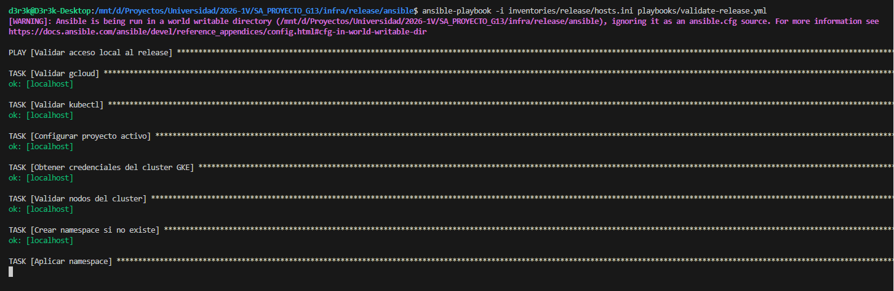
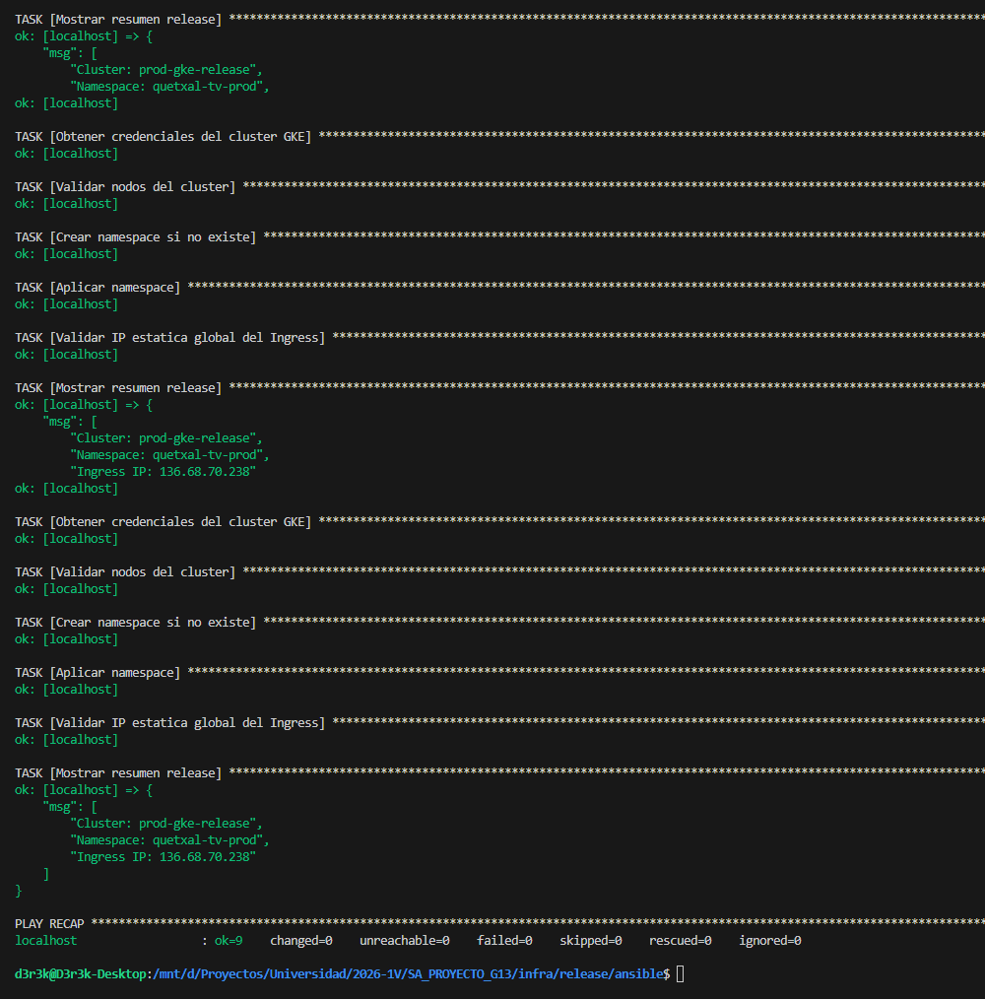

# Documentación sobre Ansible

## Qué es y Cómo funciona
Ansible es una herramienta de automatización de TI que gestiona la configuración, los despliegues de aplicaciones y la creación de entornos. Funciona de manera "agentless" (sin agentes), conectándose directamente a los nodos a través de SSH. Esto simplifica su administración, ya que no requiere software adicional instalado en los servidores destino. 

La configuración y el código se estructuran en:
- **Playbooks**: Archivos YAML que declaran las tareas a ejecutar en un grupo de máquinas de manera secuencial y ordenada.
- **Roles**: Mecanismo para agrupar y organizar de manera estructurada las tareas, variables, archivos y manejadores relacionados, facilitando la reutilización del código en múltiples playbooks.

## Configuración paso a paso

El proceso de aprovisionamiento de las herramientas base y los entornos en las VMs de desarrollo se realiza mediante los playbooks de Ansible.

### Ejecución de Playbooks

Se ejecutaron los playbooks correspondientes para instalar dependencias y configurar las herramientas en las VMs. A continuación se evidencian los logs de ejecución en la terminal, donde Ansible se conecta mediante SSH, ejecuta las tareas declaradas e informa el estado de los cambios realizados en cada nodo:

## Gestión de Inventarios y Entornos

La configuración de Ansible también está segmentada según el entorno (ej. `develop` y `release`) dentro del directorio `infra/`. Esta separación asegura que los cambios aplicados en desarrollo no afecten al entorno productivo.

- **`inventories/<entorno>/hosts.ini`**: Este archivo define el inventario de las máquinas (nodos) a las que se conectará Ansible, agrupándolas según su propósito (como servidores base de datos o herramientas de desarrollo).
- **`group_vars/`**: Dentro de cada inventario, este directorio permite sobreescribir las variables de los roles, inyectando configuraciones específicas por entorno (como credenciales, versiones o URLs).