# Mockups — Quetxal TV

Representaciones visuales de las pantallas principales de la plataforma. El diseño sigue una identidad oscura inspirada en plataformas de streaming, con fondo negro espacial, tarjetas , acento primario rojo y acento de éxito verde.

---

## 1. Inicio de Sesión

**Ruta:** `/login`

Pantalla de acceso para usuarios existentes. Solicita correo electrónico y contraseña con validación mínima de 8 caracteres. Incluye enlace de navegación hacia el registro.

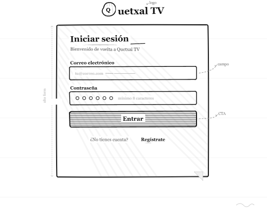

---

## 2. Registro de Cuenta

**Ruta:** `/register`

Formulario de creación de cuenta nueva. Solicita nombre completo, correo electrónico y contraseña. Incluye enlace de navegación hacia el inicio de sesión.

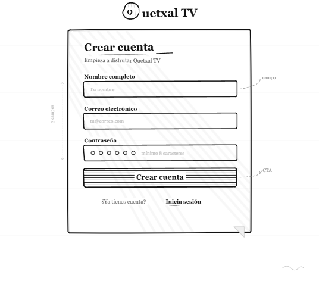

---

## 3. Selección de Perfiles

**Ruta:** `/profiles`

Pantalla de selección de perfil activo dentro de la cuenta. Muestra los perfiles existentes con avatares de color diferenciado y permite agregar un perfil nuevo (máximo 5). Incluye acceso a administración de perfiles.

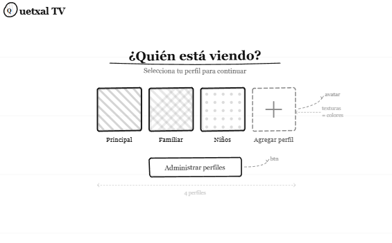

---

## 4. Catálogo

**Ruta:** `/catalog`

Vista principal de navegación de contenido. Incluye barra de navegación con búsqueda por texto, chips de filtro por género, y grillas de contenido organizadas por secciones (Tendencias, Series populares). Cada tarjeta muestra el porcentaje de recomendación calculado dinámicamente por la comunidad.

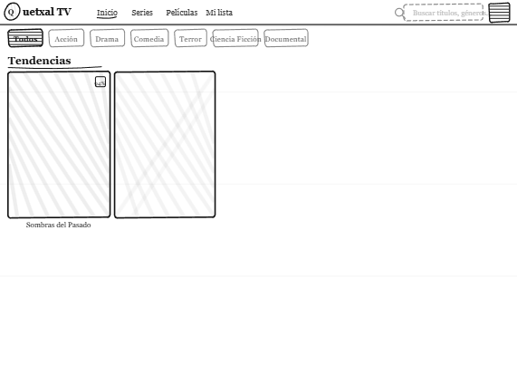

---

## 5. Detalle de Contenido

**Ruta:** `/catalog/:id`

Vista completa de una película o serie. Muestra el hero con título, géneros, año, número de temporadas y episodios, porcentaje de recomendación y sinopsis. Incluye botones de reproducción, lista y calificación. Debajo presenta el reparto principal y el sistema de calificación comunitaria con pulgar arriba/abajo.

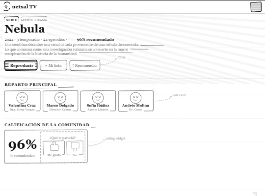

---

## 6. Planes y Suscripción

**Ruta:** `/subscriptions`

Página de selección de plan con comparativa de tres niveles: Básico ($5 USD), Estándar ($8 USD, destacado) y Premium ($12 USD). Los precios se convierten automáticamente a la moneda local mediante el FX Service. El selector de moneda permite cambiar entre GTQ, USD, MXN y EUR. Al seleccionar un plan se abre un modal de pago con tarjeta de crédito.

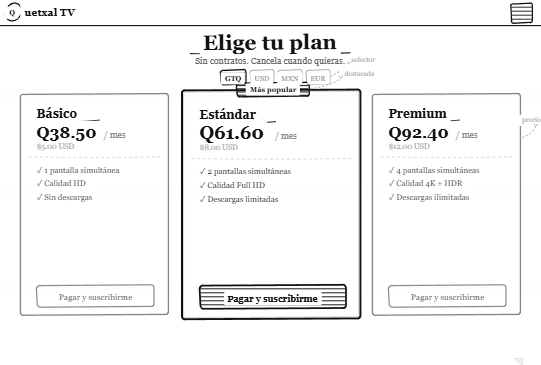

---

## 7. Historial de Reproducción

**Ruta:** `/history`

Lista de contenido en progreso del perfil activo. Cada ítem muestra el título, la temporada, episodio y minuto exacto donde se detuvo el usuario, junto con una barra de progreso visual. El botón "Reanudar" inicia la reproducción desde el punto guardado.

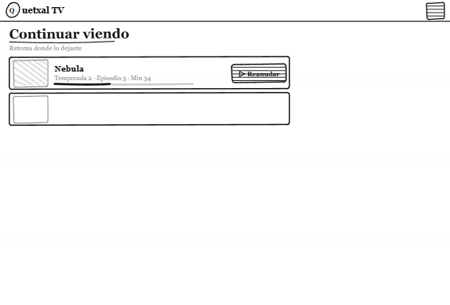

---

---

# Mockups — Panel de Administración

Representaciones visuales de las pantallas del panel de administración de Quetxal TV. El administrador accede mediante credenciales separadas y tiene acceso exclusivo a la gestion del catalogo, los planes, los logs de auditoria y la generacion de reportes.

---

## 8. Login Administrador

**Ruta:** `/login/admin`

Pantalla de acceso exclusiva para el rol administrador. Solicita usuario y contrasena de administrador. Las credenciales se validan en el frontend contra las variables de entorno. Acceso denegado redirige al mismo formulario con mensaje de error.

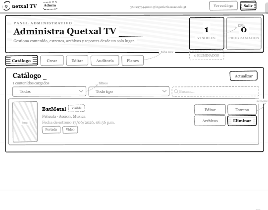

---

## 9. Dashboard Principal

**Ruta:** `/admin`

Vista principal del panel de administracion. Muestra accesos directos a los modulos disponibles: gestion de catalogo, gestion de planes, log de auditoria y descarga de reportes. Incluye boton de cierre de sesion.

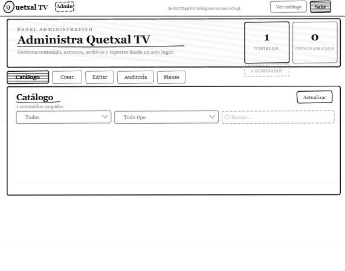

---

## 10. Gestion de Catalogo — Lista de Contenido

**Ruta:** `/admin/catalog`

Tabla con todos los titulos registrados (peliculas y series). Cada fila muestra titulo, tipo, categoria, estado de visibilidad y fecha de estreno programada. Incluye boton para agregar nuevo contenido y acciones de editar y eliminar por fila.

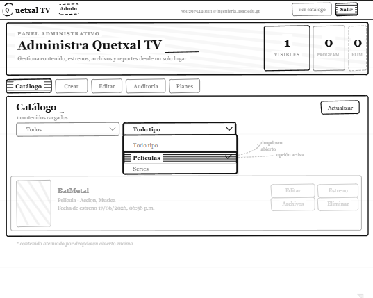

---

## 11. Agregar Nuevo Contenido

**Ruta:** `/admin/catalog/new`

Formulario para registrar un titulo nuevo. Campos: tipo (pelicula / serie), titulo, overview, poster (upload a GCS), generos (JSONB), cast (JSONB) y episodios (JSONB para series). Incluye selector de fecha de estreno para calendarizar la visibilidad del contenido.

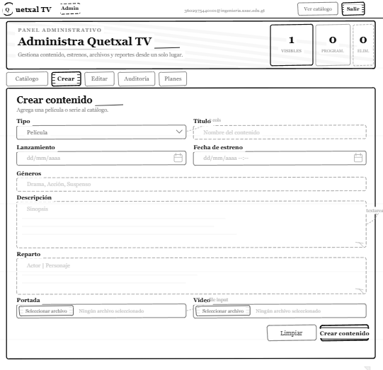

---

## 12. Editar Contenido Existente

**Ruta:** `/admin/catalog/edit/:id`

Formulario de edicion precargado con los metadatos del titulo seleccionado. Permite modificar cualquier campo incluyendo el poster (reemplaza el archivo en GCS) y reprogramar la fecha de estreno. Cambios se persisten via `gRPC UpdateContent` al Catalog Service.

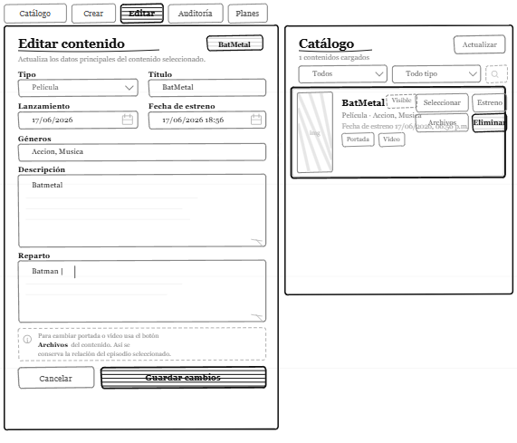

---

## 13. Gestion de Planes

**Ruta:** `/admin/plans`

Tabla de planes de suscripcion disponibles con nombre, precio en USD y estado activo/inactivo. Permite editar nombre y precio directamente en la fila. Los cambios se envian via `gRPC UpdatePlan` al Subscription Service.

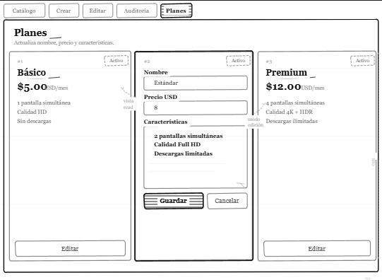

---

## 14. Log de Auditoria

**Ruta:** `/admin/audit`

Tabla paginada con el registro transaccional de la tabla de auditoria. Columnas: timestamp, tabla afectada, operacion (INSERT / UPDATE), usuario responsable, estado anterior y estado nuevo. Incluye filtros por rango de fecha y tipo de operacion.

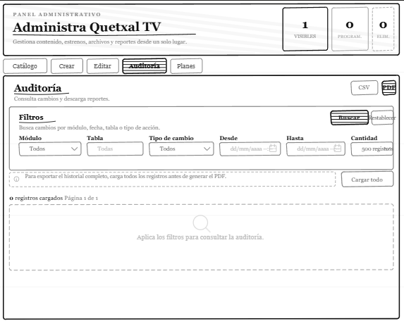

---

## 15. Descarga de Reportes

**Ruta:** `/admin/audit/report`

Vista de generacion y descarga de reportes estructurados a partir del log de auditoria. Permite seleccionar rango de fechas y formato de exportacion. Los reportes se generan en el API Gateway via `gRPC ListAuditLogs` y se descargan directamente desde el navegador.

| Formato | Descripcion |
| :------ | :---------- |
| `.csv` | Exportacion plana de todos los registros del rango seleccionado |
| `.pdf` | Reporte formateado con encabezado, tabla y totales por tipo de operacion |

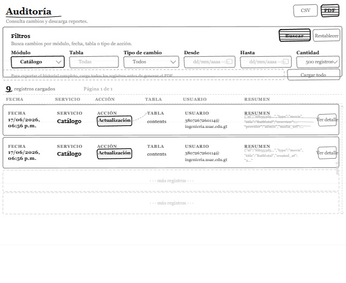

---
