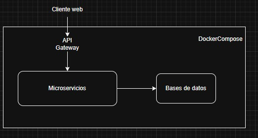

# Requerimientos del Sistema

## 1. Introducción

El presente documento describe los requerimientos funcionales y no funcionales de **Quetxal TV**, una plataforma de streaming de video bajo demanda construida bajo una arquitectura de microservicios.

El sistema debe permitir a los usuarios registrarse, iniciar sesión, administrar perfiles, consultar catálogo multimedia, visualizar detalle de contenido, gestionar planes de suscripción, consultar precios en moneda local, calificar contenido, registrar historial de reproducción y recibir notificaciones.

La solución se diseña con un enfoque desacoplado, utilizando un **API Gateway** como punto único de entrada, comunicación interna mediante **gRPC**, contratos definidos con **Protocol Buffers**, bases de datos independientes por microservicio, objetos programables de base de datos, Redis para caché del servicio financiero, contenedores Docker y despliegue en Google Cloud Platform.

---

## 2. Alcance general del sistema

La plataforma contempla los siguientes dominios funcionales:

1. Autenticación, gestión de sesiones y multiperfil.
2. Gestión de planes y suscripciones.
3. Catálogo, búsqueda y detalle de contenido.
4. Sistema de calificaciones dinámico.
5. Servicio financiero FX-Service con Redis Cache.
6. Historial de reproducción reciente.
7. Sistema de notificaciones por correo.
8. API Gateway como punto único de entrada.
9. Comunicación interna mediante gRPC.
10. Despliegue mediante Docker, Docker Compose y Google Cloud Platform.

Cada dominio funcional podrá implementarse como un microservicio independiente, con su propia base de datos cuando aplique, respetando el patrón **Database per Microservice**.

---

## 3. Arquitectura funcional esperada

La arquitectura general del sistema se estructura de la siguiente forma:

El cliente externo no debe consumir directamente los microservicios internos. Toda comunicación externa debe pasar por el API Gateway.

---

# 4. Requerimientos Funcionales

La prioridad se clasifica de la siguiente forma:

* **Alta**: indispensable para cumplir el alcance mínimo del proyecto.
* **Media**: necesaria para completar el flujo principal de negocio.
* **Baja**: mejora complementaria o extensible.

---

## 4.1 Autenticación, sesión y perfiles

| Código     | Requerimiento Funcional                                                                            | Prioridad |
| ---------- | -------------------------------------------------------------------------------------------------- | --------: |
| RF-AUTH-01 | El sistema debe permitir el registro de usuarios mediante datos básicos de cuenta.                 |      Alta |
| RF-AUTH-02 | El sistema debe permitir el inicio de sesión seguro de usuarios registrados.                       |      Alta |
| RF-AUTH-03 | El sistema debe generar un JWT después de una autenticación exitosa.                               |      Alta |
| RF-AUTH-04 | El sistema debe mantener la sesión del cliente mediante cookies seguras.                           |      Alta |
| RF-AUTH-05 | El sistema debe permitir cerrar sesión.                                                            |      Alta |
| RF-AUTH-06 | El sistema debe permitir validar una sesión activa antes de acceder a rutas protegidas.            |      Alta |
| RF-AUTH-07 | El sistema debe permitir actualizar credenciales de acceso.                                        |     Media |
| RF-PROF-01 | El sistema debe permitir crear múltiples perfiles dentro de una cuenta.                            |      Alta |
| RF-PROF-02 | El sistema debe limitar la cantidad de perfiles a un máximo de cinco por cuenta.                   |      Alta |
| RF-PROF-03 | El sistema debe permitir listar los perfiles asociados a una cuenta.                               |      Alta |
| RF-PROF-04 | El sistema debe permitir seleccionar un perfil activo.                                             |      Alta |
| RF-PROF-05 | El sistema debe mantener separación lógica entre perfiles para historial, preferencias y progreso. |      Alta |

---

## 4.2 Gestión de planes y suscripciones

| Código    | Requerimiento Funcional                                                                   | Prioridad |
| --------- | ----------------------------------------------------------------------------------------- | --------: |
| RF-SUB-01 | El sistema debe permitir visualizar los planes de suscripción disponibles.                |      Alta |
| RF-SUB-02 | El sistema debe permitir seleccionar un plan de suscripción.                              |      Alta |
| RF-SUB-03 | El sistema debe permitir consultar la suscripción actual de una cuenta.                   |     Media |
| RF-SUB-04 | El sistema debe permitir modificar el plan de suscripción actual.                         |     Media |
| RF-SUB-05 | El sistema debe permitir cancelar una suscripción.                                        |     Media |
| RF-SUB-06 | El sistema debe registrar la operación de suscripción para fines de consulta y auditoría. |     Media |

---

## 4.3 Catálogo, búsqueda y detalle de contenido

| Código    | Requerimiento Funcional                                                      | Prioridad |
| --------- | ---------------------------------------------------------------------------- | --------: |
| RF-CAT-01 | El sistema debe permitir consultar el catálogo de contenido multimedia.      |      Alta |
| RF-CAT-02 | El sistema debe permitir buscar contenido por título.                        |      Alta |
| RF-CAT-03 | El sistema debe permitir filtrar contenido por categoría o género.           |      Alta |
| RF-CAT-04 | El sistema debe permitir consultar el detalle de una película o serie.       |      Alta |
| RF-CAT-05 | El sistema debe mostrar la ficha técnica del contenido.                      |     Media |
| RF-CAT-06 | El sistema debe mostrar actores y reparto asociados al contenido.            |     Media |
| RF-CAT-07 | El sistema debe diferenciar entre películas, series, temporadas y episodios. |     Media |

---

## 4.4 Calificaciones dinámicas

| Código     | Requerimiento Funcional                                                                            | Prioridad |
| ---------- | -------------------------------------------------------------------------------------------------- | --------: |
| RF-RATE-01 | El sistema debe permitir calificar contenido mediante estrellas o recomendación positiva/negativa. |      Alta |
| RF-RATE-02 | El sistema debe asociar cada calificación a un perfil y a un contenido específico.                 |      Alta |
| RF-RATE-03 | El sistema debe calcular dinámicamente el porcentaje global de recomendación de cada contenido.    |      Alta |
| RF-RATE-04 | El sistema debe mostrar el porcentaje de recomendación en el catálogo o detalle del contenido.     |     Media |
| RF-RATE-05 | El sistema debe permitir actualizar una calificación previamente registrada.                       |      Baja |

---

## 4.5 FX-Service y Redis Cache

| Código   | Requerimiento Funcional                                                                                           | Prioridad | 
| -------- | ----------------------------------------------------------------------------------------------------------------- | --------: | 
| RF-FX-01 | El sistema debe consultar tipos de cambio para mostrar precios en moneda local.                                   |      Alta | 
| RF-FX-02 | El sistema debe implementar Redis como capa de caché para los tipos de cambio.                                    |      Alta | 
| RF-FX-03 | El sistema debe configurar políticas TTL para evitar consultas repetitivas a fuentes externas.                    |      Alta | 
| RF-FX-04 | El sistema debe permitir convertir el precio base de los planes a la moneda solicitada.                           |      Alta | 
| RF-FX-05 | El sistema debe manejar respuestas de respaldo si la fuente externa de tipo de cambio no se encuentra disponible. |     Media | 

---

## 4.6 Historial de reproducción

| Código     | Requerimiento Funcional                                                                     | Prioridad |
| ---------- | ------------------------------------------------------------------------------------------- | --------: |
| RF-HIST-01 | El sistema debe registrar el progreso de visualización por perfil.                          |      Alta |
| RF-HIST-02 | El sistema debe almacenar el contenido visualizado recientemente por cada perfil.           |      Alta |
| RF-HIST-03 | Para series, el sistema debe almacenar temporada, episodio y minuto exacto de reproducción. |      Alta |
| RF-HIST-04 | El sistema debe permitir reanudar contenido desde el último punto registrado.               |      Alta |
| RF-HIST-05 | El sistema debe mostrar una sección de reproducción reciente o “continuar viendo”.          |     Media |

---

## 4.7 Notificaciones por correo

| Código    | Requerimiento Funcional                                                          | Prioridad |
| --------- | -------------------------------------------------------------------------------- | --------: |
| RF-NOT-01 | El sistema debe enviar o registrar una notificación de confirmación de registro. |     Media |
| RF-NOT-02 | El sistema debe enviar o registrar recibos de compra o suscripción.              |     Media |
| RF-NOT-03 | El sistema debe enviar o registrar alertas de nuevas publicaciones de contenido. |      Baja |

---

## 4.8 API Gateway e integración

| Código   | Requerimiento Funcional                                                                                 | Prioridad |
| -------- | ------------------------------------------------------------------------------------------------------- | --------: |
| RF-GW-01 | El sistema debe exponer las operaciones externas únicamente mediante el API Gateway.                    |      Alta |
| RF-GW-02 | El API Gateway debe validar sesiones antes de procesar rutas protegidas.                                |      Alta |
| RF-GW-03 | El API Gateway debe comunicarse con los microservicios internos mediante gRPC.                          |      Alta |
| RF-GW-04 | El API Gateway debe transformar solicitudes HTTP externas en llamadas gRPC internas.                    |      Alta |
| RF-GW-05 | El API Gateway debe centralizar el manejo de errores de autenticación y autorización.                   |     Media |
| RF-GW-06 | El API Gateway debe permitir agregar nuevos clientes gRPC conforme se integren nuevos servicios.        |      Alta |

---

## 4.9 Programación en base de datos

| Código   | Requerimiento Funcional                                                                           | Prioridad |
| -------- | ------------------------------------------------------------------------------------------------- | --------: |
| RF-DB-01 | Cada microservicio con persistencia debe contar con su propia base de datos independiente.        |      Alta |
| RF-DB-02 | Los servicios deben implementar procedimientos almacenados para flujos transaccionales complejos. |      Alta |
| RF-DB-03 | Los servicios deben implementar vistas para simplificar consultas de lectura.                     |      Alta |
| RF-DB-04 | Los servicios deben implementar funciones para lógica reutilizable o cálculos del dominio.        |      Alta |
| RF-DB-05 | Los servicios deben implementar triggers para auditoría o automatización de eventos de datos.     |      Alta |
| RF-DB-06 | La documentación debe especificar qué objetos programables usa cada componente.                   |      Alta |

---

# 5. Requerimientos No Funcionales

| Código       | Requerimiento No Funcional                                                                                                   | Prioridad | Criterio de aceptación                                                               |
| ------------ | ---------------------------------------------------------------------------------------------------------------------------- | --------: | ------------------------------------------------------------------------------------ |
| RNF-ARQ-01   | El sistema debe estar construido bajo arquitectura de microservicios.                                                        |      Alta | Cada dominio debe ser implementado como servicio desacoplado.                        |
| RNF-ARQ-02   | Cada microservicio debe tener base de datos independiente cuando requiera persistencia.                                      |      Alta | Debe respetarse el patrón Database per Microservice.                                 |
| RNF-ARQ-03   | El sistema debe utilizar de forma simultánea TypeScript, Go y Python.                                                        |      Alta | La matriz de servicios debe evidenciar el lenguaje usado por cada servicio.          |
| RNF-ARQ-04   | El cliente externo no debe comunicarse directamente con los microservicios internos.                                         |      Alta | Solo el API Gateway debe exponerse externamente.                                     |
| RNF-COM-01   | La comunicación interna entre servicios debe realizarse mediante gRPC.                                                       |      Alta | Los servicios deben contar con contratos `.proto`.                                   |
| RNF-COM-02   | Los contratos entre servicios deben definirse mediante Protocol Buffers.                                                     |      Alta | Debe existir una carpeta común o documentada para archivos `.proto`.                 |
| RNF-SEC-01   | El sistema debe implementar mecanismos seguros de sesión e identidad.                                                        |      Alta | Debe usarse JWT, cookies seguras y/o OAuth según el flujo implementado.              |
| RNF-SEC-02   | Las contraseñas no deben almacenarse en texto plano.                                                                         |      Alta | Deben almacenarse usando hash.                                                       |
| RNF-SEC-03   | La información sensible debe configurarse mediante variables de entorno.                                                     |      Alta | No se deben versionar archivos `.env` reales.                                        |
| RNF-BD-01    | Los servicios deben utilizar objetos programables de base de datos.                                                          |      Alta | Deben documentarse procedimientos, vistas, funciones y triggers.                     |
| RNF-CACHE-01 | El FX-Service debe utilizar Redis para caché.                                                                                |      Alta | Debe existir configuración de Redis y TTL.                                           |
| RNF-DEP-01   | Cada microservicio, base de datos, caché y API Gateway debe contar con Dockerfile o configuración equivalente de contenedor. |      Alta | Deben existir archivos de construcción o configuración por componente.               |
| RNF-DEP-02   | El sistema debe poder levantarse mediante Docker Compose en entorno local.                                                   |      Alta | Debe existir `docker-compose.local.yml`.                                             |
| RNF-DEP-03   | El sistema debe poder desplegarse mediante Docker Compose en entorno nube.                                                   |      Alta | Debe existir `docker-compose.cloud.yml`.                                             |
| RNF-DEP-04   | La aplicación funcional debe desplegarse en Google Cloud Platform.                                                           |      Alta | Debe existir evidencia del despliegue en nube.                                       |
| RNF-GIT-01   | No se permiten commits directos a `main` o `develop`.                                                                        |      Alta | Todo cambio debe integrarse mediante Pull Request.                                   |
| RNF-GIT-02   | Los Pull Requests deben contar con revisión y aprobación del equipo.                                                         |      Alta | Debe existir evidencia en GitHub.                                                    |
| RNF-GIT-03   | La entrega final debe contar con tag de versión `v1.0.0`.                                                                    |      Alta | El repositorio debe contener el tag final.                                           |
| RNF-DOC-01   | La documentación técnica debe estar en formato Markdown.                                                                     |      Alta | Deben existir archivos `.md` versionados.                                            |
| RNF-DOC-02   | Los diagramas deben realizarse en Draw.io.                                                                                   |      Alta | Deben versionarse archivos `.drawio` y exportaciones visuales.                       |
| RNF-DOC-03   | Todo elemento funcional debe estar documentado para ser tomado en cuenta.                                                    |      Alta | Cada servicio debe aportar su sección de documentación.                              |

---

# 6. Matriz de microservicios esperada

| Servicio             | Dominio                             | Lenguaje            | Comunicación                | Persistencia                          |
| -------------------- | ----------------------------------- | ------------------- | --------------------------- | ------------------------------------- |
| API Gateway          | Entrada única, sesión, enrutamiento | TypeScript          | HTTP externo / gRPC interno | No aplica o mínima                    |
| Identity Service     | Usuarios, autenticación y perfiles  | TypeScript          | gRPC                        | Base de datos Identity                |
| Catalog Service      | Catálogo, búsqueda y detalle        | Go                  | gRPC                        | Base de datos Catalog                 |
| Subscription Service | Planes y suscripciones              | Python              | gRPC                        | Base de datos Subscription            |
| FX Service           | Conversión de divisas               | Python              | gRPC                        | Redis Cache                           |
| Engagement Service   | Calificaciones e historial          | Go o Python         | gRPC                        | Base de datos Engagement              |
| Notification Service | Correos y alertas                   | Python o TypeScript | gRPC                        | Base de datos o log de notificaciones |
| Web App              | Interfaz de usuario                 | TypeScript          | HTTP hacia Gateway          | No aplica                             |

---

# 7. Reglas de negocio generales

| Código | Regla                                                                                                       |
| ------ | ----------------------------------------------------------------------------------------------------------- |
| RN-01  | Ningún cliente externo puede consumir directamente microservicios internos.                                 |
| RN-02  | Una cuenta puede tener como máximo cinco perfiles.                                                          |
| RN-03  | Cada perfil debe mantener de forma aislada su historial, progreso y preferencias.                           |
| RN-04  | Los precios de planes deben poder mostrarse en moneda local usando FX-Service.                              |
| RN-05  | El FX-Service debe usar Redis para evitar consultas repetitivas de tipo de cambio.                          |
| RN-06  | El porcentaje de recomendación debe calcularse dinámicamente con base en calificaciones de usuarios.        |
| RN-07  | El historial de reproducción debe registrar temporada, episodio y minuto cuando el contenido sea una serie. |
| RN-08  | Todo servicio con persistencia debe tener base de datos independiente.                                      |
| RN-09  | La información sensible debe manejarse mediante variables de entorno.                                       |
| RN-10  | Todo cambio de código o documentación debe integrarse por Pull Request.                                     |

---

# 8. Trazabilidad con módulos del sistema

| Módulo                   | Requerimientos relacionados |
| ------------------------ | --------------------------- |
| Autenticación y perfiles | RF-AUTH, RF-PROF            |
| API Gateway              | RF-GW                       |
| Catálogo                 | RF-CAT                      |
| Suscripciones            | RF-SUB                      |
| FX-Service               | RF-FX                       |
| Calificaciones           | RF-RATE                     |
| Historial                | RF-HIST                     |
| Notificaciones           | RF-NOT                      |
| Persistencia             | RF-DB                       |
| Infraestructura          | RNF-DEP                     |
| Documentación            | RNF-DOC                     |

---

# 9. Criterio de actualización documental

Cada nuevo microservicio integrado debe actualizar como mínimo:

1. La matriz de microservicios.
2. Los requerimientos funcionales de su dominio.
3. Los requerimientos no funcionales que aplique.
4. La sección de persistencia y objetos programables.
5. Los casos de uso asociados.
6. Los diagramas generales si cambia la arquitectura.
7. Los diagramas específicos del módulo si agregan flujos nuevos.
8. La evidencia de pruebas e integración.
9. La evidencia de Pull Request.
10. El índice del documento técnico principal.

Ninguna funcionalidad debe considerarse completa si no está documentada.
