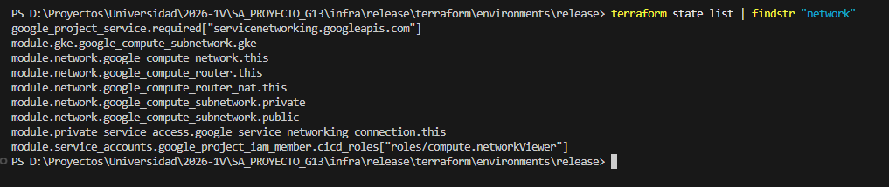
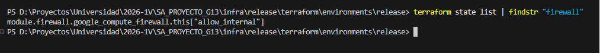
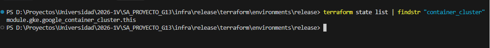
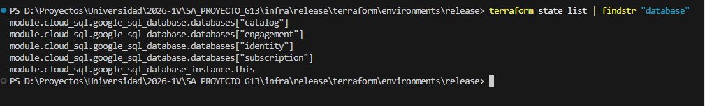
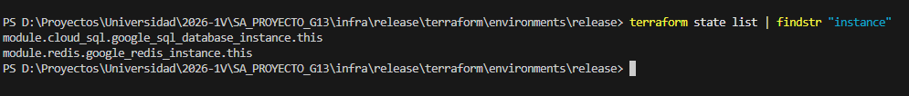

# Documentación sobre Terraform

## Qué es y Cómo funciona
Terraform es una herramienta de infraestructura como código (IaC) que permite definir, aprovisionar y configurar recursos en cualquier nube utilizando un lenguaje de configuración declarativo (HCL). Funciona comparando el estado actual de la infraestructura (guardado en un archivo de estado, `terraform.tfstate`) con el estado deseado definido en el código, y ejecutando un plan de acción para alcanzar dicho estado. El aprovisionamiento declarativo significa que el usuario define "qué" recursos quiere, y Terraform se encarga de determinar "cómo" crearlos, gestionando las dependencias.

## Configuración paso a paso de la infraestructura

A continuación, se detalla la creación de los recursos mediante el código IaC:

### 1. VPC y Subredes
Se configuró la red virtual (VPC) y las subredes necesarias para aislar de forma correcta los recursos del entorno:

### 2. Firewalls
Se establecieron reglas de firewall en la red para permitir el tráfico necesario (como HTTP/HTTPS, SSH y puertos específicos) de forma segura:

### 3. Clúster de GKE
Se aprovisionó el clúster de Kubernetes Engine (GKE) para el despliegue de todos los microservicios:

### 4. Instancias de Base de Datos Externas
Se levantaron las instancias de bases de datos de manera externa al clúster para asegurar la persistencia de datos y rendimiento:

### 5. Máquinas Virtuales (VMs)
Se crearon las máquinas virtuales que servirán para los entornos de desarrollo y demás procesos requeridos:

## Gestión de Entornos y Configuraciones

La infraestructura del proyecto está dividida por entornos (`develop` y `release`) dentro del directorio `infra/`. Esta separación permite mantener configuraciones aisladas y organizadas:
- **`terraform.tfvars`**: Archivo utilizado en cada entorno para sobreescribir las variables por defecto con valores específicos (como nombres de red, tipos de máquina o dimensionamiento del clúster).
- **`variables.tf`**: Define la estructura y el tipo de datos que recibe Terraform.
- **`backend.tf`**: Configura el almacenamiento remoto del estado (`terraform.tfstate`) para evitar conflictos cuando múltiples personas administran la infraestructura de forma simultánea.
